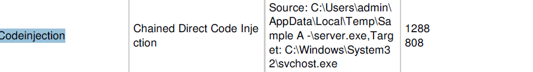
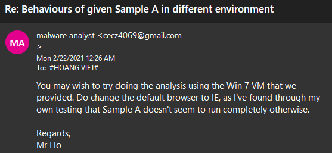
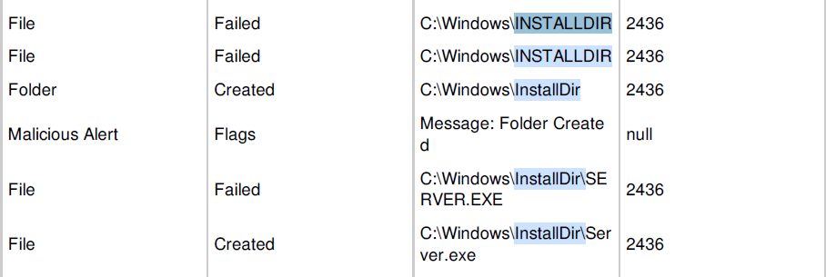

### Assignment 1 Question 

```
For each sample

a.	What is the name of the malware family? 
b.	What method of malware persistence is in use for this sample?
c.	Are there any potential host-based indicators and/or network-based indicators for the malware? 
d.	Any special observations about this sample after it was executed? 
e.	Devise/Deploy a method to extract the malware configuration file for similar samples. Provide a step-by-step explanation and any references that was used. 

```

# Sample A
### **a. Family name**
XtremeRAT (or XRAT) is a family of Remote Access Trojan. According to FireEye \[[A1](#A1)\], "The XtremeRAT was developed by “xtremecoder” and has been available since at least 2010.  Written in Delphi, the code of XtremeRAT is shared amongst several other Delphi RAT projects including SpyNet, CyberGate, and Cerberus. The RAT is available for free; however, the developer charges 350 Euros for the source code.  Unfortunately for xtremecoder, the source code has been leaked online.  The current version is Xtreme 3.6, however, there are a variety of “private” version of this RAT available as well. As such, the official version of this RAT and its many variants are used by a wide variety of actors."  

A full description of the malware functionalities can be found here -- taken from the [XRAT whitepaper](https://www.sans.org/reading-room/whitepapers/malicious/xtremerat-unicode-breaks-35897)


### **a2. Functionalities**
It is a RAT so like usually RAT it grants attacker access into the infected machines with a few other functionalities. 

I have extracted the imports libraries it uses in [a_imports.txt](./a_imports.txt) and the strings output in [a_strings.txt](./a_strings.txt). Mapping them to the functionalities stated in \[[A1](#A1)\]

    Interact with the victim via a remote shell (ShellExecuteW)
    Upload/download files (URLDownloadToCacheFileW,FtpPutFileW,Ftp-related functions)
    Interact with the registry (SHDeleteKeyW,SHDeleteValueW,RegQueryValueExA,RegOpenKeyExA,REgCloseKey)
    Manipulate running processes and services (CreateThread,CreateProcessW,CreateFileW,CreateEventA,)
    Capture images of the desktop (GetDesktopWindow)
    GetClipboard data, GetKeyboardstate (Esp impt since it's arabic keyboard)
    Record from connected devices, such as a webcam or microphone 

I also notice a few interesting things in strings output:

    SOFTWARE\Borland\Delphi\RTL: it is definitely Delphi
    Software\Microsoft\Windows\CurrentVersion\Run: it will run on startup.
    Software\Microsoft\Active Setup\Installed Components\; restart; StubPath: it will attempt funny things during logon.

_Author's notes: I will copy output for certain parts under other parts in order to avoid reference pointers pointing everywhere. So there will be duplicates
_
### **b. Persistence**

For this section, I run the malware multiple times each with less filters as I notice it inject itselfs into svchost.exe and msedge.exe (my default browser). This is a behaviour already examined by TrendMicro \[[A2](./#A2)\] -- "It injects itself into the following processes as part of its memory residency routine".

The final procmon file I settled with was [a_all_events.csv](./a_all_events.csv) which contains 0 filter. 

From my own procmon log + ipynb analysis and the sandbox result \*_see the notes at the end of this section_\*, I noticed code injection, hiding a copy of itself and HKEY modification as the main persistence mechanism

#### b.1 Code Injection

From ipynb+procmon: 


From sandbox: 




<a name="Erratic_Behaviours">Notes</a>: I have emailed our profs about the behaviour of malware not executing fully in different environment. I realized that they behave more mildly in a Win10 env compared to Win7 when I compare the regshots result from two machines. This was the replies I got from the profs: 




#### b.2 Drop a copy of itself into the system

From ipynb+procmon: 


From sandbox: 



#### b.3 Modify registry keys

From ipynb+procmon: 

IE suspicious HKEY:


svchost suspicious HKEY:


Other interesting keys:

    iexplore.exe --RegSetValue -- HKCU\Software\BlackMamba_Mutex\ServerName -- Type: REG_EXPAND_SZ, Length: 66, Data: C:\Windows\InstallDir\Server.exe
    iexplore.exe --RegSetValue -- HKCU\Software\BlackMamba_Mutex\ServerStarted -- Type: REG_EXPAND_SZ, Length: 40, Data: 20/02/2021 23:43:04


From the strings output we already notices:

    Software\Microsoft\Windows\CurrentVersion\Run: C:\Windows\InstallDir\Server.exe (now we know the value)
    Software\Microsoft\Active Setup\Installed Components\; restart; StubPath: it will attempt funny things during logon (not detected)

However the malware doesn't seem to modify the second key. The other keys matched up with most (if not all) of the HKEY mod events reported by TrendMicro \[[A2](./#A2)\]. 

### b.4 Mutex

From Regshot:


From ipynb+procmon:
```
server.exe --RegSetValue -- HKCU\Software\XtremeRAT\Mutex -- Type: REG_EXPAND_SZ, Length: 34, Data: BlackMamba_Mutex
iexplore.exe --CreateFile -- C:\Users\IEUser\AppData\Roaming\Microsoft\Windows\BlackMamba_Mutex.xtr 
server.exe --CreateFile -- C:\Users\IEUser\AppData\Roaming\BlackMamba_Mutex.cfg 
```
From sandbox: 


And later on during resource decryption, we also find these:


### **c. Indicators**

### c.1 Network based

Later on in section 5 we will explain how we got the C2 key IPs as:

    C2 server IP: 111.65.40.69
    DNS server IP: 112.66.17.12

The reason is because fakenet doesn't report anything as said in [Notes](#Erratic_Behaviours).

This also holds out with FireEye Sandbox result.


And seen in IDA


where it calls the {IP}/1234567890.functions

### c.2 Host based

The files events, mutex and HKEY modifications are prime examples of host based indicators. I have selected a few important one:

    --RegSetValue--
    iexplore.exe HKCU\Software\BlackMamba_Mutex\ServerStarted 
    iexplore.exe HKLM\SOFTWARE\Microsoft\Windows\CurrentVersion\Run\HKLM -- Data: C:\Windows\InstallDir\Server.exe
    iexplore.exe HKCU\Software\Microsoft\Windows\CurrentVersion\Run\HKCU -- Data: C:\Windows\InstallDir\Server.exe
    iexplore.exe HKCU\Software\BlackMamba_Mutex\ServerName --  Data: C:\Windows\InstallDir\Server.exe
    iexplore.exe HKCU\Software\BlackMamba_Mutex\ServerName -- Type: REG_EXPAND_SZ, Length: 66, Data: C:\Windows\InstallDir\Server.exe
    iexplore.exe HKCU\Software\BlackMamba_Mutex\ServerStarted -- Type: REG_EXPAND_SZ, Length: 40, Data: 20/02/2021 23:43:04

    --CreateFile--
    cfg iexplore.exe -- --  C:\Users\IEUser\AppData\Roaming\BlackMamba_Mutex.cfg 
    xtr iexplore.exe -- -- C:\Users\IEUser\AppData\Roaming\Microsoft\Windows\BlackMamba_Mutex.xtr
    exe server.exe -- C:\Windows\System32\svchost.exe 
    html server.exe -- C:\Users\IEUser\AppData\Local\Temp\x.html 
    exe server.exe -- C:\Program Files\Internet Explorer\iexplore.exe 

    --Mutex--
    BlackMamba_MutexEXIT
    BlackMamba_Mutex
    BlackMamba_MutexPERSIST

### **d.	Any special observations about this sample after it was executed?** 

The malware deletes itself in win7 but will stay there in win10. Again due to [Notes](#Erratic_Behaviours). This is possibly due to 

    a. Detect itself in a VM environment
    b. Persistence mechanism and evasion

Since it never deletes itself in win10 I guess b. is a more appropriate answer. 

Additionally, there's 6 calls to CreateFileW


Setting F2 at all these addresses in OllyDbg, we can only find hit the first breakpoint as the other breakpoints are executed by the infected processes -- svchost and msedge.

And the breakpoint it hit is a junkcode in creating a x.html file that does absolutely nothing


### **e. Devise/Deploy a method to extract the malware configuration file for similar samples. Provide a step-by-step explanation and any references that was used.** 
 

The RAT contains an RC4 encrypted config files that contain several useful information (under %APPDATA%\Roaming\BlackMamba_Mutex.cfg). This can be seen in the encrypted strings in [a_strings.txt](./a_strings.txt)

For the RC4, it is a relatively simple, elegant and vulnerable stream cipher algorithm. I have used it to create a small CTF in the [start page](../L3/sakura_qn.html). The key is "sosig". Malwarelu \[[A3](#A3)\] has done a brilliant job at detecting the KSA and PKGA in their blogs. 

There is then two approaches to decrypt this file:

    1. Ollygdb it till the point it write the file to disk , extract the file, RC4 decrypt using string "CONFIG" and read the content. Decryption can be done using FireEye XTRAT tools (which is also the same thing that malware lu used)
    2. Use Malwarelu method  of extracting it directly from the resource section, and the rest is the same. The cool things is Malwarelu package all of these into a single python script that is extremely short, so it's more convenient.

Why string CONFIG? FireEye said there's two possible strings "CYBERGATEPASS" or "CONFIG". Also in IDA we can tell in the RC4 routine that the key is "CONFIG". 


**A step by step explanation of method 1:**'
1. Locate the .cfg files(You may want to modify the malware such that it doesn't delete this file right before it delete itself) OR take it from rsrc section using tools like Resource Hacker
2. Run FireEye tool on it to extract the data. 


**A step by step explanation of method 2:**

The link is \[[A3](#A3)\]. Just use their xtremerat_config.py on the executable. It is very convenient. I will explain the python file below:

1. Using python pefile module, we locate the resource section directories of the executable
2. Get the directory entry. Then for each of the entries (which will contain a block of 16 strings) 
3. Find the relative virtual address of the strings. Since these are almost always differ from its position in disk, we need to use pe.get_memory_mapped_image()\[data_rva:data_rva+size\] to get the actual data

The output file is [a_RC4_decrypted_cfg.txt](./a_RC4_decrypted_cfg.txt)

We see the following info as mentioned:

    C2 server IP: 111.65.40.69
    DNS server IP: 112.66.17.12
    Folder is InstallDir
    File is server.exe
    Injected process is %DEFAULTBROWSER% & %SERVER%
    Mutex created: BlackMamba_Mutex, BlackMamba_MutexEXIT BlackMamba_MutexPERSIST 

    --misc--
    NTU_Education
    ConCSA_MA_Team
    HKCU\Software\Microsoft\Windows\CurrentVersion\Run
    GUID: {5460C4DF-B266-909E-CB58-E32B79832EB2}
    Microsoft Terminal Services
    ftp.ftpserver.com


For the OSINT work, I have used references from the following work (A-- referenced and M is for misc -- not referenced).

 

 
## References for Sample A
<a name="A1" href="https://www.fireeye.com/blog/threat-research/2014/02/xtremerat-nuisance-or-threat.html">A1. FireEye XRAT</a>

<a name="A2" href="https://www.trendmicro.com/vinfo/us/threat-encyclopedia/malware/XTRAT ">A2. TrendMicro XRAT threat encyclopedia</a>

<a name="A3" href="https://malware.lu/articles/2012/07/22/xtreme-rat-analysis.html">A3. Malware lu analysis</a>

<a name="A3" href="https://github.com/fireeye/tools/blob/master/malware/Xtreme%20RAT/xtrat_decrypt_config.py">A4. FireEye XTRAT decryptor</a>

<a name="AM1" href=" https://blog.malwarebytes.com/detections/backdoor-xtrat/">Misc 1. Malwarebyte XTRAT backdoor</a>

<a name="AM2" href="https://www.sans.org/reading-room/whitepapers/malicious/xtremerat-unicode-breaks-35897">Misc 2. SANS whitepaper</a>

<a name="AM3" href="https://cyware.com/news/xtreme-rat-a-deep-insight-into-the-remote-access-trojans-high-profile-attacks-14dea04b">Misc 3. Cyware</a>

<a name="AM4" href="https://krebsonsecurity.com/tag/xtreme-rat/">Misc 4. KrebsonSecurity</a>
 # Sample B

Part 5

The encryption are generally done in the constructor (.ctor) function as seen  here:


The strings are:

1. encrypted email string: YlAuOB61JP7Xi5h8K5L2IGA3jMtN/jZDgXP5GUj1CQYs9MF2eXs+5iQpyz2Lq/2U
2. encrypted pass string: YHJmuJ6TTu5y2oLCttlBqrST5C8glLTFVKWb1Tx6kDjgbFUpHqEg8vimBaE9zP3ZbgA78xiY46Mx/vlEgZkTkg==
3. encrypted smtp string: R6xOQvVyglYi1VZrU6YLSXgCm7kggtpdkexS+D7agYk=
4. encrypted ftp host: DAsaMA1AiWAMiX7/2niNpvJ+E0CcAZ0/P/PUZITbhX0UWQ8oMH0QOkPNxtwLtBAs
5. encrypted ftp user: wY0LEe9y+2yGXhDXmfDrHo+J8EmuP1ocrF5FrTuC1PY=
6. encrypted ftp pass: 3/BxGIs7loR7FQ9LFgYmxASj436ZcTD4lx8u+gtq6ug=
7. encrypted ftp php link: PN4TW3peZ3UeXi7asDB56E4dMEf6JrdkxXNUlrUjLlWcjHK1wZ5CpLZZKB/ocuFWy9Kw0Q8tIc1Qv7OEgqzD+w== 

Using decryption at {link} using
string secret = "HawkEyeKeylogger";
string salt = "099u787978786";
(I suppose you use a clean sample, it was a wild guess anyway). 

I use an online [C# compiler](https://rextester.com/)

Decrypted strings are:
1. email: bossmance4069@gmail.com
2. pass: ThisI\$TheAttack3rPa\$\$w0rd
3. smtp: smtp.gmail.com
4. ftp host: ftp.yourhost.com
5. ftp user: YourUsername
6. ftp pass: YourPassword
7. php site: https://www.site.com/logs.php

