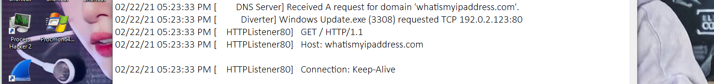

# Assignment 1 Question 

```
For each sample

a.	What is the name of the malware family? 
b.	What method of malware persistence is in use for this sample?
c.	Are there any potential host-based indicators and/or network-based indicators for the malware? 
d.	Any special observations about this sample after it was executed? 
e.	Devise/Deploy a method to extract the malware configuration file for similar samples. Provide a step-by-step explanation and any references that was used. 

```
Since this version is not graded, I feel obligated to put a sakura gif. 


# Preamble about structure of A1 subfolder

The main report is A1.md. The relevant analysis files are:

     *_imports.txt (for IDA imports)
     *_strings.txt for strings output
     *_reg_win7.txt for regshot output
     *.csv for procmont output
     *.ipynb for procmon analysis 
     Fakenet results, decrypted config files

## Menu 
_Disclaimer: this is my own work and thus by no means the "correct" answer. However it should serve as a good reference!_

[1. Sample A](#sample_a)

[2. Behaviours in different environments](#env)

[3. Sample B](#sample_b)


# <a name="sample_a">Sample A</a>
### **a. Family name**
XtremeRAT (or XRAT) is a family of Remote Access Trojan. According to FireEye \[[A1](#A1)\], "The XtremeRAT was developed by “xtremecoder” and has been available since at least 2010.  Written in Delphi, the code of XtremeRAT is shared amongst several other Delphi RAT projects including SpyNet, CyberGate, and Cerberus. The RAT is available for free; however, the developer charges 350 Euros for the source code.  Unfortunately for xtremecoder, the source code has been leaked online.  The current version is Xtreme 3.6, however, there are a variety of “private” version of this RAT available as well. As such, the official version of this RAT and its many variants are used by a wide variety of actors."  

A full description of the malware functionalities can be found here -- taken from the [XRAT whitepaper](https://www.sans.org/reading-room/whitepapers/malicious/xtremerat-unicode-breaks-35897)


### **a2. Functionalities**
It is a RAT so like other RAT it grants attacker access into the infected machines with a few other functionalities. 

I have extracted the imports libraries it uses in [a_imports.txt](./a_imports.txt) and the strings output in [a_strings.txt](./a_strings.txt). Mapping them to the functionalities stated in \[[A1](#A1)\]

    Interact with the victim via a remote shell (ShellExecuteW)
    Upload/download files (URLDownloadToCacheFileW, FtpPutFileW, Ftp-related functions)
    Interact with the registry (SHDeleteKeyW, SHDeleteValueW, RegQueryValueExA, RegOpenKeyExA, REgCloseKey)
    Manipulate running processes and services (CreateThread, CreateProcessW, CreateFileW, CreateEventA,)
    Capture images of the desktop (GetDesktopWindow)
    GetClipboard data, GetKeyboardstate (Esp impt since it's arabic keyboard)
    Record from connected devices, such as a webcam or microphone 

I also notice a few interesting things in strings output:

    SOFTWARE\Borland\Delphi\RTL: it is definitely Delphi
    Software\Microsoft\Windows\CurrentVersion\Run: it will run on startup.
    Software\Microsoft\Active Setup\Installed Components\; restart; StubPath: it will attempt funny things during logon.

_Author's notes: I will copy output for certain parts under other parts in order to avoid reference pointers pointing everywhere. So there will be duplicates_
### **b. Persistence**

For this section, I run the malware multiple times each with less filters as I notice it inject itselfs into svchost.exe and msedge.exe (my default browser). This is a behaviour already examined by TrendMicro \[[A2](./#A2)\] -- "It injects itself into the following processes as part of its memory residency routine".

The final procmon file I settled with was [a_all_events.csv](./a_all_events.csv) which contains 0 filter. 

From my own procmon log + ipynb analysis and the sandbox result \*_see the notes at the end of this section_\*, I noticed code injection, self-duplication and some other minor hkey-related technique as the main persistence mechanism

#### b.1 Code Injection

From ipynb+procmon: 


From sandbox: 


#### b.2 Drop a copy of itself into the system

From ipynb+procmon: 


From sandbox: 


#### b.3 Modify registry keys

From ipynb+procmon: 

IE suspicious HKEY:


svchost suspicious HKEY:


Other interesting keys:

    iexplore.exe --RegSetValue -- HKCU\Software\BlackMamba_Mutex\ServerName -- Type: REG_EXPAND_SZ, Length: 66, Data: C:\Windows\InstallDir\Server.exe
    iexplore.exe --RegSetValue -- HKCU\Software\BlackMamba_Mutex\ServerStarted -- Type: REG_EXPAND_SZ, Length: 40, Data: 20/02/2021 23:43:04


From the strings output we already notices:

    Software\Microsoft\Windows\CurrentVersion\Run: C:\Windows\InstallDir\Server.exe (now we know the value)
    Software\Microsoft\Active Setup\Installed Components\; restart; StubPath: it will attempt funny things during logon (not detected)

However the malware doesn't seem to modify the second key. The other keys matched up with most (if not all) of the HKEY mod events reported by TrendMicro \[[A2](./#A2)\]. 


### **c. Indicators**

### _c.1 Network based_

Later on in section 5 we will explain how we got the C2 key IPs as:

    C2 server IP: 111.65.40.69
    DNS server IP: 112.66.17.12

The reason is because fakenet doesn't report anything as said in [Notes](#env).

This also holds out with FireEye Sandbox result.


And seen in IDA


where it calls the {IP}/1234567890.functions

\[Trojan Horse\] has reported that he has the fakenet result for those IP after setting the default browser to IE. I was too lazy at this point (26/02/21) to insert it here. 

### _c.2 Host based_

In addition to the files and HKEY events, the malware also create mutex.

From Regshot:


From ipynb+procmon:
```
server.exe --RegSetValue -- HKCU\Software\XtremeRAT\Mutex -- Type: REG_EXPAND_SZ, Length: 34, Data: BlackMamba_Mutex
iexplore.exe --CreateFile -- C:\Users\IEUser\AppData\Roaming\Microsoft\Windows\BlackMamba_Mutex.xtr 
server.exe --CreateFile -- C:\Users\IEUser\AppData\Roaming\BlackMamba_Mutex.cfg 
```
From sandbox: 


And later on during resource decryption, we also find these:


The files events, mutex and HKEY modifications are prime examples of host based indicators. I have selected a few important one:

    --Language--
    Delphi
    
    --RegSetValue--
    iexplore.exe HKCU\Software\BlackMamba_Mutex\ServerStarted 
    iexplore.exe HKLM\SOFTWARE\Microsoft\Windows\CurrentVersion\Run\HKLM -- Data: C:\Windows\InstallDir\Server.exe
    iexplore.exe HKCU\Software\Microsoft\Windows\CurrentVersion\Run\HKCU -- Data: C:\Windows\InstallDir\Server.exe
    iexplore.exe HKCU\Software\BlackMamba_Mutex\ServerName --  Data: C:\Windows\InstallDir\Server.exe
    iexplore.exe HKCU\Software\BlackMamba_Mutex\ServerName -- Type: REG_EXPAND_SZ, Length: 66, Data: C:\Windows\InstallDir\Server.exe
    iexplore.exe HKCU\Software\BlackMamba_Mutex\ServerStarted -- Type: REG_EXPAND_SZ, Length: 40, Data: 20/02/2021 23:43:04

    --CreateFile--
    cfg iexplore.exe -- --  C:\Users\IEUser\AppData\Roaming\BlackMamba_Mutex.cfg 
    xtr iexplore.exe -- -- C:\Users\IEUser\AppData\Roaming\Microsoft\Windows\BlackMamba_Mutex.xtr
    exe server.exe -- C:\Windows\System32\svchost.exe 
    html server.exe -- C:\Users\IEUser\AppData\Local\Temp\x.html 
    exe server.exe -- C:\Program Files\Internet Explorer\iexplore.exe 

    --Mutex--
    BlackMamba_MutexEXIT
    BlackMamba_Mutex
    BlackMamba_MutexPERSIST

### **d.	Any special observations about this sample after it was executed?** 

The malware deletes itself in win7 but will stay there in win10. Again due to [Notes](#env). This is possibly due to 

    a. Detect itself in a VM environment
    b. Persistence mechanism and evasion

Since it never deletes itself in win10 I guess b. is a more appropriate answer. Code injection traces further proves this point. So the malware exhibits self-deletion, self-duplication (at **%SYSTEM%/InstallDir/Server.exe**) and code injection for evasion and fileless persistence. 

Additionally, there's 6 calls to CreateFileW


Setting F2 at all these addresses in OllyDbg, we can only find hit the first breakpoint as the other breakpoints are executed by the infected processes -- svchost and msedge.

And the breakpoint it hit is a junkcode in creating a x.html file that does absolutely nothing


So there is some anti-evasion technique employed (together with the RC4 which I will discuss later). 

### **e. Devise/Deploy a method to extract the malware configuration file for similar samples. Provide a step-by-step explanation and any references that was used.** 
 

The RAT contains an RC4 encrypted config files that contain several useful information (under %APPDATA%\Roaming\BlackMamba_Mutex.cfg). This can be seen in the encrypted strings in [a_strings.txt](./a_strings.txt)

For RC4, it is a relatively simple, elegant and vulnerable stream cipher algorithm. I have used it to create a small CTF in my blog [start page](../L3/sakura_qn.html) (The pwd is "sosig"). Malwarelu \[[A3](#A3)\] has done a brilliant job at detecting the KSA and PKGA in their blogs for XTRAT sample. 

There is then a few approaches to decrypt this file:

    1. Dynamically, Ollygdb it till the point it write the file to disk , extract the file, RC4 decrypt using string "CONFIG" and read the content. Decryption can be done using FireEye XTRAT tools (which is also the same thing that malware lu used)
    2. Statically, use Resource Hacker (or any other resource extractor)> FireEye script > strings 
    3. Use Malwarelu method  of extracting it directly from the resource section, and the rest is the same. The cool thing is Malwarelu package all of these into a single python script that is extremely short, so it's more convenient.
    4. LordPE and Volatility for Memory Forensics (hardcore)

Why string CONFIG? FireEye said there's two possible strings "CYBERGATEPASS" or "CONFIG". Also in IDA we can tell in IDA that the key is "CONFIG". 


**A step by step explanation of method 1:**
1. Locate the .cfg files(You may want to modify the malware such that it doesn't delete this file right before it delete itself) OR take it from rsrc section using tools like Resource Hacker
2. Run FireEye tool on it to extract the data. 
3. Run Strings on the output for a more readable results.

**A step by step explanation of method 1:**
1. Use resource Hacker to get the file out. It is Xtreme.BIN

2. Open it in python with _open(filename,'rb')_ to read in the binary. Then pipe that binary stream to FireEye script.

3. Pipe the output through strings for better view. 

**A step by step explanation of method 3:**

The link is \[[A3](#A3)\]. Just use their xtremerat_config.py on the executable. It is very convenient. I will explain the python file below:

1. Using python pefile module, we locate the resource section directories of the executable
2. Get the directory entry. Then for each of the entries (which will contain a block of 16 strings) 
3. Find the relative virtual address of the strings. Since these are almost always differ from its position in disk, we need to use pe.get_memory_mapped_image()\[data_rva:data_rva+size\] to get the actual data

The output file is [a_RC4_decrypted_cfg.txt](./a_RC4_decrypted_cfg.txt)

We see the following info as mentioned:

    C2 server IP: 111.65.40.69
    DNS server IP: 112.66.17.12
    Folder is InstallDir
    File is server.exe
    Injected process is %DEFAULTBROWSER% & %SERVER%
    Mutex created: BlackMamba_Mutex, BlackMamba_MutexEXIT BlackMamba_MutexPERSIST 

    --misc--
    NTU_Education
    ConCSA_MA_Team
    HKCU\Software\Microsoft\Windows\CurrentVersion\Run
    GUID: {5460C4DF-B266-909E-CB58-E32B79832EB2}
    Microsoft Terminal Services
    ftp.ftpserver.com


For the OSINT work, I have read and used references from the following work 
    
    --notation--
    Ax -- referenced 
    MA -- misc, not referenced, but noteworthy read

 
## References for Sample A
<a name="A1" href="https://www.fireeye.com/blog/threat-research/2014/02/xtremerat-nuisance-or-threat.html">A1. FireEye XRAT</a>

<a name="A2" href="https://www.trendmicro.com/vinfo/us/threat-encyclopedia/malware/XTRAT ">A2. TrendMicro XRAT threat encyclopedia</a>

<a name="A3" href="https://malware.lu/articles/2012/07/22/xtreme-rat-analysis.html">A3. Malware lu analysis</a>

<a name="A3" href="https://github.com/fireeye/tools/blob/master/malware/Xtreme%20RAT/xtrat_decrypt_config.py">A4. FireEye XTRAT decryptor</a>

<a name="AM1" href=" https://blog.malwarebytes.com/detections/backdoor-xtrat/">Misc 1. Malwarebyte XTRAT backdoor</a>

<a name="AM2" href="https://www.sans.org/reading-room/whitepapers/malicious/xtremerat-unicode-breaks-35897">Misc 2. SANS whitepaper</a>

<a name="AM3" href="https://cyware.com/news/xtreme-rat-a-deep-insight-into-the-remote-access-trojans-high-profile-attacks-14dea04b">Misc 3. Cyware</a>

<a name="AM4" href="https://krebsonsecurity.com/tag/xtreme-rat/">Misc 4. KrebsonSecurity</a>
 

# <a name="env">Actual Behaviours Under Different Environment</a>
_This was written before the email they sent to us about the ova and default browser._

The first time I ran the malware, it only created a single mutex and do nothing else. The procmon result was poor. Nothing special. My fakenet couldn't capture anything. 

I have another fakenet in win7 so I bring the sample there and run. _And now it deletes itself._ 

HOL UP


This is weird. So it exhibits different behaviours under different conditions... I verified again with the regshot results and noticed significantly more keys edited on a win 7. 


I have emailed our profs about the behaviour of malware not executing fully in different environment. I realized that they behave more mildly in a Win10 env compared to Win7 when I compare the regshots result from two machines. This was the replies I got from the profs: 


Now you may ask **why the malware behave like this?** The hypothesis me and \[Trojan Horse\] and \[Lord Mega Simp\] have developed are as followed:

   1. \[Trojan Horse\] detected XTRAT trying to inject itself into Chrome.exe on the OVA given by the prof. He suspects that it tries to fight the wrong process (which was absolutely correct, because Chromium developers have always complained about not letting AV module inject stuff into their process on ground that it opens up more attack surface). 
   2. I know at that time (26/02/21) that XTRAT will search for an environment variable called %DEFAULTBROWSER% (from its config file) to inject itself into it. 
   3. After repeating many different configurations (different HKEY orders, different browsers availability), we noticed the following:
      1. The RAT attacked msedge.exe on my win10 lab, but does not attack firefox.exe on Songqin's lab. The order of keys in browsers available is chrome.exe, firefox.exe, iexplore.exe and msedge.exe. So the search for browser seems weird enough
      2. \[Trojan Horse\] uninstalled Chrome from the given OVA. It still attack Chrome.exe. This indicated that it based its browser search from HKEY or some other env var that wasn't cleaned up properly. 
      3. Once IE is set default, the attack will flow as normal. This is to be expected as %DEFAULTBROWSER% is now there. 
   4. We still have no idea how does the malware select which browser to attack on. But we are sure that this was the cause because the browser process is the one that create InstallDir/Server.exe and subsequently responsible for 90% of the malware signatures. 

_So in other words, if your malware never delete itself, meaning it couldn't inject itself properly to a browser, which means the self-duplication, the HKEY modification, the injection and like literally  90% of this malware activities. The injection method is unknown (maybe some kind soul can olly this and study the procedure) for now, but it highly depend on the system env variables, the target browser path in HKEY as well as how strong are the browser against things like process injection._


 # <a name="sample_b">Sample B</a>

### f.	What is the name of the malware family? 

Hawkeye keylogger. It also loads in other malware like a Bitcoin Wallet Stealer. Goes by the name Phulli.exe, but overall is still very much of a HawkEye variant. This is also reported in \[[B5](#B5)\]: "Researchers observed the HawkEye keylogger acting as the first-stage downloader for a cryptocurrency miner in a new phishing campaign."

The malware is written in .NET, so have fun IDA it if you are poor. I used .NET Reflector trial version. 


### g. Functionality of the malware?

It has a few:

    1.  Steals information and credentials from compromised systems (the original HawkEye steals from browsers and mail clients, then this variant also steals minecraft, runescape, steams and bitcoin wallet creds). 
    2.  Also spread via removable data (usb) and disable many other processes

Check out here at this [tweet](https://twitter.com/avman1995/status/951397247421366273). Although the string in its strings output in [b_strings.txt](./b_strings.txt)
```
C:\Users\Jovan\Documents\Visual Studio 2010\Projects\Stealer\CMemoryExecute\CMemoryExecute\obj\Release\CMemoryExecute.pdb
```
reminds me of Lokibot, I think it's more Hawkeye than Loki. 

From strings output we can see the following:
```
    ==============================================
            WEB Browser Password Stealer
    ==============================================
    ==============================================
            Mail Messenger Password Stealer
    ==============================================
    ==============================================
            Internet Download Manager Stealer
    ==============================================
    ==============================================
            JDownloader Password Stealer
    ==============================================
    ==============================================
            WEB Browser Password Stealer
    ==============================================

    HawkEye Keylogger | RuneScape Stealer | 
    HawkEye Keylogger | BitCoin Stealer | 
    HawkEye Keylogger | MineCraft Stealer | 
    DisableTaskManager
    Disablecmd
    Disablemsconfig
    Disablereg
    regedit
    Disablestartup
    HawkEye Keylogger | Keylog Records | 
    ==============================================
                        ClipBoard Records
    ==============================================
    **********************************************
                        Keylog Records
    ==============================================
```
The last noteworthy point is that in the NET decompiler, we see a runPE function. This suggests that the malware is capable of running some payload executable PE files. 

### **h. Indicators**

#### h.1 Network

The following was captured in fakenet




The following calls were made:

    whatismyipaddress.com
    192.0.2.123:587

These are efforts to resolve external IP addresses that the malware does not have in its configuration already. 

Sandbox result:


#### h.2 Host

a. Registry Modification

The only important one is:

    Windows Update.exe --RegSetValue -- HKCU\Software\Microsoft\Windows\CurrentVersion\Run\Windows Update -- Type: REG_SZ, Length: 100, Data: C:\Users\IEUser\AppData\Roaming\WindowsUpdate.exe

which enables its autorun -- or as profs like to put it _Run Registry Keys_. 


b. Files creations:


The more important files are:

    %temp%/sysinfo.txt -- contains its running path
    %appdata%/pid.txt -- contains its pid
    %appdata%/pidloc.txt -- same

The same can be seen from sandbox results:


So to sum up everything so far on indicators:

```
    ---files---
    %temp%/sysinfo.txt -- contains its running path
    %appdata%/pid.txt -- contains its pid
    %appdata%/pidloc.txt 
    %temp%/holdermail.txt -- more on this later
    %temp%/holderwb.txt -- more on this later too

    --keys--
   HKCU\Software\Microsoft\Windows\CurrentVersion\Run\Windows Update 
   -- Data: C:\Users\IEUser\AppData\Roaming\WindowsUpdate.exe (the standard autorun mechanism)

   --network--
   whatismyipaddress (not reliable -- a lot of false alarms)
   beacon activity for windows update.exe for a php page
```

### **i. Special Observation**

_Injection:_

We can also see the first thing this malware do is to copy itself to Windows Update.exe (shown in Regkey part earlier), delete the original copy then runs off. 


A true meme-ful moment:


The malware displays a Fake error message: "This is an educational sample..." (nice one there profs). It also delete itself.

Then after that it starts stealing and sending things to its host. The full blown walkthrough of the program has been analyzed by YinzerRE at  \[[B4](#B4)\].

_Spreading itself:_

From \[[B6](#B6)\]: "once the malware is running on the compromised system and if the spreader option is set, it will periodically enumerate all of the connected drives. When a drive is detected of the type DriveType.Removable an Autorun.inf file is created and the malware is copied to the root of the drive as the file Sys.exe."

We can see that here in NET Reflector:


The newer variant of this malware can do a lot more:
   1. Injects its code into MSBuild.exe, RegAsm.exe, and VBC.exe, which are signed executables that ship with .NET framework. Also has IEFO. 
   2. Alternate data streams that remove mark of the web (MOTW) from the malware’s downloaded files.
   3.	It prevents antivirus software from running.
   4.	Attempts to avoid automated analysis by delay execution and monitor analysis tools. 

Please refer to Microsoft report for more details :> 

### **j. Decrypt the config**

The encryption are generally done in the constructor (.ctor) function as seen here in the trial NET Reflector (A lot of people use ILSpy too). The strings are AES encrypted (can seen by the Rjindael related struct in the code):


The strings are:
```
    1. encrypted email string: YlAuOB61JP7Xi5h8K5L2IGA3jMtN/jZDgXP5GUj1CQYs9MF2eXs+5iQpyz2Lq/2U
    2. encrypted pass string: YHJmuJ6TTu5y2oLCttlBqrST5C8glLTFVKWb1Tx6kDjgbFUpHqEg8vimBaE9zP3ZbgA78xiY46Mx/vlEgZkTkg==
    3. encrypted smtp string: R6xOQvVyglYi1VZrU6YLSXgCm7kggtpdkexS+D7agYk=
    4. encrypted ftp host: DAsaMA1AiWAMiX7/2niNpvJ+E0CcAZ0/P/PUZITbhX0UWQ8oMH0QOkPNxtwLtBAs
    5. encrypted ftp user: wY0LEe9y+2yGXhDXmfDrHo+J8EmuP1ocrF5FrTuC1PY=
    6. encrypted ftp pass: 3/BxGIs7loR7FQ9LFgYmxASj436ZcTD4lx8u+gtq6ug=
    7. encrypted ftp php link: PN4TW3peZ3UeXi7asDB56E4dMEf6JrdkxXNUlrUjLlWcjHK1wZ5CpLZZKB/ocuFWy9Kw0Q8tIc1Qv7OEgqzD+w== 
```

Using decryption at algorithm by Denialble.org at \[[B1](#B1)\] using 
```
    string secret = "HawkEyeKeylogger"; 
            #can be "HawkSpySoftware" in some variant
    string salt = "099u787978786";
```
(I guessed prof use a clean sample, it was a wild guess anyway). 

Special thanks to Rodel Mendrez@TrustWave and YinzerRE for being very detailed with the decryption, it gave me more insights into the code, but overall I will run using Deniable.org method. They are more or less the same anyway. 

I use an online [C# compiler](https://rextester.com/) for the process.

Decrypted strings are:
1. email: bossmance4069@gmail.com
2. pass: ThisI\$TheAttack3rPa\$\$w0rd
3. smtp: smtp.gmail.com
4. ftp host: ftp.yourhost.com
5. ftp user: YourUsername
6. ftp pass: YourPassword
7. php site: https://www.site.com/logs.php


There is also some hidden functions at the resource sections


To make sense of these I have kindly borrowed the diagram from FireEye \[[B8](#B8)\]


The resource are encrypted, but anyway Decrypt class is there to custom decrypt it. FireEye explains: 

"After decrypting the resource section, the following files can be extracted:

    Decoy pdf file.
    <Random_Name>.XML-- Contains configuration data for a Windows task creation
    CMemoryExecute.dll
    WebBrowserPassView.exe
    MailPV.exe

The xml is used to schedule task in taskmgr in order to attain persistence in infected system. CMemoryExecute.dll is used to load the Mailpv.exe and WebBrowserPassview.exe into the mem of vbc.exe." (tbh, I didn't bother to extract this thing because it isn't the main config of this malware. Although task scheduler (persistence technique #6 in our lecture notes) is important, I didn't have the time to download a .NET debugger to trace its execution till decryption of resource NOR find anyone's github who has implemented the custom decryptor Hawkeye has. The resource extracted from RH is also not very special...or maybe i overlooked something).

The WebBrowserPassView.exe will extract password in web browsers and store in holderwb.txt. MailPV.exe extract password from email clients and store them in holdermail.txt (shown above in files creation section h.2). Both of these are actual Password Recovery Tools (see \[[B6](#B6)\]) that is run as PE file and is hidden inside the resource section of this malware. 

In short, this resource section is used to expand upon the info stealing capabilities of the malware.  

_Notes: You can also use MalConfScan - it's a Volatility Plugin for memory forensics and all sort of heavy stuffs. Personally I think at this level using it kinda defeat the purpose of analyzing malwares. You are free to use it though, although the installation process is a pain on Windows due to a bug in python (Volatility Github Issues has one on that -- they are not going to do anything about it) If you insist, prepare a new sandbox and follow [this guide](https://soji256.medium.com/build-a-malconfscan-with-cuckoo-environment-to-analyze-emotet-ff0c4c589afe)._

 
## References for Sample B
<a name="B1" href="https://gist.github.com/fdiskyou/6c1d9cd2a0a41925671c21700a23dbe7">B1. AES Decryptor in C# by Deniable.org</a>

<a name="B2" href="https://0x1.gitlab.io/reverse-engineering/Cracking-HawkEye-Keylogger-Reborn/">B2. Deniable.org Blog on HawkEye </a>(also includes a trove of other references).

<a name="B3" href="https://itsjack.cc/blog/2016/05/poor-mans-malware-hawkeye-keylogger-reborn/">B3. LinkCabin Blog on HawkEye</a>

<a name="B4" href="https://yinzerre.blogspot.com/2019/03/hawkeye-keylogger-analysis-ive-been.html">B4. Yinzer RE Blog</a>

<a name="B5" href="https://securityintelligence.com/news/hawkeye-keylogger-acts-as-first-stage-loader-for-cryptocurrency-miner/">B5. SecIntel News</a>

<a name="B6" href="http://blog.idiom.ca/2015/06/a-look-at-golrotedhawkeye-keylogger.html">B6. Golroted technical analysis</a>

<a name="B7" href="https://www.trustwave.com/en-us/resources/blogs/spiderlabs-blog/how-i-cracked-a-keylogger-and-ended-up-in-someones-inbox/">B7. Trustwave report</a>

<a name="B8" href="https://www.fireeye.com/blog/threat-research/2017/07/hawkeye-malware-distributed-in-phishing-campaign.html">B8. FireEye Report</a>


# Conclusion

Wew!! If you have read through all the way till here, thank you for your support for this page. I hope I haven't provided anything conceptually wrong (I know I used different terms to describe the same concept from the lecture notes). Some feedback I got is that it's easy to understand but difficult to replicate (WELL....) I can't possibly give detailed explanation on how to run all the tools, but Tutorial 1 has some brief guidelines and step-by-step stuff for my common tools and hopefully google can be a better friend at showing you around the MA toolset. There are many tools out there -- I recommend a look at PEBear's author page for learning malware analysis as well as Practical Malware Analysis appendix for important tools. 

And of course since it's not tutorial, I can put IZONE gif. 

Here's a feather chaeng gif (ﾉ◕ヮ◕)ﾉ*:･ﾟ✧


See you soon! 

[Back to Main Page](./../)