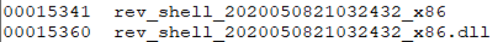
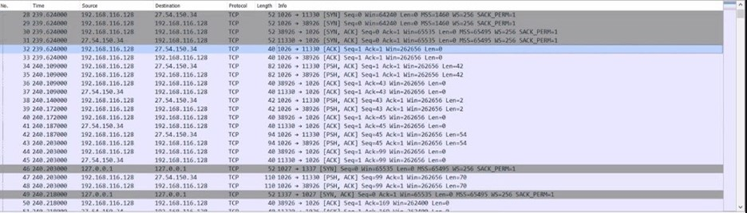
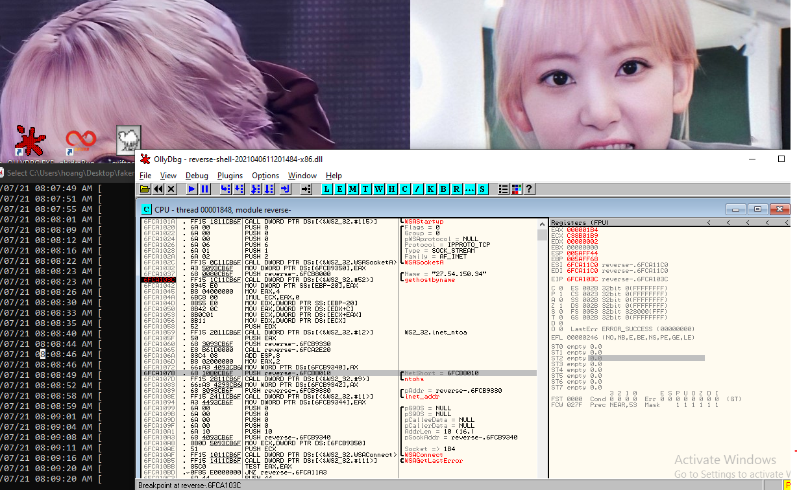

# Assignement 2

As (again) this version is not graded, so we will be having a sakura gif


Disclaimer: part of this report is done by my groupmate. I will not disclose which part, but thank you Pei Pei and Giraffe for your contribution (☆ω☆)

## Reverse shell

Like legit it's just a reverse shell. 

### a.	Host based indicators and/or network indicators (if any) 

27.54.150.34: 11330

and some strings:



### (b) Step-by-step working of your analysis, including static analysis, dynamic analysis and reverse engineering. Give an assessment on the malware functionality

*static*

CFF Explorer, “1588961233.1353054.jpeg” is a PE 32 .NET Assembly, dynamic library file. The file does not appear to be obfuscated.
* MD5 Hash: d28cb18fba2187466e5f9ac60eddf6eb
* Date of Modification: Tuesday 23 March 2021, 15.32.37

The strings mentioned above are extracted with strings.exe

*dynamic*

run fakenet with it, and use ollygdb so it cau auto load the dllusing loaddll.exe:



It shows the Ip and the Port as stateed earlier. 

You can also cheat using advanced dynamic analysis with Ollydbg



*RE*

First, at 0x10001010, 0x10019360 (lpWSAData)  and 202h (514) (wVersionRequired) is pushed onto the stackfor the API WSAStartup to initiate use of the Winsock DLL.

Secondly, the values 0,0,0,6,1,2 is pushed onto the stack, the values will be used as input parameters for the function WSASocketA. WSASocketA requires 6 parameters namely, af, type, protocol, ipProtocolInfo, g and dwFlags. WSASocketA function creates a socket that is bound to a specific transport service provider. (IPV4, TCP Socket Stream)

Next, the value “27.54.150.34” is being pushed to the stack and a call to gethostbyname can be seen. The function retrieves host information corresponding to a host name from a host database. Following, a call to inet_aton is made, inet_aton() converts the Internet host address from the IPv4 numbers-and-dots notation into binary form (in network byte order) and stores it in the structure that it points to. inet_aton() returns nonzero if the address is valid, zero if not. Result is push onto stack and sub_10003540 is called.

Variable hostshort, with a value of 11330 is pushed to stack and htons function is called, which converts a u_short from host to TCP/IP network byte order. Offset cp (cp[16]) is then pushed to stack for function inet_addr, which converts the string pointed to by cp, in the standard IPv4 dotted decimal notation, to an integer value suitable for use as an Internet address. Finally, attempted connection to the internet address is made with WSAConnect.

The interesting bit is in the CreateProcessA that it invoked if WSAGetLastError does not fail. The STARTUPINFOA struct’s stdin and stdout is loaded with eax (the return value of WSAConnect – aka the TCP connection) (left figure below). It then assembles the string “cmd.exe” using sprintf. This is an anti-static analysis technique so strings and floss cannot identify the command from the file as the fragments are mixed into other bytes (left figure below). Then the malware invokes CreateProcessA, (right figure below) with cmd.exe and the STARUPINFOA struct with stdin/out pointed to the TCP crafted before as arguments.  This will launch a command line with environment of the local host, but the terminal is shown at the other end of the TCP. This is indicative of a Reverse shell.

You can see it from the orginal C payload [here](https://github.com/noperator/CVE-2019-18935/blob/master/reverse-shell.c).


**The key to earning mark is how to explain that it's a reverse shell.**

### c.	Any open-source information related to the file			
This file is a payload (reverse shell) that was uploaded into the server via a vulnerability in the Telerik UI. It insecurely deserialize JSON (in its RAUCrypto module), which allow arbitrary file upload. Full writeup can be found out here.

The related CVE are:
*	CVE-2017-11317 — Unrestricted File Upload via Weak Encryption
*	CVE-2019-18935 — Remote Code Execution via Insecure Deserialization
*	CVE-2019-18935 Exploit Details


### d.	Follow-up actions to remediate or prevent further malicious activities.

Telerik mitigated the vulnerability in June 2017 by removing default keys in version R2 2017 SP1 (2017.2.621) and provided users the ability to disable the system feature RadAsyncUpload in version R2 2017 SP2 (2017.2.711). With the following patches being conducted on the system, Telerik was able to remediate and prevent further conduct of malicious activities.

So, to patch, follow the Telerik Advisory:
* Upgrade Telerik for ASP.NET AJAX to R3 2019 SP1 (v2019.3.1023) or later.
* Read Telerik's RadAsyncUpload security guide in its entirety and configure the control according to the recommended security settings.

Incident response measure on the server site:
* Blacklist outbound connection to 27.54.150.34:11330
* Remove any files containing the string rev_shell_[…].dll


## Sender.exe

### (a) Host based indicators and/or network indicators (if any) [1 mark]

Host-based: 
* malwareanalyst
* a full alphabet {a-z}{A-Z}{0-9}+/  (base64 encode charset)
* key.txt

  
Network-based: 
* e1337.net (the C2 server )
* Mozilla/5.0 (Windows NT 6.1; WOW64) KEY (the user agent)

### (b) Step-by-step working of your analysis, including static analysis, dynamic analysis and reverse engineering. Give an assessment on the malware functionality

First using PE viewer we know the sample is UPX-packed. Unpack with upx.exe 

Static: 
* strings as mentioned above

Dynamic: we try to run fakenet with it. 

First error:


Using RE (explain later), we know it open a file in the same dir called key.txt. Creating this file key.txt, rerun and get a second error: 


This gives us an idea that the malware is *exfiltrating data to e1337.net on port 80*. The data seems encrypted. 

Performing RE on the malware start routine: 
* start (base+ 1100)
* Open Existing File (CreateFileA with dwCreationDisposition = 3) called *key.txt* from the current folder.
* If file does not exist, gives error (First Error as shown above)
* If file does exist, invoke [ReadFile](https://docs.microsoft.com/en-us/windows/win32/api/fileapi/nf-fileapi-readfile). Filehandle is at *esi*, the receiving buffer lpBuffer address is *eax* and the number of BytesToRead is  *80000h*. 
* Invoke sub_401250, which takes buffer addr and buffer size as arguments. It also has a string "malwareanalyst" inside. More on this later. 
* Invoke sub_4012A0, which has the base64 charset inside. 
* Chunk the data into 4 bytes each per packet. 
* Start exfiltrating at (base+401000):
  * [InternetOpenA](https://docs.microsoft.com/en-us/windows/win32/api/wininet/nf-wininet-internetopena) with UserAgent *Mozilla/5.0 (Windows NT 6.1; WOW64) KEY*. This initializes the malware's use of the WinINet functions. 
  * [InternetConnectA](https://docs.microsoft.com/en-us/windows/win32/api/wininet/nf-wininet-internetconnecta) with url e1337.net and port 80. This opens a HTTP session.
  * [HttpOpenRequestA](https://docs.microsoft.com/en-us/windows/win32/api/wininet/nf-wininet-httpopenrequesta) to create an HTTP request handle. The Verb is POST and object is / (root folder). 
  * [HttpSendRequest](https://docs.microsoft.com/en-us/windows/win32/api/wininet/nf-wininet-httpsendrequesta) to send the 4bytes to the server. 

The chunking can be seen here:


As we roughly know the flow of the malware, we can expect sub_401250 and sub_4012A0 to be the encryption routine. 

Analyzing these two routines yield:
1. sub_4012A0 is a base64 encode routine with a custom character set. 
2. sub_401250 is a simple key-based encryption


It uses the magic number 24924925, which is an optimization trick mentioned in [Hacker's Delight Book](https://doc.lagout.org/security/Hackers%20Delight.pdf) for division and modulo related ops. Here, it is used to perform the modulo of the loop counter on ecx, which is possibly the length of our key 'malwareanalyst'. 

We can summarize the function as:
```
for (i = 0; i < buff_len; i++){buff[i] += KEY[i % KEY_LEN]}
```

In summary: 
```
1. Read the file key.txt into a buffer
2. Encrypt the buffer with a key 'malwareanalyst' using the above simple encryption
3. Base64 encode the buffer
4. Send the data to e1337.net:80/ by 4 byte packets, probably for stealth reasons. 
```
(c) Determine if any information had been exfiltrated. Show the original contents (if any). You are strongly encouraged to write a program / script for this task. 

We can create a python script that can scrap the data portion of any TCP with the user agent 'Mozilla/5.0 (Windows NT 6.1; WOW64) KEY', then base64 decode (already done in Tutorial 6) and then decrypt by subtracting 'malwareanalyst''s char off each byte in the same way it was encrypted.

The file is called [flareon15.py](./flareon15.py). I made use of scapy to read the tcp and extract the info. 

The result is: 


Going to the pastebin:


Tada! That's it we got the flag. 

*Honorable mention:*

The ascii art for the junk packets are nice too:


# Conclusion


It was a not a hard assignment tbh given how a tutorial is also flareon now :) So welps

Thank you prof for making my life abit easier


*It's always Sakura and Chaeng for assignments*

[Back to Main Menu](./../)


