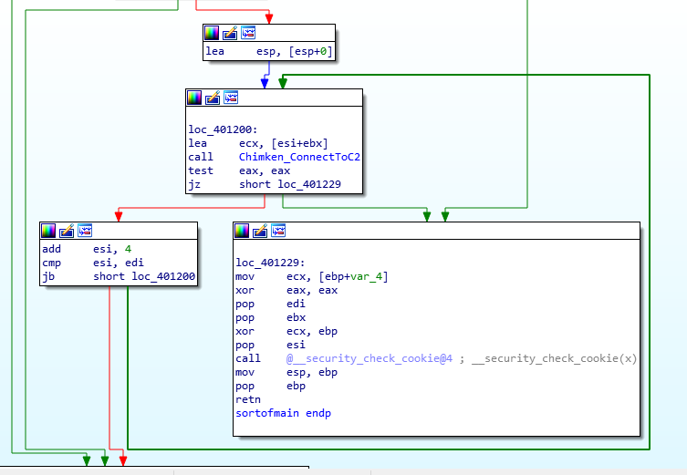

# Assignement 2

As (again) this version is not graded, so we will be having a sakura gif


## Reverse shell

## Sender.exe

(a) Host based indicators and/or network indicators (if any) [1 mark]

Host-based: 
* malwareanalyst
* a full alphabet {a-z}{A-Z}{0-9}+/  (base64 encode charset)
* key.txt

  
Network-based: 
* e1337.net (the C2 server )
* Mozilla/5.0 (Windows NT 6.1; WOW64) KEY (the user agent)

(b) Step-by-step working of your analysis, including static analysis, dynamic analysis and reverse engineering. Give an assessment on the malware functionality

First using PE viewer we know the sample is UPX-packed. Unpack with upx.exe 

Static: 
* strings as mentioned above

Dynamic: we try to run fakenet with it. 

First error:


Using RE (explain later), we know it open a file in the same dir called key.txt. Creating this file key.txt, rerun and get a second error: 


This gives us an idea that the malware is *exfiltrating data to e1337.net on port 80*. The data seems encrypted. 

Performing RE on the malware start routine: 
* start (base+ 1100)
* Open Existing File (CreateFileA with dwCreationDisposition = 3) called *key.txt* from the current folder.
* If file does not exist, gives error (First Error as shown above)
* If file does exist, invoke [ReadFile](https://docs.microsoft.com/en-us/windows/win32/api/fileapi/nf-fileapi-readfile). Filehandle is at *esi*, the receiving buffer lpBuffer address is *eax* and the number of BytesToRead is  *80000h*. 
* Invoke sub_401250, which takes buffer addr and buffer size as arguments. It also has a string "malwareanalyst" inside. More on this later. 
* Invoke sub_4012A0, which has the base64 charset inside. 
* Chunk the data into 4 bytes each per packet. 
* Start exfiltrating at (base+401000):
  * [InternetOpenA](https://docs.microsoft.com/en-us/windows/win32/api/wininet/nf-wininet-internetopena) with UserAgent *Mozilla/5.0 (Windows NT 6.1; WOW64) KEY*. This initializes the malware's use of the WinINet functions. 
  * [InternetConnectA](https://docs.microsoft.com/en-us/windows/win32/api/wininet/nf-wininet-internetconnecta) with url e1337.net and port 80. This opens a HTTP session.
  * [HttpOpenRequestA](https://docs.microsoft.com/en-us/windows/win32/api/wininet/nf-wininet-httpopenrequesta) to create an HTTP request handle. The Verb is POST and object is / (root folder). 
  * [HttpSendRequest](https://docs.microsoft.com/en-us/windows/win32/api/wininet/nf-wininet-httpsendrequesta) to send the 4bytes to the server. 

The chunking can be seen here:



As we roughly know the flow of the malware, we can expect sub_401250 and sub_4012A0 to be the encryption routine. 

Analyzing these two routines yield:
1. sub_4012A0 is a base64 encode routine with a custom character set. 
2. sub_401250 is a simple key-based encryption


It uses the magic number 24924925, which is an optimization trick mentioned in [Hacker's Delight Book](https://doc.lagout.org/security/Hackers%20Delight.pdf) for division and modulo related ops. Here, it is used to perform the modulo of the loop counter on ecx, which is possibly the length of our key 'malwareanalyst'. 

We can summarize the function as:
```
for (i = 0; i < buff_len; i++){buff[i] += KEY[i % KEY_LEN]}
```

In summary: 
```
1. Read the file key.txt into a buffer
2. Encrypt the buffer with a key 'malwareanalyst' using the above simple encryption
3. Base64 encode the buffer
4. Send the data to e1337.net:80/ by 4 byte packets, probably for stealth reasons. 
```
(c) Determine if any information had been exfiltrated. Show the original contents (if any). You are strongly encouraged to write a program / script for this task. 

We can create a python script that can scrap the data portion of any TCP with the user agent 'Mozilla/5.0 (Windows NT 6.1; WOW64) KEY', then base64 decode (already done in Tutorial 6) and then decrypt by subtracting 'malwareanalyst''s char off each byte in the same way it was encrypted.

The file is called [flareon15.py](./flareon15.py). I made use of scapy to read the tcp and extract the info. 

The result is: 


Going to the pastebin:


Tada! That's it we got the flag. 

*Honorable mention:*

The ascii art for the junk packets are nice too:


# Conclusion


