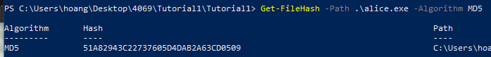
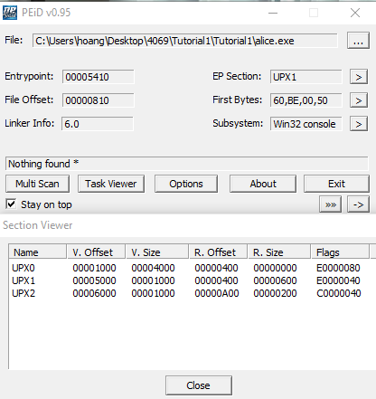
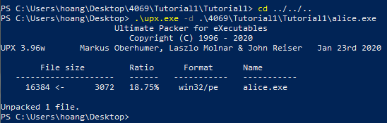
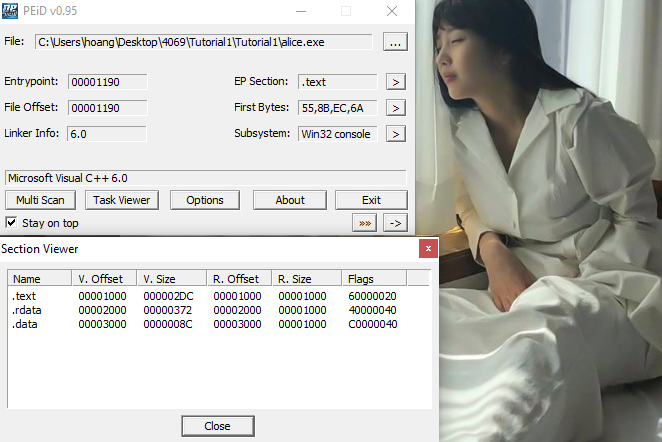
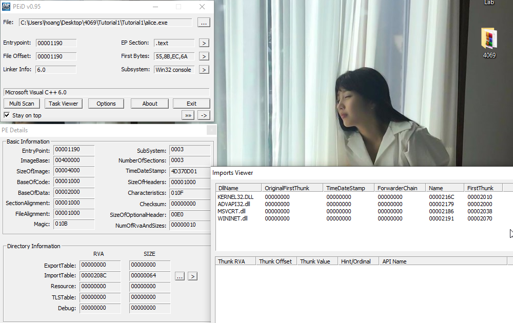
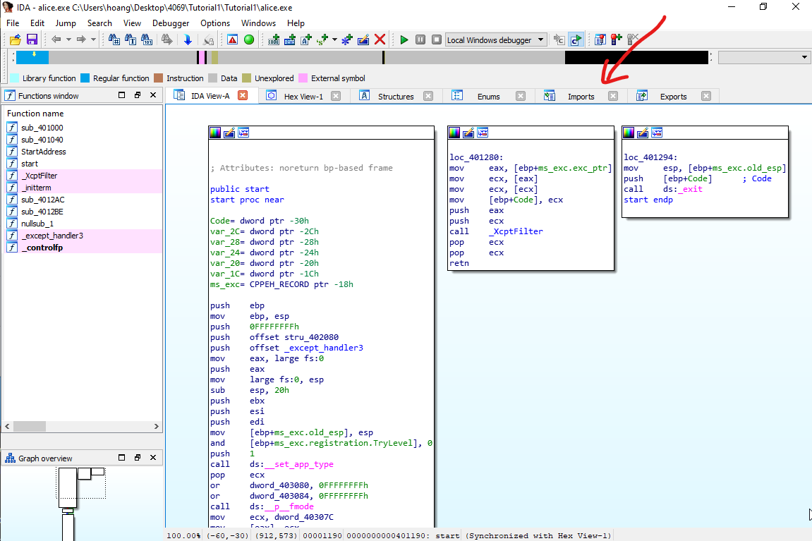
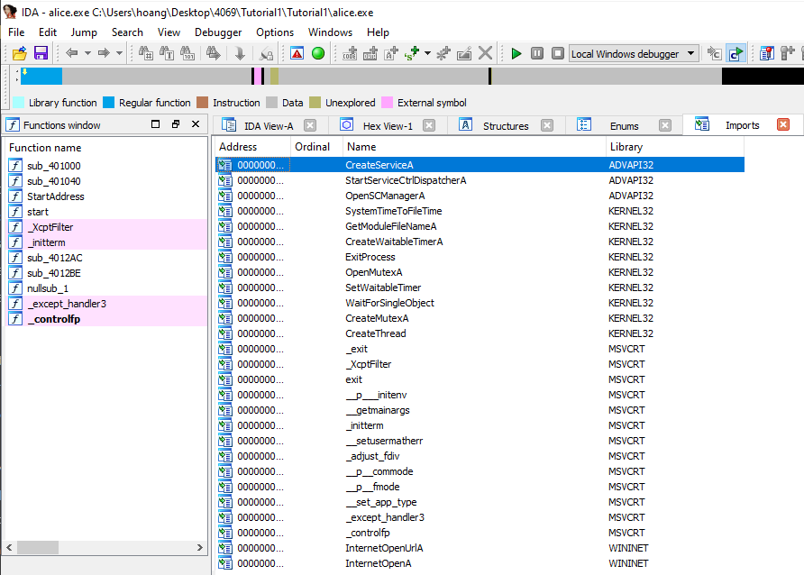
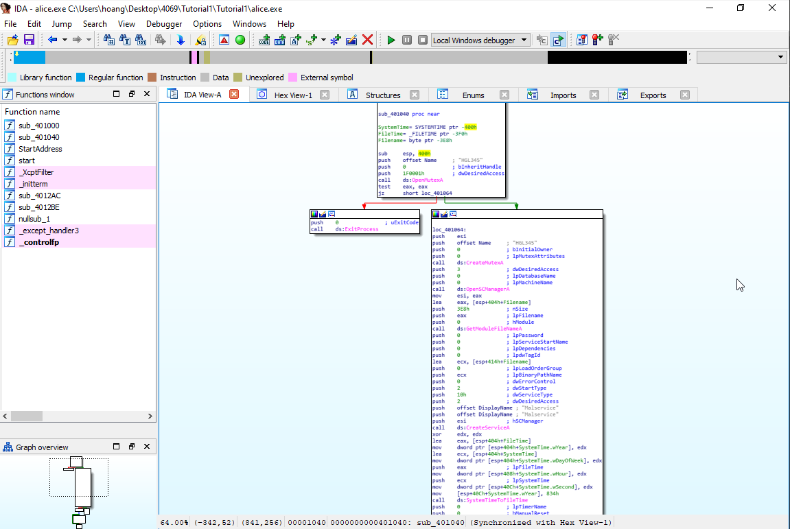

## Tutorial 1: Basic Static Analysis

### (a) alice.exe 

We first unpack the folder into our favorite spot and disable Windows scan on that folder 

The first thing we need to do is to check the MD5 checksum of the file. 
After some googling, I found out that Win Powershell has some built in tools for this

So the file is uncorrupted. Now let's check the sections with _**PEiD**_. You can use any other tools like PEViewer or PEStudio if you like. For PEiD, press the **\[...\]** button on the top right hand corner, on the row with **File:** to load the file in. Click on **\>** next to **EP Section** to view the sections.

We can see that the sections are named UPX0, UPX1 and UPX2, which are characteristic of a UPX-packed program. We also noticed that the Physical size is much smaller than the Virtual size -- meaning that in the disk/drive (**R.Size**) it only take a small space, but in memory (during execution, **V.Size**) it takes up much more. This is a very clear indication of packed malware. Therefore we will need to unpack this file before proceeding further. 

I have found the original UPX packer [here](https://upx.github.io/) on github. You can download the exe into your malware lab. 

Using upx unpacker (this thing does not preserve original file... I had to unpack the original .7z for this post)

 

_the -d means decrypt_

After unpacking, the resulting sections look like this

We should also check on other basic details (compilation time, imports, exports, etc..) by clicking on **>** subsystem, followed by \[...\] near ImportTable.

The time is in epoch time. You can convert it [here](https://www.epochconverter.com/) and get the time as **Wednesday, January 19, 2011 4:10:41 PM** (GMT+00:00).

Usually we will only spend 1-2mins checking these details, before jumping into more static analysis with IDA. Since there is an __imports__ table in IDA, I usually check the imports there (as it provides more useful details which subroutine invoke those imports). However for this tutorial purpose, I will also show you how it will look like if view from PEiD. 

If we load the files into IDA, we will see this: 

IDA has many views for different purposes -- Hex, Structures, Graph, Enums,... If you want to enable certain views, go to **Windows** tab on topbar and enable it. 

The imports views of alice.exe:

And we'll see the same things, but more details (that are useful for analysis). 

## **\<\<  IDA sections   \>\>**

If you go into tracing the call graph of alice.exe, ignoring all the windows function wrapper (that do the necessary environment setup), we will notice **\_\_sub401040\_\_** is where all the fun is. 

I can roughly summarize the functionalities, based on the graph as followed:
1. Start malService in the infected machine
2. Create a timer of ...
3. Continous create thread that do \_\_sub????\_\_ 
4. Open the URL defined by szURL \(http://www.CZCE4069FINDPROFLAM.com\) 
5. _Effectively create a DDoS attack on the site_ 