## Tutorial 1: Basic Static Analysis

The tutorial is abit lengthy, so you can jump to specific parts by this:

[(a). alice.exe](#alice_section)

[(b). bobby.exe](#bobby_section)

Also, the answer will be put in block quote, like this:
```
This is a sample answer
```
Now let's dive in. 

### <a name="alice_section">(a) alice.exe </a>

We first unpack the zip given into our favorite spot and disable Windows scan on that folder 

The first thing we need to do is to check the MD5 checksum of the file. 
After some googling, I found out that Win Powershell has some built in tools for this


So the file is uncorrupted. Now let's check the sections with _**PEiD**_. You can use any other tools like PEViewer or PEStudio if you like. For PEiD, press the **\[...\]** button on the top right hand corner, on the row with **File:** to load the file in. Click on **\>** next to **EP Section** to view the sections.


We can see that the sections are named UPX0, UPX1 and UPX2, which are characteristic of a UPX-packed program. We also noticed that the Physical size is much smaller than the Virtual size -- meaning that in the disk/drive (**R.Size**) it only take a small space, but in memory (during execution, **V.Size**) it takes up much more. This is a very clear indication of packed malware. Therefore we will need to unpack this file before proceeding further. 

```
Answer to (a): yes alice.exe is packed
```

I have found the original UPX packer [here](https://upx.github.io/) on github. You can download the exe into your malware lab. 

Using upx unpacker (this thing does not preserve original file... I had to unpack the original .7z for this post)

 

_the -d means decrypt_

After unpacking, the resulting sections look like this


We should also check on other basic details (compilation time, imports, exports, etc..) by clicking on **>** subsystem, followed by \[...\] near ImportTable.


The time is in epoch time. You can convert it [here](https://www.epochconverter.com/) and get the time as **Wednesday, January 19, 2011 4:10:41 PM** (GMT+00:00).

Usually we will only spend 1-2mins checking these details, before jumping into more static analysis with IDA. Since there is an __imports__ table in IDA, I usually check the imports there (as it provides more useful details which subroutine invoke those imports). However for this tutorial purpose, I will also show you how it will look like if view from PEiD. 

If we load the files into IDA, we will see this: 


IDA has many views for different purposes -- Hex, Structures, Graph, Enums,... If you want to enable certain views, go to **Views>Open Subview** tab on topbar and enable it. 

The imports views of alice.exe:


And we'll see the same things, but more details (that are useful for analysis). 

Looking at thse imports, we notice it uses **ADVAPI32.dll**, **KERNEL32.dll** and **WININET.dll** (**MSCVRT.dll** is Windows C/C++ functions dll, uses for malloc, input output and mostlikely won't be important to us for now). The functions that are used is listed on the ida pane. 

From the list of functions (you can google for their specific usage, but from the name we can roughly know), we can infer:
```
ADVAPI32 was imported to create service, start service
KERNEL32 was imported to create timer, create and access mutex, create thread
WININET was imported to make a internet connection (open an url)
```

IDA also have a subviews called **Strings** that list all the literal strings used by the program. (It's in View>Open Subview> String) Let's take a look at that too: 

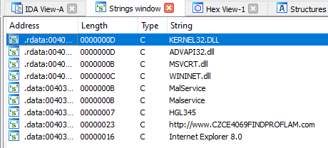

Most of the strings are the imports, but there are three interesting one:
```
Network-based indicator:
1. An URL that is http://www.CZCE4069FINDPROFLAM.com
Host-based indicator:
2. A service called MalSevice and Malservice
3. A mutex called HGL345
```

By now the tutorial is finished for (a), but then why stop here...

## **In-depth section**

If you go into tracing the call graph (how the program executes) of alice.exe, ignoring all the windows function wrapper (that do the necessary environment setup), we will notice **\_\_sub401040\_\_** is where all the fun is. 

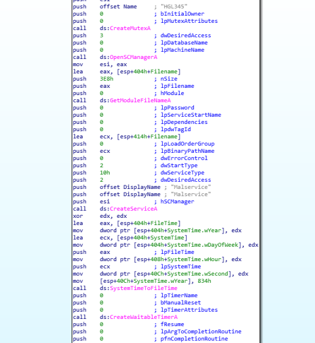

We can roughly summarize the functionalities, based on the graph as followed:
1. Create mutex "HGL345" -- this is to prevent the malware to infect the same machine again
2. Establishes connection to the service control manager (OpenSCManagerA)
3. Gets handle of current process (GetCurrentProcess), gets File name (GetModuleFileNameA).
4. Creates the service named “Malservice” (CreateServiceA) 
5. Create a timer of 0x834 (834h) years -- 2100 years
6. Create 20 thread (shown below) whose task is at __StartAddress__ subroutine
   
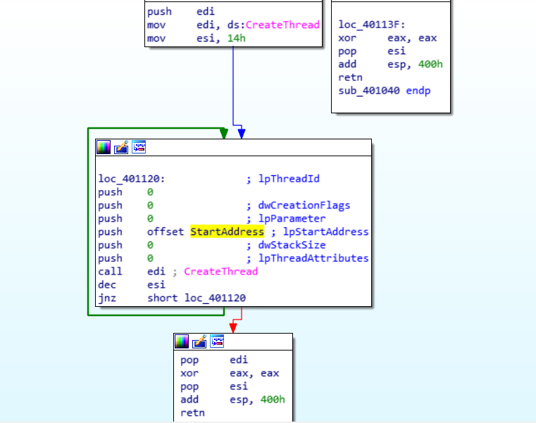

_In the original code, the 400h argument in the last subroutine was to be passed to sleep (to put the program to sleep for 1024hrs -- roughly 6 weeks before exiting). But I guess our prof removed it._

The **StartAddress** subroutine does: 

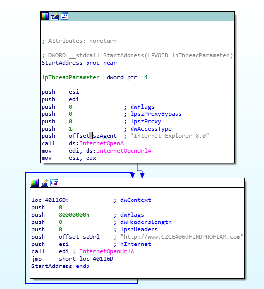

1. Start userAgent (browser) szAgent: Internet Explorer 8.0
2. Open the URL defined by szURL \(http://www.CZCE4069FINDPROFLAM.com\) and connect to it 
3. Never stop, _effectively create a DDoS attack on the site_ 
    

```
In short, alice.exe is a part of a botnet that tries to DDoS the poor url. 
```
### <a name="bobby_section">(b). Bobby</a>

If you have read alice.exe section, you'll know i will follow the same steps so


0. Check MD5 -- you can NEVER be too safe, plus it takes 30s:
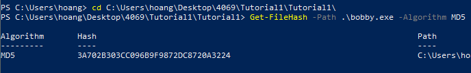

1. Check with PEiD:

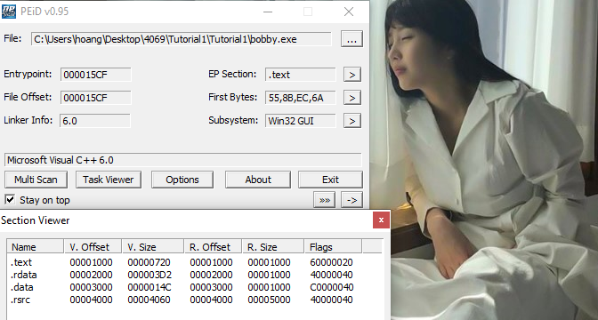

```
It doesn't look packed. Most sections doesn't show size expansion upon execution. 
```

2. Check imports and other basic details


Now the compilation date looks abit too big. [Epoch Converter](http://www.epochconverter.com) says that the date is:**Monday, January 31, 2039 3:11:11 AM**

```
As such this program compilation date was clearly forged. 
```

Also if you notice, PEiD has picked up a resouce in this file. 

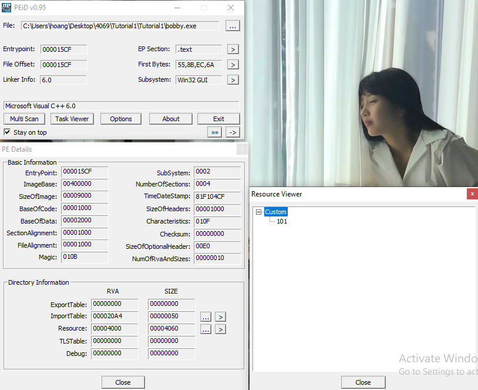

But let's look at it later. 

For now, let's continue the analysis of bobby.exe and its functions. Using IDA with load resource enabled (enable that [here](./Assets/ida_load_resc.png))

Looking at its Imports
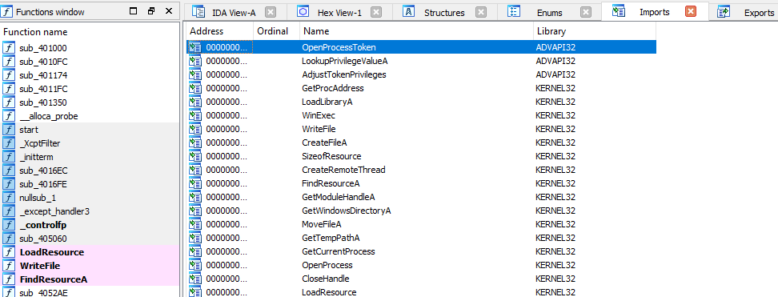

```
token privilege -- likely to do something with writing in privileged mode
Load Library and write file 
Remote thread -- it needs something from another process 
A few other directory get functions

ANS: we guess, up to this point that this malware will load some library, create some malicious file that it isn't supposed to, and run that file. 
```

And in the strings it uses:

_.data_
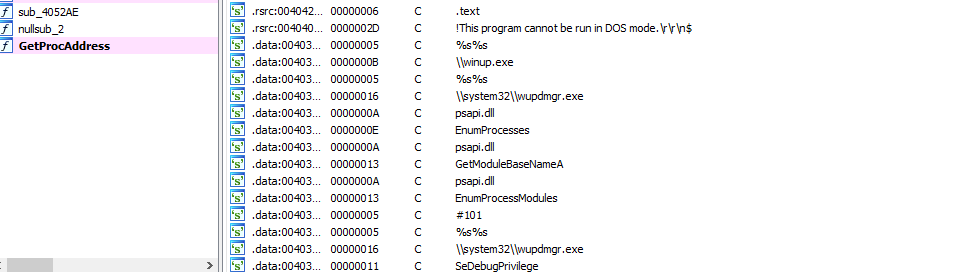

_.rsrc_ (resource)

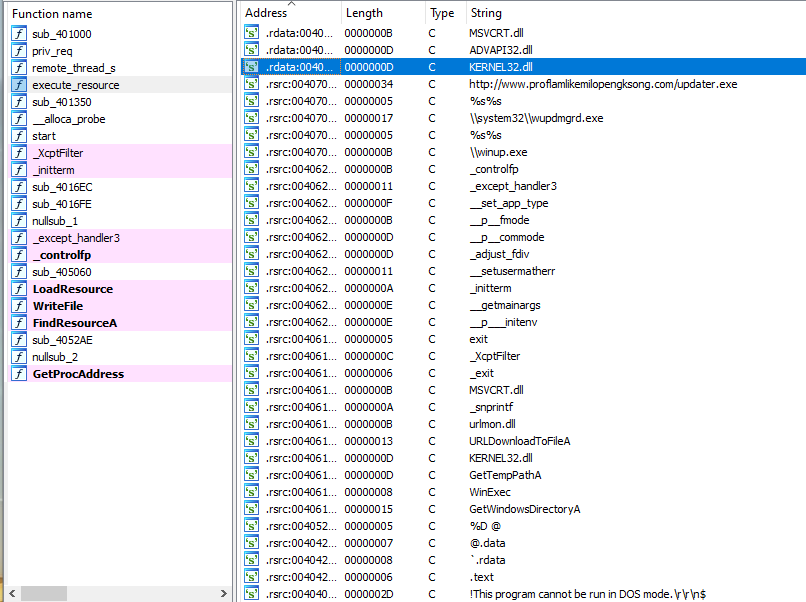

We can spot some funky strings the program is trying to use:
```
Network-based indicator: 
http://proflamlikemilopengksong.com/updater.exe

Host-based indicator:
winup.exe
system32/wupdmgrd.exe 
```

Does this reveal any hints? Probably not ...
BUT it smells fishy in several way, not necessarily malicious but: 
1. There is an external url in the rsrc section (first entry) and a function URLDownloadToFileA, which suggests attempt todownload from external source.
2. SeDebugPrivilege, Token and Privs related functions, which suggests the malware may escalate privilege in the system
3. WinExec -- there is something else to be run here when this malware executes
4. Functions related to file and GetTempPathA -- create, move files, maintaining low visibility via temporary files
5. GetProcAddress and LoadLibraryA -- it can dynamically resolve and import external resources (aka during execution). Things it import can be from url (point 1), resource (point 7), or several dll strings we see such as urlmon.dll, psapi.dll
6. CreateRemoteThread and OpenProcess -- it may inject code into running process, which is quite worrisome with point 4. The things is CreateRemoteThread are NOT allowed to be run in user mode, so all the more worried that point 2 will happen. 
7. Resource related Fns -- in line with point 5 


If you have a hunch by now, you are probably right: these signs should probably means the malware is actually just download/update (illegally -- in privilege escalated manner) some payload dynamically and then execute that thing. At least, that's a pretty good guess for now. 

****_post_edits_**: I didn't expect the deep dive to be this long, so I will move the resource analysis on top. Those who stay for the call graph yall are free to do so. 

For the resource BIN101

You can use either Resource Hacker or IDA or PEStudio to extract the thing out. I used Resource Hacker for this and it's an executable -- you can tell by the header 4D5A -- the MZ DOS header .

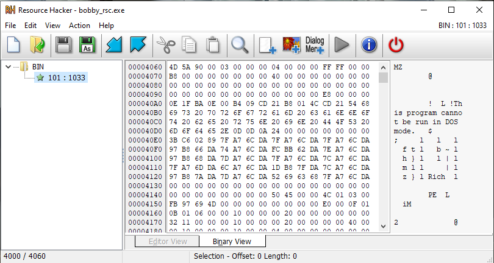

Export this file as a binary file (save*.bin resources option in resource hacker). IDA this file we get

_the imports_
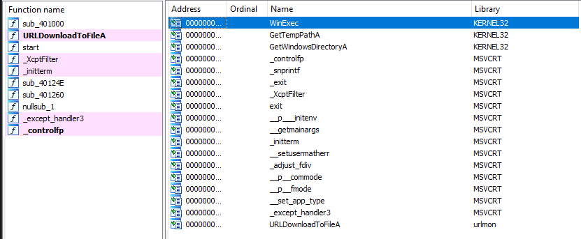

_the strings_ 
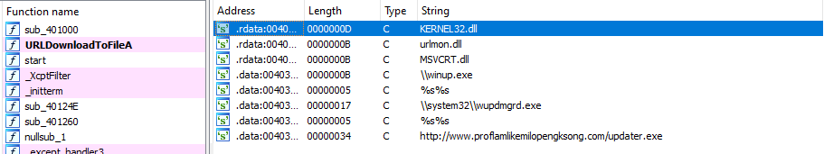

```
Can you find out which dates were this exe resource compiled?
This time round it shouldn't be forged already...
```

We can tell that this resource try to locate a directory (**GetTempPathA** and **GetWindowDirectoryA**), and download a file from the url **http://proflamlikemilopengksong.com/updater.exe**


Viewing in graph form, we know that in the infected system this file will be named **\\\\system32\\\\wupdmgrd.exe**

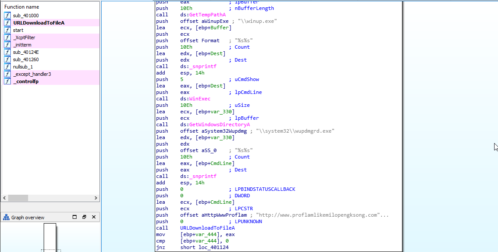

[Run to summary of what happened](#booby_summary)

## In-depth section
Let's dive: 

After identifying main, we noticed that this malware dynamically load some process, from psapi.dll: 

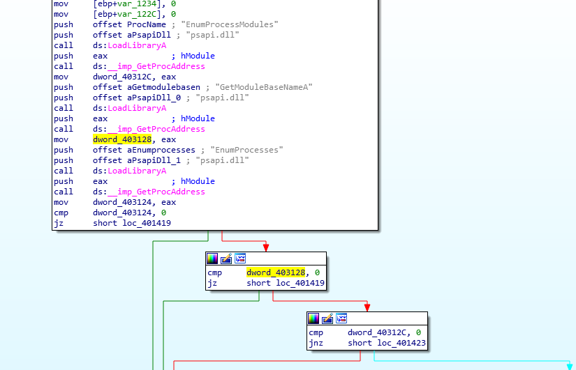

Follow eax the result (and many other things, but in this case it is the result of function calls) we can see that 
_ dword_403123 is GetModuleBaseNameA
_ dword_40312C is EnumProcessModules 
_ dword_403124 is EnumProcesses

Rename these variables to their respective Modules, we can see what the malware do next is to enumerate through all processes in the system. _What is it looking for?_  

In the [search loop](./Assets/bobby_whileloop.png)  it iterates through the list of processes, and call **sub_401000** on two strings... You can see the horrendous amount of raw address [here](./Assets/bobby_raw_addr.png). Turns out it tries to do a **stricmp** (compare ignore cases). 

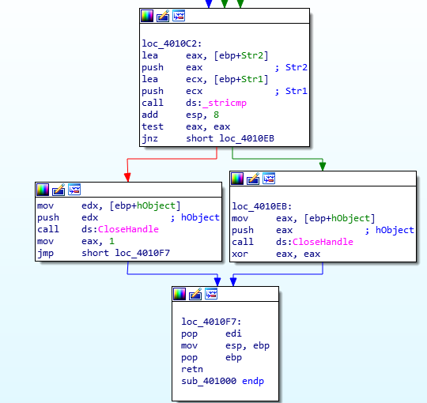

_So it is looking for something!! A string -- a process id to be exact_

However it would be closed to impossible to recognize what processID it is looking for by looking at the hex, so I run it in Ollydbg to see what's being pushed into the stack (IDA gave me the address of stricmp in hex, i just need to Ctrl+G it in Olly): 

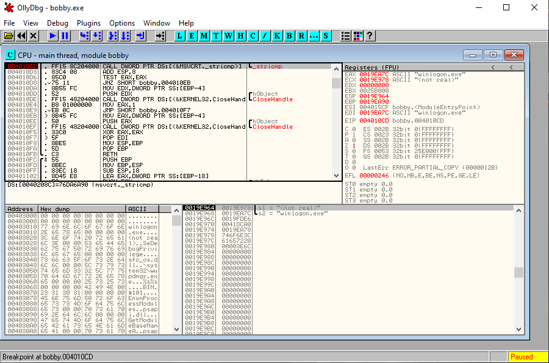

After a few F8 to get a few looks at the while loop, we found it. 

**_It's looking for winlogon.exe_**

Looking at the loop again

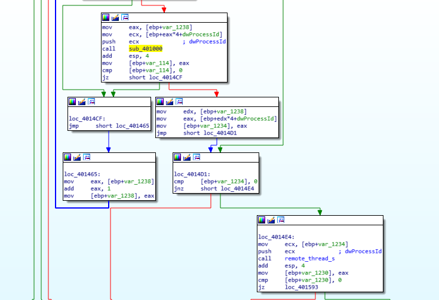

The stricmp operations will continue looping if result is 0. On return value of 1, it will switch branch -- to **_remote_thread_s_** (I renamed this subroutine earlier when we were looking at the string because it allows a process to inject things in another process). So now the victim process is **winlogon.exe**. That doesn't sound so good...

remote_thread_s has the offset **SeDebugPrivilege** string that we identified earlier. By now we can guess that this malware is trying to escalate privilege by taking the token of **winlogon.exe**, and use it to probably **createRemoteThread**. But _how is it going to do so?_ We jump into the function where it does so: 

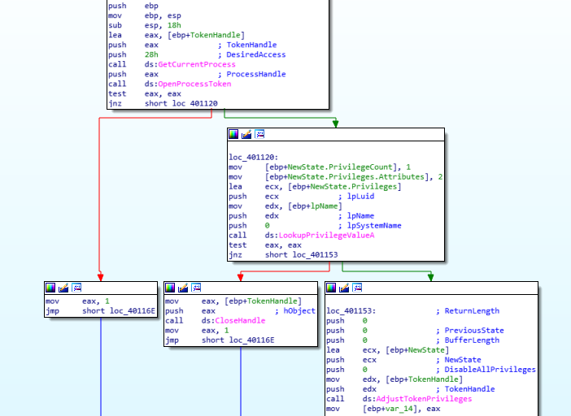

We saw some very interesting function names. With that, we can guess how the malware casually upgrades itself by casually copying the Privilege of winlogon.exe into itself. Not spending too much time on this -- although if has time i will get back to it later. For now I'm comfortable enough knowing it borrows privileges. 7Trust me I have as much questions as you regarding this -- how can a process adjust itself like this??? but this is a bit too advanced for me at the moment. 

After the malware succeeds at priv esc, it loads another library:

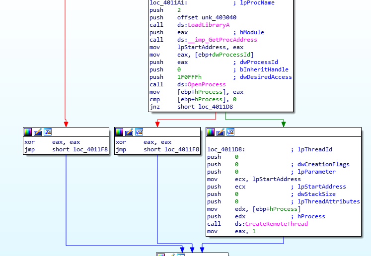

Ollydbg tells me it's **sfc_os.dll**. [here is the docs](). It looks like some file protection things. 

Now if you notice in the big subroutine, it's trying to access a function inside sfc_os.dll. To be precise, ordinal 2 function, which by the docs above is SfcTerminateWatcherThread 

So the original code can be something along this line:
```
typedef DWORD(__stdcall *CPP) (DWORD param1, PWCHAR param2, DWORD param3);

void Disable_WFP(filepath) {
    hmod=LoadLibrary("sfc_os.dll");
    CPP SetSfcFileException;
    // the function is stored at the fifth ordinal in sfc_os.dll
    SetSfcFileException=(CPP)GetProcAddress(hmod,(LPCSTR)2);
    SetSfcFileException(0, filepath,-1);
    // Now we can modify the system file in a complete stealth.
}
```

If you are interested, there are a few interesting articles on how to disable WPF (win file protection) dynamically [here](https://ntcore.com/files/wfp.htm) and [here](https://www.aldeid.com/wiki/WFP-Windows-File-Protection)

I guess it's just a known method to disable file protection, by using winlogon.exe (the second link above explains it concisely why we ended up in this mess)

After it succedds and return (we haven't been to this page in a while):

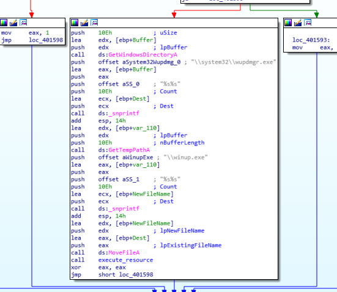

So now it makes sense that the file **wupdmgr.exe** (that is downloaded by the resource) is copied to Temp folder, under the name **winup.exe**. After that it **execute** the **resource** via that function i renamed earlier.

This function carries out the running of the executable inside the resource. It also execute WinExec on winup.exe (in the resource) and the system32\wupdmgr.exe as well. 

<a name="bobby_summary">In summary</a>
```
In short, bobby.exe 
- privilege escalte itself by disabling WFP with one of the known technique (via winlogon.exe)
- download a file from the url (an updater executable) from its .rsrc 
- moved a copy of it to %TEMP% by its now escalated privilege
- execute this file from both location. 

This helps the malware achieve better persistence. It is likely it works with another program (which explains the double WinExec of an updater).

This is typical of malware loader/updater program. 
```

### And.... that's it for the first tutorial!! See ya next time


