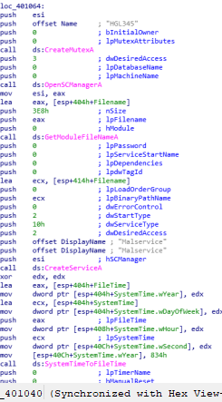
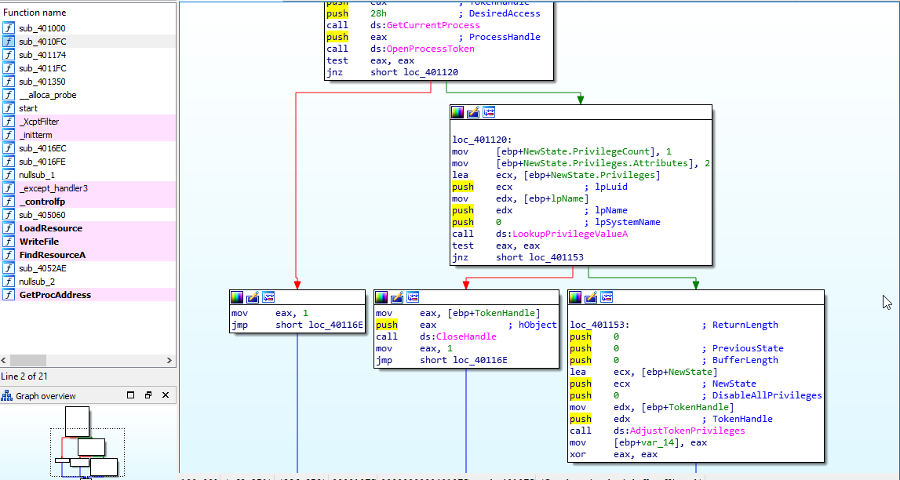
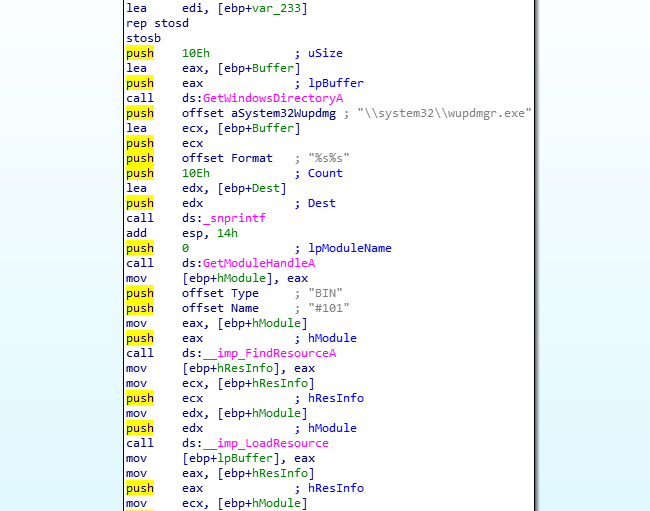

## Tutorial 1: Basic Static Analysis

The tutorial is abit lengthy, so you can jump to specific parts by this:

[(a). alice.exe](#alice_section)

[(b). bobby.exe](#bobby_section)

Also, the answer will be put in block quote, like this:
```
This is a sample answer
```
Now let's dive in. 

### <a name="alice_section">(a) alice.exe </a>

We first unpack the zip given into our favorite spot and disable Windows scan on that folder 

The first thing we need to do is to check the MD5 checksum of the file. 
After some googling, I found out that Win Powershell has some built in tools for this


So the file is uncorrupted. Now let's check the sections with _**PEiD**_. You can use any other tools like PEViewer or PEStudio if you like. For PEiD, press the **\[...\]** button on the top right hand corner, on the row with **File:** to load the file in. Click on **\>** next to **EP Section** to view the sections.


We can see that the sections are named UPX0, UPX1 and UPX2, which are characteristic of a UPX-packed program. We also noticed that the Physical size is much smaller than the Virtual size -- meaning that in the disk/drive (**R.Size**) it only take a small space, but in memory (during execution, **V.Size**) it takes up much more. This is a very clear indication of packed malware. Therefore we will need to unpack this file before proceeding further. 

```
Answer to (a): yes alice.exe is packed
```

I have found the original UPX packer [here](https://upx.github.io/) on github. You can download the exe into your malware lab. 

Using upx unpacker (this thing does not preserve original file... I had to unpack the original .7z for this post)

 

_the -d means decrypt_

After unpacking, the resulting sections look like this


We should also check on other basic details (compilation time, imports, exports, etc..) by clicking on **>** subsystem, followed by \[...\] near ImportTable.


The time is in epoch time. You can convert it [here](https://www.epochconverter.com/) and get the time as **Wednesday, January 19, 2011 4:10:41 PM** (GMT+00:00).

Usually we will only spend 1-2mins checking these details, before jumping into more static analysis with IDA. Since there is an __imports__ table in IDA, I usually check the imports there (as it provides more useful details which subroutine invoke those imports). However for this tutorial purpose, I will also show you how it will look like if view from PEiD. 

If we load the files into IDA, we will see this: 


IDA has many views for different purposes -- Hex, Structures, Graph, Enums,... If you want to enable certain views, go to **Views>Open Subview** tab on topbar and enable it. 

The imports views of alice.exe:


And we'll see the same things, but more details (that are useful for analysis). 

Looking at thse imports, we notice it uses **ADVAPI32.dll**, **KERNEL32.dll** and **WININET.dll** (**MSCVRT.dll** is Windows C/C++ functions dll, uses for malloc, input output and mostlikely won't be important to us for now). The functions that are used is listed on the ida pane. 

From the list of functions (you can google for their specific usage, but from the name we can roughly know), we can infer:
```
ADVAPI32 was imported to create service, start service
KERNEL32 was imported to create timer, create and access mutex, create thread
WININET was imported to make a internet connection (open an url)
```

IDA also have a subviews called **Strings** that list all the literal strings used by the program. (It's in View>Open Subview> String) Let's take a look at that too: 


Most of the strings are the imports, but there are three interesting one:
```
Network-based indicator:
1. An URL that is http://www.CZCE4069FINDPROFLAM.com
Host-based indicator:
2. A service called MalSevice and Malservice
3. A mutex called HGL345
```

By now the tutorial is finished for (a), but then why stop here...

## **In-depth section**
##### _You might want to skip this part if you just want the answer. This part will be confusing to some._

If you go into tracing the call graph (how the program executes) of alice.exe, ignoring all the windows function wrapper (that do the necessary environment setup), we will notice **\_\_sub401040\_\_** is where all the fun is. 



I can roughly summarize the functionalities, based on the graph as followed:
1. Create mutex "HGL345" -- this is to prevent the malware to infect the same machine again
2. Establishes connection to the service control manager (OpenSCManagerA)
3. Gets handle of current process (GetCurrentProcess), gets File name (GetModuleFileNameA).
4. Creates the service named “Malservice” (CreateServiceA) 
5. Create a timer of 0x834 (834h) years -- 2100 years
6. Create 20 thread (shown below) whose task is at __StartAddress__ subroutine
   


_In the original code, the 400h argument in the last subroutine was to be passed to sleep (to put the program to sleep for 1024hrs -- roughly 6 weeks before exiting). But I guess our prof removed it._

The **StartAddress** subroutine does: 


1. Start userAgent (browser) szAgent: Internet Explorer 8.0
2. Open the URL defined by szURL \(http://www.CZCE4069FINDPROFLAM.com\) and connect to it 
3. Never stop, _effectively create a DDoS attack on the site_ 
    

```
In short, alice.exe is a part of a botnet that tries to DDoS the poor url. 
```
### <a name="bobby_section">(b). Bobby</a>

If you have read alice.exe section, you'll know i will follow the same steps so:

1. Check with PEiD:


```
It doesn't look packed
```

2. Check imports and other basic details


Now the compilation date looks abit too big. [Epoch Converter](http://www.epochconverter.com) says that the date is:**Monday, January 31, 2039 3:11:11 AM**

```
As such this program compilation date was clearly forged. 
```

Also if you notice, PEiD has picked up a resouce in this file. 


But let's look at it later. 

For now, let's continue the analysis of bobby.exe and its functions


```
bobby.exe adjust token privilege -- likely to do something with writing in restricted section
Load Library and write file
Remote thread -- it needs something from another process 
A few other directory get functions
```

And in the strings it uses:


bobby.exe do a few weird things:
1. It adjust a process privileges



2. It load a resource called BIN101



into a file called 'wupdmgrd.exe' which it later executes. 

```
Host-base indicator
winup.exe and system32/wupdmgrd.exe are the two executable that is run by the malware.  
```

For the resource BIN101

You can use either Resource Hacker or IDA or PEStudio to extract the thing out. I used Resource Hacker for this, and I dump this resource out as an exe -- you can tell by the header 4D5A -- the MZ DOS header .


Export this file as a binary file (save*.bin resources option in resource hacker). IDA this file we get

_the imports_


_the strings_ 


```
Can you find out which dates were this exe resource compiled?
This time round it shouldn't be forged already...
```

We can tell that this resource try to locate a directory (**GetTempPathA** and **GetWindowDirectoryA**), and download a file from the url **http://proflamlikemilopengksong.com/updater.exe**

```
Network-based indicator: http://proflamlikemilopengksong.com/updater.exe
```

Viewing in graph form, we know that in the infected system this file will be named **\\\\system32\\\\wupdmgrd.exe**


```
In short, bobby.exe adjusts its own privileges to download a file from the url (an updater executable) into the infected machine, and execute this file. This is typical of malware loader program. 
```


And.... that's it for the first tutorial!! See ya


