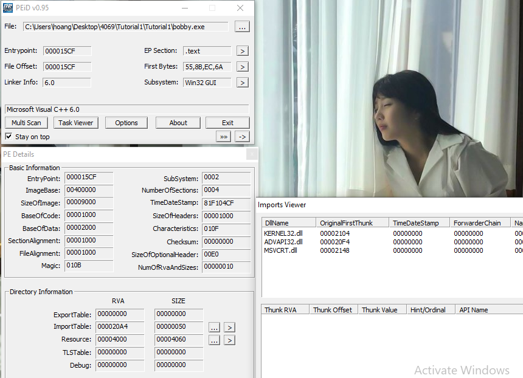

## Tutorial 1: Basic Static Analysis

For each part given, I will do a basic analysis with the tools of my preference (so sorry about this... but there's just too many tools and I can't cover all of them. If you happen to use a different tool from mine, do not fret! A few quick googles should show you how to get the same objective). This analysis will cover most tutorial questions. Following that there will be a in-depth section where I do some intermediate level analysis of the execution of the malware in IDA. You can skip that part, it's not important for the tutorial and if you don't understand all the things I said, don't worry about it. 

The tutorial is abit lengthy, so you can jump to specific parts by this:

[(a). alice.exe](#alice_section) 

[(a). Summary of alice purpose](#alice_summary)

[(b). bobby.exe](#bobby_section)

[(b). Summary of bobby purpose](#bobby_summary)

Also, the answer to the tutorial questions will be put in block quote, like this:
```
This is a sample answer
```

Now let's dive in. 

### <a name="alice_section">(a) alice.exe </a>

We first unpack the zip given into our favorite spot and disable Windows scan on that folder 

The first thing we need to do is to check the MD5 checksum of the file. 
After some googling, I found out that Win Powershell has some built in tools for this


So the file is uncorrupted. Now let's check the sections with _**PEiD**_. You can use any other tools like PEViewer or PEStudio if you like. For PEiD, press the **\[...\]** button on the top right hand corner, on the row with **File:** to load the file in. Click on **\>** next to **EP Section** to view the sections.


We can see that the sections are named UPX0, UPX1 and UPX2, which are characteristic of a UPX-packed program. We also noticed that the Physical size is much smaller than the Virtual size -- meaning that in the disk/drive (**R.Size**) it only take a small space, but in memory (during execution, **V.Size**) it takes up much more. This is a very clear indication of packed malware. Therefore we will need to unpack this file before proceeding further. 

```
Answer to (a): yes alice.exe is packed using UPX
```

I have found the original UPX packer [here](https://upx.github.io/) on github. You can download the exe into your malware lab. 

Using upx unpacker (this thing does not preserve original file... I had to unpack the original .7z for this post)

 

_the -d means decrypt_

After unpacking, the resulting sections look like this


We should also check on other basic details (compilation time, imports, exports, etc..) by clicking on **>** subsystem, followed by \[...\] near ImportTable.


The time is in epoch time. You can convert it [here](https://www.epochconverter.com/) and get the time as **Wednesday, January 19, 2011 4:10:41 PM** (GMT+00:00).

Usually we will only spend 1-2mins checking these details, before jumping into more static analysis with IDA. Since there is an __imports__ table in IDA, I usually check the imports there (as it provides more useful details which subroutine invoke those imports). However for this tutorial purpose, I will also show you how it will look like if view from PEiD. 

If we load the files into IDA, we will see this: 


IDA has many views for different purposes -- Hex, Structures, Graph, Enums,... If you want to enable certain views, go to **Views>Open Subview** tab on topbar and enable it. 

The imports views of alice.exe:


And we'll see the same things, but more details (that are useful for analysis). 

Looking at thse imports, we notice it uses **ADVAPI32.dll**, **KERNEL32.dll** and **WININET.dll** (**MSCVRT.dll** is Windows C/C++ functions dll, uses for malloc, input output and mostlikely won't be important to us for now). The functions that are used is listed on the ida pane. 

From the list of functions (you can google for their specific usage, but from the name we can roughly know), we can infer:
```
ADVAPI32 was imported to create service, start service
KERNEL32 was imported to create timer, create and access mutex, create thread
WININET was imported to make a internet connection (open an url)
```

IDA also have a subviews called **Strings** that list all the literal strings used by the program. (It's in View>Open Subview> Strings) Let's take a look at that too: 


Most of the strings are the imports, but there are three interesting one:
```
Network-based indicator:
1. An URL that is http://www.CZCE4069FINDPROFLAM.com
Host-based indicator:
2. A service called MalSevice and Malservice
3. A mutex called HGL345
```

By now the tutorial is finished for (a), but then why stop here...

[Run to summary of what sort of malware alice.exe is](#alice_summary)

## **In-depth section**

If you go into tracing the call graph (how the program executes) of alice.exe, ignoring all the windows function wrapper (that do the necessary environment setup), we will notice **\_\_sub401040\_\_** is where all the fun is. 


We can roughly summarize the functionalities, based on the graph as followed:
1. Create mutex "HGL345" -- this is to prevent the malware to infect the same machine again
2. Establishes connection to the service control manager (OpenSCManagerA)
3. Gets handle of current process (GetCurrentProcess), gets File name (GetModuleFileNameA).
4. Creates the service named “Malservice” (CreateServiceA) 
5. Create a timer of 0x834 (834h) years -- 2100 years
6. Create 20 thread (shown below) whose task is at __StartAddress__ subroutine
   


_In the original code, the 400h argument in the last subroutine was to be passed to sleep (to put the program to sleep for 1024hrs -- roughly 6 weeks before exiting). But I guess our prof removed it._

The **StartAddress** subroutine does: 


1. Start userAgent (browser) szAgent: Internet Explorer 8.0
2. Open the URL defined by szURL \(http://www.CZCE4069FINDPROFLAM.com\) and connect to it 
3. Never stop, _effectively create a DDoS attack on the site_ 

#### <a name="alice_summary">Summary of alice purpose in life</a>    

```
In short, alice.exe is a part of a botnet.
It creates and access mutex to prevent reinfection.
Its whole purpose is to create 20 thread that while(true) {attack url}
In an attempt to DDoS the site
```
### <a name="bobby_section">(b). Bobby</a>

If you have read alice.exe section, you'll know i will follow the same steps so I won't go through the details of the tools again. 


0. Check MD5 -- you can NEVER be too safe, plus it takes 30s:
   


1. Check with PEiD:


```
It doesn't look packed. Most sections doesn't show size expansion upon execution. 
```

2. Check imports and other basic details



Now the compilation date looks abit too big. [Epoch Converter](http://www.epochconverter.com) says that the date is:**Monday, January 31, 2039 3:11:11 AM**

```
As such this program compilation date was clearly forged. 
```

Also if you notice, PEiD has picked up a resouce in this file. 


But let's look at it later. For now, let's continue the analysis of bobby.exe and its functions. Using IDA with load resource enabled (enable that [here](./Assets/ida_load_resc.png))

Looking at its Imports


And in the strings it uses:

_.data_


_.rsrc_ (resource)


We can spot some funky strings the program is trying to use:
```
Network-based indicator: 
http://proflamlikemilopengksong.com/updater.exe

Host-based indicator:
winup.exe
system32/wupdmgrd.exe 
```

Does this reveal any hints? Probably not ... BUT it smells fishy in several way, not necessarily malicious: 
1. There is an external url in the rsrc section (first entry) and a function URLDownloadToFileA, which suggests attempt todownload from external source.
2. SeDebugPrivilege, Token and Privs related functions, which suggests the malware may escalate privilege in the system
3. WinExec -- there is something else to be run here when this malware executes
4. Functions related to file and GetTempPathA -- create, move files, maintaining low visibility via temporary files
5. GetProcAddress and LoadLibraryA -- it can dynamically resolve and import external resources (aka during execution). Things it import can be from url (point 1), resource (point 7), or several dll strings we see such as urlmon.dll, psapi.dll
6. CreateRemoteThread and OpenProcess -- it may inject code into running process, which is quite worrisome with point 4. The things is CreateRemoteThread are NOT allowed to be run in user mode, so all the more worried that point 2 will happen. 
7. Resource related functions -- in line with point 5 


If you have a hunch by now, you are probably right: these signs should probably means the malware is actually just download/update (illegally -- in privilege escalated manner) some payload dynamically and then execute that thing. At least, that's a pretty good guess for now. 

**_post_edits_**: Originally I plan to go into the IDA call graph beforer doing the resource analysis. I didn't expect the deep dive to be so long, so I will move the resource analysis in front for those who want answer for tutorial first. Those who stay for the call graph yall need to read abit more. 

For the resource BIN101

You can use either Resource Hacker or IDA or PEStudio to extract the thing out. I used Resource Hacker for this and it's an executable -- you can tell by the header 4D5A -- the MZ DOS header .


Export this file as a binary file (save*.bin resources option in resource hacker). IDA this file we get

_the imports_


_the strings_ 


```
Sosig's questions: 
Can you find out which dates were this exe resource compiled?
It shouldn't be forged this time
```
[Ans](./Assets/bobby_rsc_compilation_date.png)

We can tell that this resource try to locate two directories (**GetTempPathA** and **GetWindowDirectoryA** to prepend the two **winup.exe** and **system32\\wupdmgr.exe**), and download a file from the url **http://proflamlikemilopengksong.com/updater.exe**

```
The resource is trying to download from the url an executable into \\system32\\wupdemgrd.exe

```
The call graph is pretty straight-forward for this one -- construct the fullpath to those 2 host-based indicators and then execute download. 


By now, we have a good sense of what this thing is trying to do. But we do not know exactly what it is going to do. And it bothers me that it has **TWO** executables created instead of just one. So I've decided to dissect this exe in greater details. 

[Run to summary of what bobby.exe does](#bobby_summary)

## In-depth section
I did this at 11pm, so some part won't be coherent. Sumimasen and let's dive in:  

After identifying the main function, we noticed that this malware dynamically load some process, from psapi.dll: 


Follow eax the result (and many other things, but in this case it is the result of function calls) we can see that 

**dword_403123** is **GetModuleBaseNameA**

**dword_40312C** is **EnumProcessModules** 

**dword_403124** is **EnumProcesses**

These are variables that are the results of **GetProcAddress** subroutine call. Rename these variables to their respective modules' names, we can see what the malware do next is to enumerate through all the processes in the system. _What is it looking for?_  

The malware then enters a search loop with each processID. In the [search loop](./Assets/bobby_whileloop.png)  it iterates through the list of processes, and call **sub_401000** on two strings... You can see the horrendous amount of raw address in **sub_401000** [here](./Assets/bobby_raw_addr.png). Turns out the core thing it tries to do is a **stricmp** (compare ignore cases). 


_So it is looking for something!!_

A string -- a processid to be exact_

However it would be close to impossible (and I have no time for that) to recognize what processID it is looking for by looking at the hex, so I run it in Ollydbg (an important dynamic analysis tool -- the debugger ) to see what's being pushed into the stack. 

I use **\[spacebar\]** in IDA to switch between graph view and hex view, then with the hex address of stricmp, I find that same address in Ollydbg using **Ctrl+G** and set a breakpoint using **F2**. I usually refer to cheatsheet like [this one](http://www.ollydbg.de/quickst.htm) for shortcuts keys. You can see the break point in red in the screenshot below. 


After a few **F8** (step over) to get a few looks at the while loop, we found the arguments for stricmp. 

**_It's looking for winlogon.exe_**

So now we know the malware iterates through all running system process, and tries to find **winlogon.exe** in that while loop. _What will it do to winlogon.exe?_


The stricmp operations will continue looping if result is 0. On return value of non-zero (*jz failed*), it will branch to **_remote_thread_s_** (I renamed this subroutine after a function name earlier when we were looking at the functions imported, **createRemoteThread** was of particular interest as it needs escalated privilege). So now the victim process is **winlogon.exe** and is going to pass the processID of it to **createRemoteThread**. That doesn't sound so good...

**remote_thread_s** has the string **SeDebugPrivilege** inside it that we identified earlier. This string is a token allows the bearer to enter debug mode -- pretty much anything is available. By now we can guess that this malware is trying to escalate privilege by taking the token of **winlogon.exe**, and use it to probably **createRemoteThread**. But _how is it going to do so?_ We jump into the function inside **remote_thread_s** where it does so: 


We saw some very interesting function names. With that, we can guess how the malware casually upgrades itself by casually copying the Privilege of winlogon.exe into itself. Not spending too much time on this -- although if has time I will get back to it later. For now I'm comfortable enough knowing it borrows privileges. Trust me I have as much questions as you regarding this -- how can a process adjust itself like this??? but this is a bit too advanced for me at the moment. 

After the malware succeeds at priv esc (**we are now back at remote_thread_s**) it loads another library:


Running it in Ollydbg in the same style we do just now, it's **sfc_os.dll**. [here is the docs](https://www.win7dll.info/sfc_os_dll.html). It seems to deal with windows file protection (WFP), a particularly sensitive thing in our context. 

Now if you notice in this second part of **remote_thread_s**, it's trying to access a function inside sfc_os.dll. To be precise, ordinal 2 function, which by googling is SfcTerminateWatcherThread. 

So the original code can be something along this line:
```
typedef DWORD(__stdcall *CPP) (DWORD param1, PWCHAR param2, DWORD param3);

void Disable_WFP(filepath) {
    hmod=LoadLibrary("sfc_os.dll");
    CPP SetSfcFileException;
    // the function is stored at the fifth ordinal in sfc_os.dll
    SetSfcFileException=(CPP)GetProcAddress(hmod,(LPCSTR)2);
    SetSfcFileException(0, filepath,-1);
    // Now we can modify the system file in a complete stealth.
}
```
_(the idea is borrowed from the first link below)_ 

If you are interested, there are a few interesting articles on how to disable WFP during runtime [here](https://ntcore.com/files/wfp.htm) and [here](https://www.aldeid.com/wiki/WFP-Windows-File-Protection)

I guess it's just a known method to disable file protection, by using winlogon.exe (the second link above explains it concisely why we ended up in this mess)

After **remote_thread_s** succedds and return (we haven't been to this page in a while), we are back to the malware **main** function. The last time we were here we were still searching for **winlogon.exe**. Now we are back with Privileged Token, and let's see where this malware will take to with its new status in life: 


It tries to get TWO directories via **getWindowsDirectoryA** and **GetTempPathA**, with the two strings (the two exe path identified earlier). It then **moveFileA** (so now wupdmgr.exe is in TEMP/winup.exe) and **execute the resource**. As explained earlier, RES:BIN101 will download the updater.exe into the wupdmgr.exe path. *But what does it do to winup.exe?*

Relooking at the graph in 100 lines of code above...

The resource exe first run winup.exe (which was its original payload), then it downloads the updater in the old position (the system32/wupdmgr.exe). It then execute this file as well. 

_In other words, it runs another malware, get a new copy of the malware from C2 server, download that and then run that as well_

<a name="bobby_summary">In summary</a>
```
bobby.exe does the following
- privilege escalte itself by disabling WFP with one of the known technique (via winlogon.exe)
- run a malware (wupdmgr.exe -- stands for windows update manager.exe),execute another exe hidden in its resource
--- which moves the old malware to TEMP and dowload a freshcopy from the site, which is then also executed. 

This helps the malware achieve better persistence. It is likely it works with another program (which explains the double WinExec of the two malwares dropped by the main executable).

This behaviour is typical of malware downloader program, so we can conclude bobby.exe as a covert malware launcher.  
```

### And.... that's it for the first tutorial!! See ya next time


[Back to Main Page](./../)
