# Tutorial 10

Last round. All in. *I can't die i'm all in* (ノ°益°)ノ 

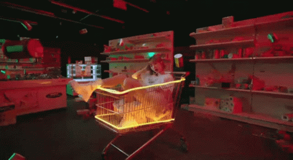

Also it's flareon 2016 Challenge 2. 

# Natalie.exe

## a.	At 0x004019E3, what is the functionality of SHGetFolderPathW and what useful information does it return?

Aint no one got time to [MSDN](https://docs.microsoft.com/en-us/windows/win32/api/shlobj_core/nf-shlobj_core-shgetfolderpatha) it. JK you should msdn and know that it retrieve a folder specified by CSIDL value of 0x10h. Let's just Olly and see what it retrieves:

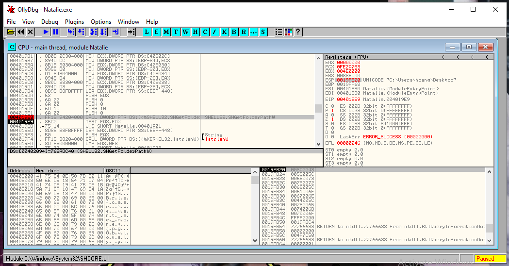

It is to Desktop. 

Also, in the spirit of Flareon, sub_401000 will construct the string %DESKTOP%/Briefcase and try to check for existing file/dir. 

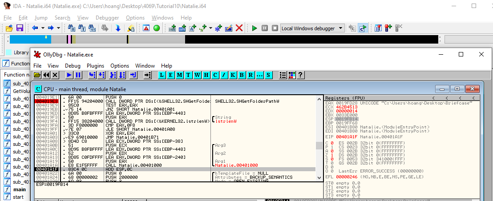

If file doesn't exist, it will print a triggering message (see for yourself).

## b.	What is the purpose of sub_401040?

MSDN [GetVolumeInformation](https://docs.microsoft.com/en-us/windows/win32/api/fileapi/nf-fileapi-getvolumeinformationa) and know that it check for volume information. The routine itselfs compare the serial number to a weird number:

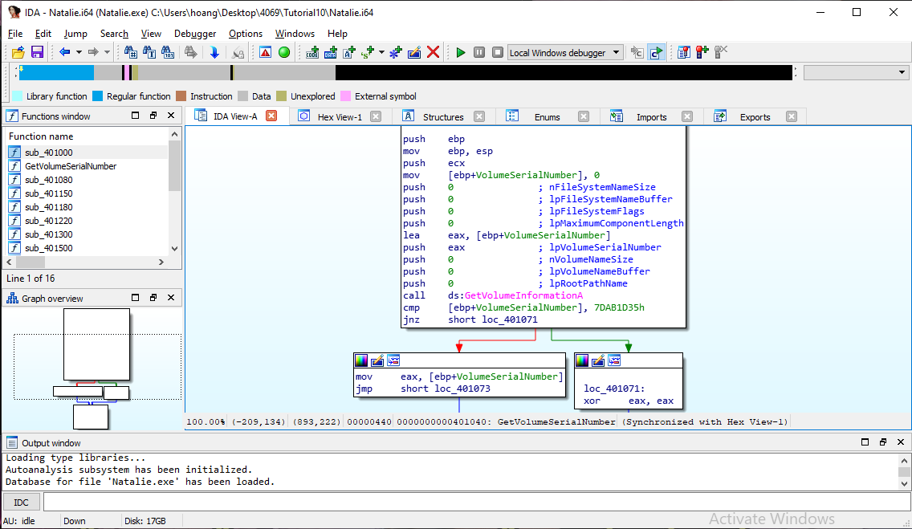

It compares the number to 7DAB1D35. Of course this is not anyone's serial number, so you have to bypass this using a debugger -- u can patch it using ollydbg to bypass the check to always return 1, but there's an issue: the eax value of 7DAB1D35 is an important key. So what I do is:

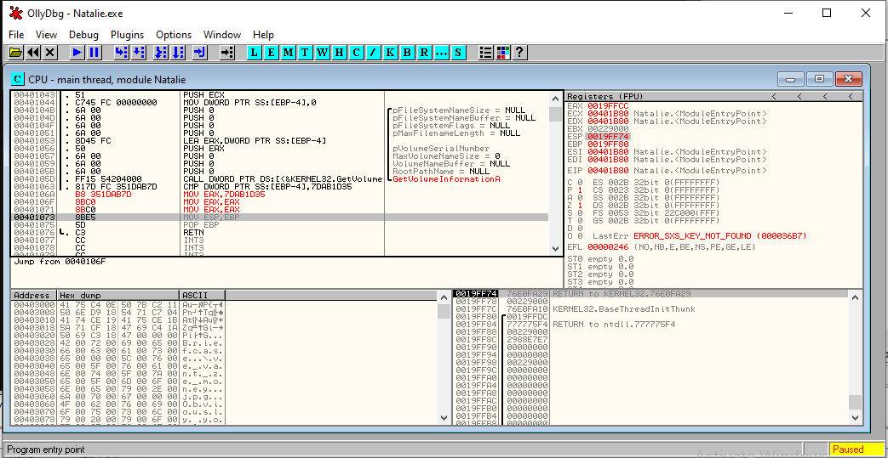

I change the jnz to mov eax, the value, and fill the other branch with some harmless instruction. This way eax can be preserved as you can see in the eax below:

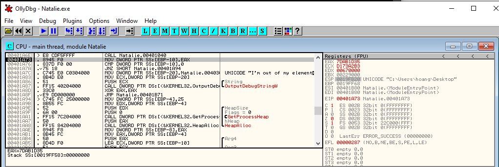

## c.	The content of unk_403000 appears to be encrypted. What is the decrypted content? What is the algorithm?

Now there are two ways to do this:

1. Follow Mr Ho method of decoding using multi byte XOR 
2. Olly your way out

Originally the decryption routine looks like this 

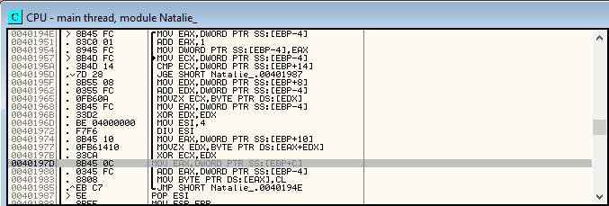

If you look hard enough, the highlighted line is not saving the xor-decoded back into the buffer but it saved it on the heap, so we gotta patch that ebp+C back to ebp+8 (just observe how the routine bring in data from unk_403000 and redirect it back to the same buffer). Normal Load-and-save architecture is like that ma...

Voila

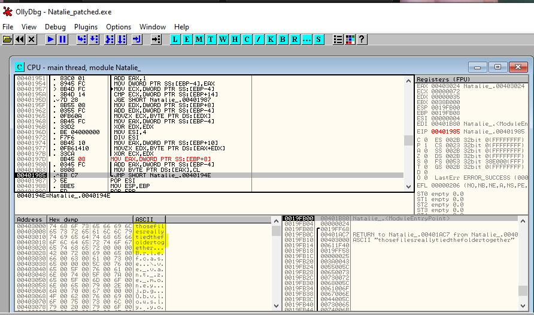

This is some advanced Olly-fu. But hey it's FLAREON :) 

## d.	What is the purpose of sub_401080? 

Again, it's Crypto API. Most likely (and through error of pressing run till return on Olly) I know that there are crypto functions that gonna be used for encryption/decryption. 

It uses [CryptAcquireContext](https://docs.microsoft.com/en-us/windows/win32/api/wincrypt/nf-wincrypt-cryptacquirecontexta) with dwProvType 24. If you google hard enough it's RSA_AES because at loc_4010CE, AlgID is 6610h which is AES-256. Find alg_id number [here](https://docs.microsoft.com/en-us/windows/win32/seccrypto/alg-id).
  
*It takes a lot of effort to study all of these crypt as there is no obvious way to google which value they correspond to*

IThen in the sub_401180 nested inside this subroutine, it will then Hash lpMem with SHA-1 inside a function at sub_401180, where it pretty much do the same thing but with SHA-1. Then it will call a CryptDeriveKey to generate the AES-key 

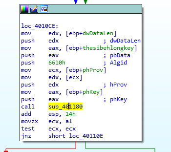

The thing you should notice is the decrypted key just now is used for a hash (in this case, SHA-1). After that they are passed to CryptDeriveKey to churn out the AES key. 

At loc_40110E, dwParam is 4 which is KP modee and the cipher mode is set to CRYPT_MODE_CBC by CryptSetParam. 

Ok so short summary:
* CryptCreateHash with 8003h algid to hash the lpData-lpMem var, which is the string just now
* CryptAcquireContext to get the AES provider
* CryptDeriveKey with 8004 algid => AES-256 and the SHA-1 Hash from just now to churn out the AES key
* CryptSetParam to set CBC and KP mode

## e.	What is the purpose of sub_401770? 

This function is used inside sub_401300. 

It uses MD5 to calculate a hash as 8003 is algid for hash

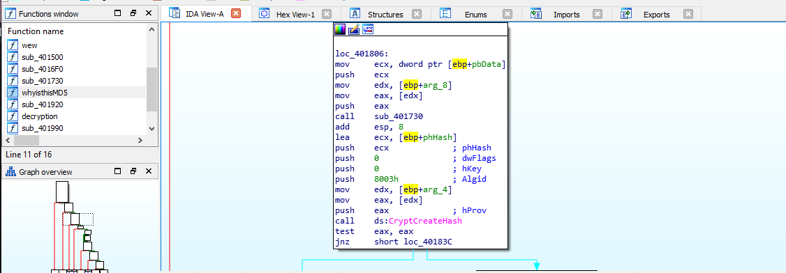

*After a while I kinda got the hang of how the crypt things work around in assemblies le*

However what does it take in? We look in Olly:

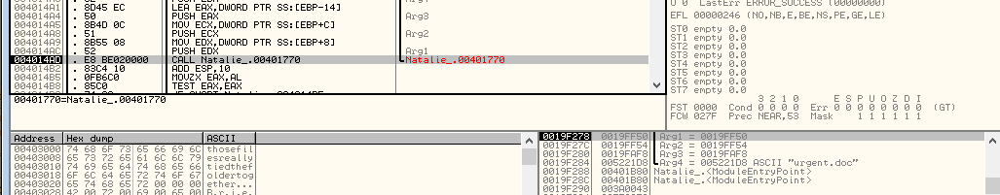

So we know arg 4 aka arg_C in the subroutine is the filename. 

After that the Hash is passed inside CryptHashData and then CryptGetHashParam with flag dw = 2 -> HP_HASHVAL. So then what does this hash value used for? Later we see CryptSetKeyParam with dwParam = 1, meaning KP_IV.

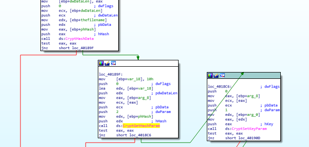

## f.	What is the purpose of sub_401300? 

This part needs abit of crypto knowledge on AES-256 IV -- I won't be answering what it is so yall can google :> 

Go through all the files in the dir (the directory is given by the Filename argument, which from just now we know is %Desktop%/Briefcase). It has the typical FindFirstFileW and a loop back. 

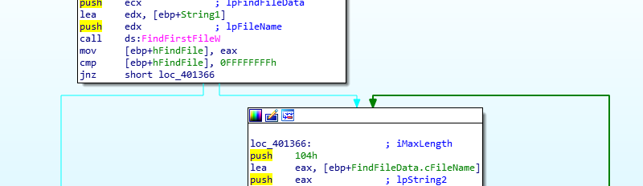

It will iterate through the file . and .. first. After that it will grab the cFilename and store in string var. This means only the filename (not fullpath) is stored. (And please see this via Olly for a better experience).

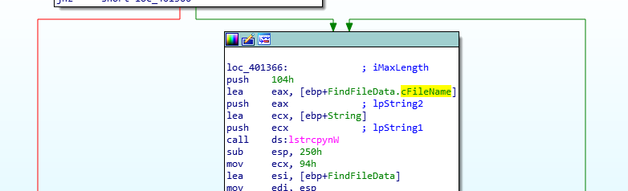

Then after that it will copy a lowercase string of the name into the heap 

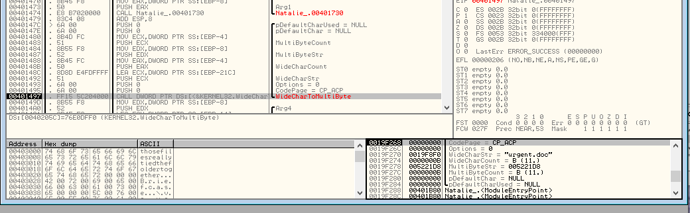

This makes static analysis considerably more difficult. After that it will pass the string (stored as cchWideChar argument) into sub_401770, the MD5 and IV initialization we did just now.  

After that...

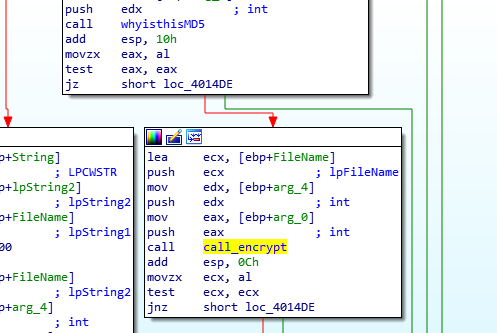

This subroutine is fairly simple, it will just encrypt the file with whatever Crypto setting we use just now. Two handles to the file are obtained: one for reading and one for writing. The file’s content is read, encrypted using CryptEncrypt, and written back to the file in 16KB blocks This is typical behaviour of *ransomware* -- rummaging all files, encrypt them with secure encryption using secure hash as IV and key. 


## g.	What is the purpose of sub_401220? 

Looking through the API it uses in sequential order:
* GetModuleHandleW
* FindResource
* SizeOfResource
* LoadResource
* CreateFileW
* WriteFileW

CreateFile is called ar 4012Bc. Olly this we will see:

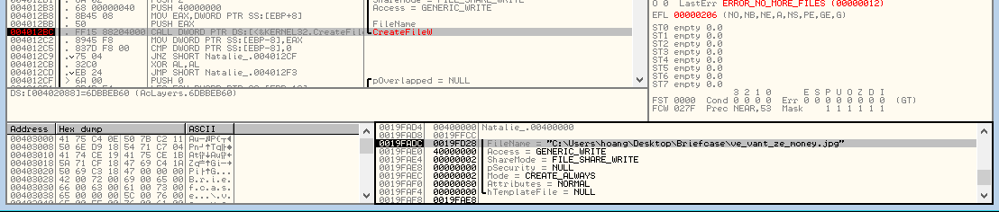

So, after encrypting all files in briefcase, it drops the binary ve_vant_the_money.jpg to the briefcase folder. The image is here:


*As you can tell, shifting between Olly and IDA is a very convenient and efficient way of figuring out what is the flow of the malware*

## h.	What is the purpose of the comparison at 0x004013 7? What happens it is true? 

First, 

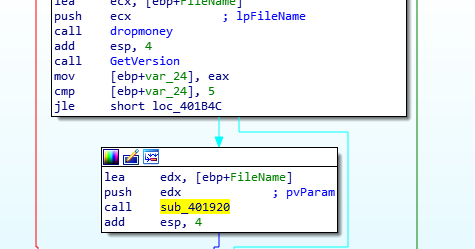

It compares the version of the host to 5 (aka Windows Vista). If it is not lesser, it will run to sub_401920:

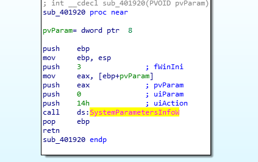

MSDN the [call](https://docs.microsoft.com/en-us/windows/win32/api/winuser/nf-winuser-systemparametersinfow), find that with uiAction == 0x14:

```
SPI_SETDESKWALLPAPER
0x0014
```
So it will set the wallpaper with pvParam as the filename (the jpg just dropped. Which caused quite some surprise. 

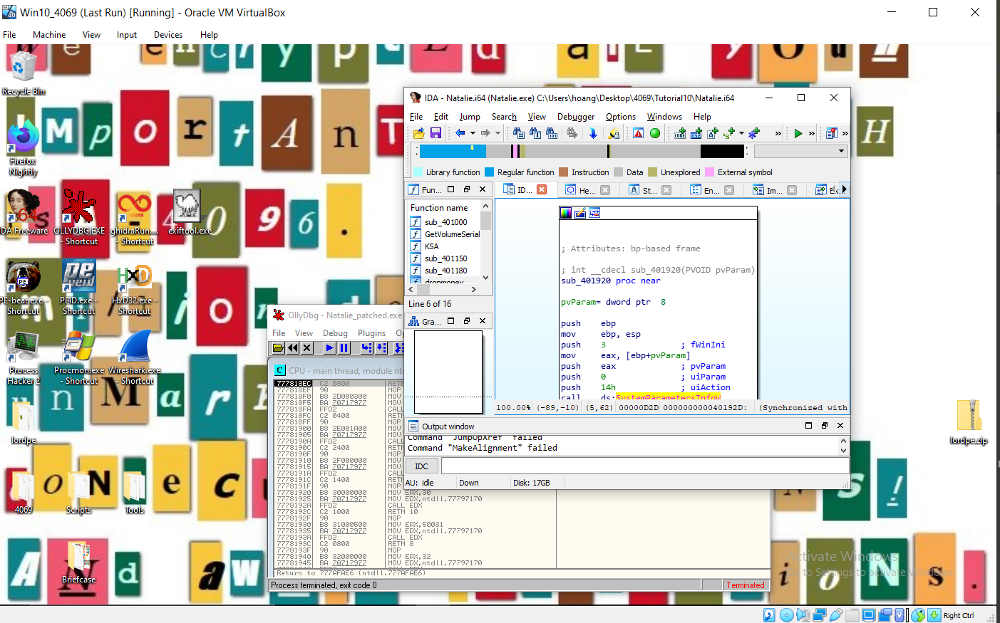

# i.	Decrypt “Urgent.doc”, preferably using a script. and what file is it? 

We technically can just change the Encrypt to Decrypt so it will reverse the process but sadly the IAT change is not that easy - I might have had some good progress with LordPE but eventually I feel not worth it so Oh well! 

Use FireEye script at [decrypt_py27.py](./decrypt_py27.py) on the urgent.doc yield the image:


I have also included the patch exe that has olly breakpoints in it in this repo. 

# Conclusion

Another hard tutorial. But again it's the last tutorial and it mainly concern the Crypto functions of WinsAPI so dont fret if you feel losted. Well done for making it this far (ﾉ´ヮ`)ﾉ*: ･ﾟ 


You deserve a pat on the back (*≧ω≦*)

[Back to Main Menu](./../)
