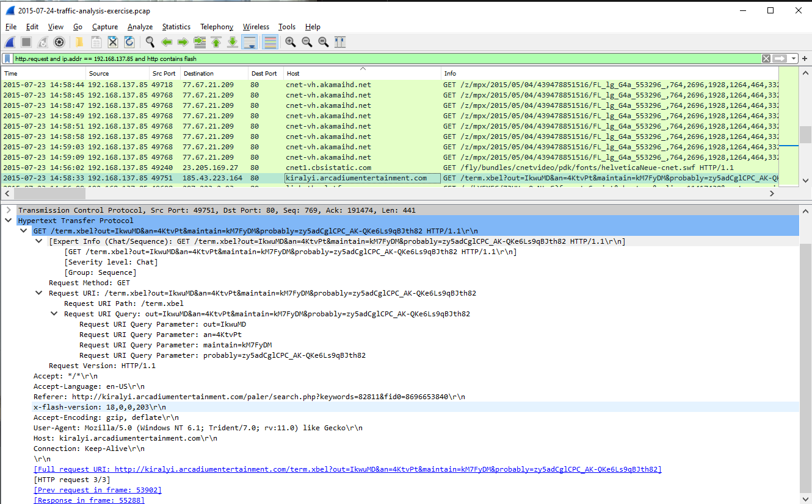
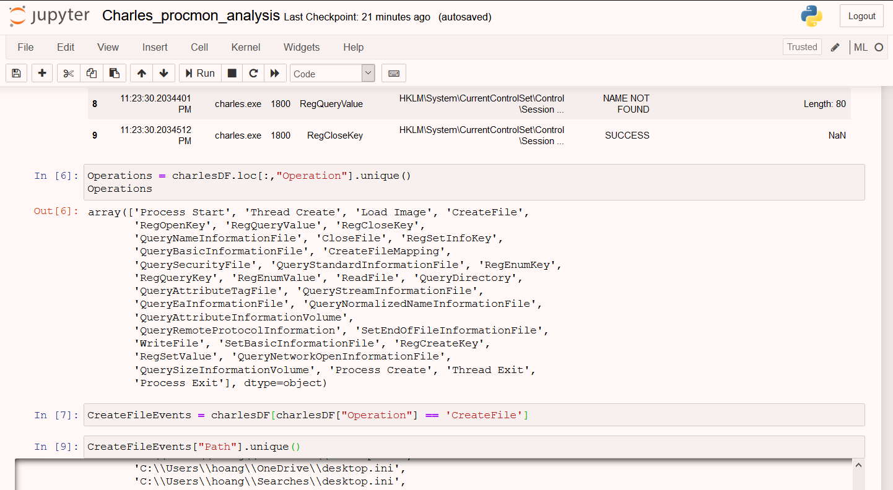
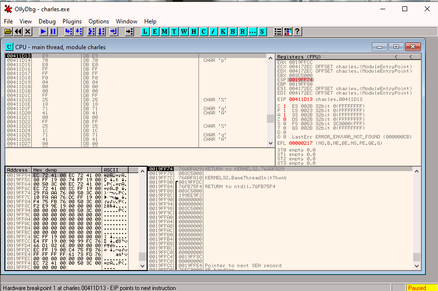

### Malware Analysis Tutorial 2 


Menu:

[1. Pcap](#pcap)
[1. Pcap summary](#pcap_summary)
[2. Charles.exe](#charles_section)
[2. Charles summary](#charles_summary)
### 0.  Preamble
_Overall I feel like there's inadequate teaching of network analysis in this course...You can't just tell us the tool is Wireshark and expect us to learn it on the spot... (Although, let's be honest that is the reality for anyone interested in this field). If you follow my previous tutorial, you know most of the time the answer came from a godlike amount of google and your intuition. Still, some guidance on setup and quick tips are nice._

_Ooh la La Ah wae ah wae ah wae? the tutorial I recommend is [here](https://www.malware-traffic-analysis.net/tutorials/index.html). It's on steroid by the way. But it saves time._

_If you have time (which I know we all don't), there's a **Practical Packet Analysis** book that's quite popular_

어차피  let's dive in. 


# <a name="pcap">Exercise 1. Network Analysis</a>

We are given a pcap file. As usual we have to check its hash: 


Oh wait this time no hash giveth.. nevermind but it's still a good practice!

We know the file is from unit42 of Palo Alto and the solution is also [there](https://www.malware-traffic-analysis.net/2015/07/24/index.html). And I'll also include a few things I take from there in this writeup :D 

### 1. What's an exploit kit 
Taken from [Palo Alto](https://www.paloaltonetworks.com/cyberpedia/what-is-an-exploit-kit) where the OG author wrote:
```
Exploit kits are automated threats that use compromised sites 
-> to divert web traffic, scan for vulnerable browser-based applications, 
-> and run malware. 

Exploit kits were developed as a way to automatically and silently 
exploit vulnerabilities on victims' machines while browsing the web.
```
Why is this question here?

 Actually there's a requirement in the original assignment to identify which exploit kit was used: Angler, Magnitude or Nuclear, but i guess it was outside the scope of this course. 
   

### 2. Hostname and Address

Now given a pcap the only reasonable thing to do is to load it into wireshark. My preference for columns are: 


_I learned how to customize wireshark efficiently [here](https://unit42.paloaltonetworks.com/unit42-customizing-wireshark-changing-column-display/)_


## What to look out for in these 75k packets??? 

By reading medium and googling for this tutorial, I learned that the first step in profiling pcap is to see the DHCP packets (I won't go through the networking bits in this tutorial as it will take too much time, I'll assume google isn't faraway OR we all know DHCP is what).

Use **dhcp** as filter


We got 6 packets -- 4 of them are broadcast to 255.255.255.255, and two of them have an IP. Now looking at the necessary info we need to fork out in the two packets (just expand on the second pane and expand some more -- it's in the **Client Identifier** and **Host Name** Option of DHCP of the packets): 


```
Hostname: Leonardo-PC
MAC: 80:c1:6e:6a:0b:f2, made by HP 
```

At this point in time we should also note that the infected machine has IP of **192.168.137.85**. 

### 3. Any suspicious DNS packets?

**After knowing the infected machine, we shall try to analyze all of its traffic in and out this machine.**

We filter by ip.addr and dns (more filter expressions [here](https://unit42.paloaltonetworks.com/using-wireshark-display-filter-expressions/).  _Just take note of any new columns I apply on the fly and the filter bar on top._

There's about 202 packets... A quick scroll through will reveal that some packets have been **flagged** due to retransmission. Flagged DNS are a crucial part of RAT malware ([why?](https://www.darkreading.com/attacks-breaches/monitor-dns-traffic-and-you-just-might-catch-a-rat/a/d-id/1269593)). 

Filtering out by DNS response's flag real quick -- there are only two major value **0x8180** (no error) and **0x8183** (no such name). We realize there are some legit DNS retransmission


This is actually **Teredo tunnelling for IPv6** ([here](https://www.reddit.com/r/networkin]g/comments/3hlagj/teredoipv6microsoftcom/) and [here](https://en.wikipedia.org/wiki/Teredo_tunneling)). I have done the googling. 

_**And then there are these bugger**_


The domain name is **SUS**. And there's recursive DNS requests made -- it looks like they are trying to resolve a CNC server name. 

```
Suspicious DNS to two domains:
6i3cb6owitcouepv.misterhoppo.com: type A, class IN 
6i3cb6owitcouepv.ministryordas.com: type A, class IN

```

You would notice that the second DNS query actually **succeed** -- its flag is 0x8180.  


### 4. Suspicious traffic

We filter any packet with that url by using the rule **tcp contains [the url]**


You can see that it get a website and the site images. I exported the text.html [here](./pcap.html) -- this will show you a rough idea of what the site looks like. 


```
There is a site to decrypt services, and then there are two img (button pay and bitcoin) to be loaded. 
A simple guess is that this is the site where you need to cough up your bitcoin in order to decrypt the jeopardized file CryptoWall3.0 has locked away. 
```

A sample from wannacry for reference:

_See the two familiar fields and images?_

### 5. Other sites

We know that the malware use DGA -- so we are out to hunt for weird looking GET 
The filter I used is:
```
http.request and ip.addr == 192.168.137.85  
```
You can add more filter to throw out legit host names after confirming they are legit. After staring at them for a while you will notice the pattern of POST \<"someurl"\>/{a,b,c,d,e}.php?=\<"some value"\>


You can notice the legit url from cbsi, although long, is just another url with tonnes of params. On the other hand biganddigital[.]com is sus with its random strings as the parameter is just a. 

The filter i settled on is \[**http.request and ip.addr == 192.168.137.85 and http.request.method == POST**\] as it is the shortest and captures the most DGA urls. 

It kinda misses out **ip-addr.es @ 188.165.164.184** GET http, but whatever that one (in the author of this pcap words -- just for CryptoWall to check its victim IP)

So the list of DGA urls are:
```
hotfrance ru                        95 85 4 87
hajuebo de                          212 90 148 43
ehsansurgical com                   50 87 150 75
biganddigital com                   198 211 120 49
bibubracelets ro                    85 204 50 99
beybladeoyunlari org                213 238 166 230
100pour100unity com                 91 216 107 226
6i3cb6owitcouepv ministryordas com  46.30.43.66
```

In wireshark:


### 6. Angler landing page

If we filter by script tag (which is not a very fail safe method due to high number of false positive -- a lot of websites , if not all, use scripts nowadays). A safer option is still to pass it through an IDS like Snort or Suricata (the sniffer pig or the sniffer meerkat) and see which IP flare up under their CryptoWall Alert (assuming your IDS has the rules for it) and look from there. 

Nonetheless, if we gracefully tracealong all the dga urls above, we will notice that there is a  **kiralyi[.]arcadiumentertainment[.]com** GET that subsequently triggers all of the dga urls request. 


It is as if this dood is reading novel, watching youtube, online shopping for some products and monitor his investment on one afternoon, then afterwards suddenly he decided to go to 7 different website in 10 seconds. We **follow HTTP/TCP** (wireshark right click) for the packet that trigger the url. 


We know the site that host Angler is **kiralyi[.]arcadiumentertainment[.]com**. However, the referer -- the site that started off all this (and probably has some vulnerable version of Flash/SilverLigh/Shockwave), is **twentyone-development[.]com**. My guess is that **twentyone-development[.]com** is a site for novel and some stuff and they enable flash for some fancy reading experience. Once you click on this *particular* novel, it links to **kiralyi[.]arcadiumentertainment[.]com** which still is a novel -- but with an angler surprise in \<'script'\> that can exploit the vulnerability in the referer site. I dumped the script out [here](./angler.txt), but the script is heavily obfuscated and segmented (jsnice yields little result --  i tried). As expected. 

So my answer for this question would be:

```
Compromised site: twentyone-development com
EK Host: kiralyi arcadium entertainment 
```

You can have a deeper understanding of the methods used by Angler on Flash in [this post](https://unit42.paloaltonetworks.com/unit42-understanding-angler-exploit-kit-part-1-exploit-kit-fundamentals/) by the author of this pcap. 

### 7. Flash 

This one is straight forward enough. And as expected we saw one packet from the referer site **kiralyi**



```
Flash version: 18.0.0.203
```

This flash version has a tonne of exploits ([CVE reports concerning Flash 18](https://www.cvedetails.com/vulnerability-list/vendor_id-53/product_id-6761/version_id-184532/Adobe-Flash-Player-18.0.0.203.html)). I don't know which CVE this particular one is though.

# <a name="pcap_summary">Thought process summary</a>
```
1. Look at DHCP packets to identify the infected machine
2. Filter out all packets in and out of this machine
3. Filter the suspicious packets by examining the TCP payload/ hostnames
4. Follow TCP stream to get the whole conversation with suspicious IPs
5. Export objects that are malicious
6. Identify key parameters that have triggered the attack, 
(although most of the time it's better to do this with Snort/Suricata or
any other IDS that has better Alerts for suspicious traffic.)
```
## In-depth

Now, I spent A REAL LOT OF TIME ON THIS TUTORIAL because they are outside of my normal RE/CTF stuff...So i got stuck since last week and i still figuring A LOT of things out

### **(один) Detecting Exploit Kit -- HOW?**

Well there's Snort and Suricata but both of them are hard to use and welps I haven't gotten around to use them yet. Installing them was a pain too so... let's just say it gonna be a tough cliff to climb if you want to get in depth with snort/suricata. By the way snort is a nightmare to install... 

So i used suricata and realised the ruleset that is used to detect Angler (ET Pro /Emergeing threats ruleset) is on a subscription basis (_by now, walls in learning process like this no longer surprises me, I just go around it_)

**Welps... Help needed here :D**

### **(два). Angler EK**

[Angler](https://heimdalsecurity.com/blog/ultimate-guide-angler-exploit-kit-non-technical-people/)  good read can be found there. 

[Nuclear](https://blog.checkpoint.com/2016/05/17/inside-nuclears-core-unraveling-a-ransomware-as-a-service-infrastructure/) and [Magnitude](https://blog.malwarebytes.com/cybercrime/2017/08/enemy-at-the-gates-reviewing-the-magnitude-exploit-kit-redirection-chain/) read can be found here.

Interesting industry they have there...

### **(три). Misc details**

It's important to take note of user agents, which browser and OS being used as well.  


In this case it's Win 7 (check [Window versioning](https://en.wikipedia.org/wiki/List_of_Microsoft_Windows_versions)) and IE 11 (r.v 11.0)

# <a name="charles_section">Exercise 2. Dynamic Analysis Exercise</a>

Let me just foreword this section by saying i spent more than 48 hours on it and the configuration just wrecked me up and down. A few pointers I have made through this exercise is:

1. Fakenet works better in win 7. Everything flareVM works better in win 7
2. Procmon with ipynb is a wonderful combo
3. _Everything_ can be seen in ollydbg


Now let's settle this tutorial, and remember to **_run charles.exe in administrator_**

### 0. MD5 check


Doesn't look like I got the wrong file. 

### 1. Network-based indicator

If you managed to get your fakenet to work then just fire it up. Else get a win7 VM [here](https://developer.microsoft.com/en-us/microsoft-edge/tools/vms/). Then fork fakenet from fireeye github down and you should be good to go. 

This is the capture from fakenet on my _newly created win7 vm for this tutorial_


Take note of the DNS server request

```
Command for fakenet on Powershell
fakenet.exe -l 4069_tut3.txt
```
The important part of that log is here


```
C2 server: CECZ4069tutorial2.net
Port: 2402
Protocol: TCP 
```

### 2. Host based indicator

I don't know why our prof likes FileChangeView (ease of use?) but i like to see fully what the malware does in _procmon_ so here is the procmon view


The filters I used for procmon in this tutorial are (**click on the filter/funnel symbol on top pane**)
```
Process Name contains charles.exe then include 
Process Name contains funny.exe then include
Operation contains CreateFile then include
```
It is to study the process charles, funny.exe and the file charles created. The full procmon output is also here in this github repo in [pml native format](./charles_procmon_log.PML) and [csv](./charles_procmon_log.csv).

I later used a ipynb for my analysis on the csv [here](./Charles_procmon_analysis.ipynb) -- you can look at it to see how can quickly iterate through the files created by charles and what not thanks to pandas.



_In the pic above, I quickly iterate through the operations of charlesDF and pick out the files it created with 3 lines of pandas. I think a lot of CS students who sit for ML positions interns will have neater way to nest these operations but this is what my 2 neurons can think of for now_

```
PSA: procmon can be used for THE REST OF THE QUESTIONS
it is just whether you can sift out the info or not
```


Back to QN 2, pasting the same pic above: 


Add the filter **Process Name contains funny.exe then include**


```
File funny.exe is created by charles.exe
File charles.exe frequently modify  naughtyme/yourpasswords_wahaha.dat
```

### 3. Registry change

Again, we can just pandas our way through the csv -- but ok since prof wants me use Regshot imma gonna use regshot. The win10 has too much things in its _hive_ that one regshot takes a solid 30s. You can use **1st shot** then **2nd shot** and **compare** for this result 


```
We see that one value in HKEY_USERS has been modified
Key: SOFTWARE\Microsoft\Windows\CurrentVersion\Run\CECZ4069
Value:"C:\Users\hoang\AppData\Roaming\naughtyme\funny.exe" 
```

Or you can be a sohai and use ipynb like a true idiot like me


### 4. Mutex

Using process hacker's handles tab on funny exe 


```
\Sessions\1\BaseNamedObjects\remcos_qdjxftopkdxsguz
```

Or... if you feel like the idiocy is not enough you can walk through **every single line of binary code to find the mutex in ollydbg**


**Everything is possible if you are patient enough**

I will walk through that process of idiocy later on in this tutorial

### 5. That file

Seriously this malware creates a lot of file but only the interesting one are the Win SYSWOW64 it created and the install.bat 


```
install.bat is the answer. I lazy type the whole path
```

You can watch out for delete events by the value of 'SetEndOfFileInformationFile' in Operation 

Again, thanks to ipynb


look through all the files it created, and matched it in those it delete. 

[Jump to summary](#charles_summary)

## In-depth-and-in-trauma section 

I have been playing with charles.exe for a few days now and it's a fairly complex malware that is packed with MPRESS and obfuscation method. Anyway I will walk through two main general processes with any packed malware. 
1. Unpack manually with olly
2. Olly and IDA combo through the functions 

### 1. Unpack 

So the malware is packed by MPRESS (just check with PEiD, I won't go through this again). A quick google on MPRESS tells us that it's a popular one that does in-place decryption aka it will overwrite the content during runtime. MPRESS has encrypted the file into two section MPRESS1 with the data and MPRESS2 with the decryption insructions. If you load charles.exe into IDA at this stage you won't see much as everything is still packed. 

So how would the malware run if itself is encrypted? well the first step it would do is to unpack the **data section** and then it will **reconstruct the imports**. If we load it into Olly, first thing we see is a call to the unpack routine


```
Step into PUSHAD [F7]
Select ESP Register (top right panel) 
Right click > Follow in Dump
Highlight the first 4 bytes in Hex Dump
Right Click > Breakpoint > Hardware On Access > Word
```

Essentially we are saying: let the malware unpack itself, but stop right after it finished unpacking (we stop the program the moment it exited the unpack routine -- by setting access breakpoint on ESP register)

Hit Run button. You will see something like this



Right click > Analyze > Code to make sense of the instructions


We can now make an educated guess that the next call is to reconstruct the imports table. So Step into it [F7] and spot a while loop (I won't show here). This is probably the loop that reconstruct the imports table. Set a breakpoint right after the loop and follow it till you find a suspicious return back to entry point -- which probably suggests that this malware has finished reconstructing its imports and are now ready to fly. 


_Or you can be stupid like me and F8 (step over) and suddenly the malware is running in full speed -- restart and leave the breakpoint there_ 

At this point it's safe to dump this process out to look at it in IDA. I used Ollydump plugin (get the ollydump.dll and throw it in the same folder as ollydbg). 


### Alternatively

You can stop at the import table and use Scylla to reconstruct the imports yourself. Now -- I have done this and there are a few import thunks that cannot be found -- due to the MSCVP60.dll that is not available in my machine. However, you can still use PEBear to fix the entry points -- but this is some advanced stuff I haven't gotten time to look it yet. 

Open charles_dump in IDA and view its strings, we can guess it definitely contains keylogging capability


Edit registry capability


Connecting to C2 server


For each of these capability, the analysis is the same so I will walk through the C2 part only -- the rest should be similar :D 

Click on the string and it will lead you to hex view. You will see the variable name. press X to find the reference. Follow through. 


Find the address in Hex View. Go back to Ollydbg and Ctrl+G that address. Place a breakpoint there. 


_Why the trouble? we can't really find strings that easily in Olly_

```
Use IDA to target the functions you want to track
Breakpoint it in Olly and run
```

However that will always guarantee success because sometimes the functions are there to decoy only. I have had a lot of cases where the malware just run off because the breakpoint never hit. 

Therefore the best way is to slowly F8 through the program and see what it does to the stack -- most of the arguments are only decoded and parsed dynamically. 


\^ If you notice the stack, there is the C2 server there,with its port as well as the message it tries to send over. 


Or in this one, you can see the malware invoking the functions from MSCVP60.dll to construct the string to the mutex name -- remcos_qdjxftopkdxgus


File funnyme about to be created as the path is being constructed.


Malware about to duplicate itself and run the other file (If you step into the call, you will see the functions CreateDirectoryA and the fullpath of charles.exe being there ready to be duplicated)

As you slowly visualize and follow the path of the malware in IDA and Olly, you will figure out exactly how each functionality of the malware is being constructed. However, don't get stuck in the details. If say you looking for its registry behaviours, set breakpoints there and let the program run to it. 

```
In short, use IDA to visualize the call graph
Set strategic breakpoints in Olly from that call graph
Watch the stack for arguments as they are decoded in runtime
```

<a name="charles_summary">Summary</a>
```
You can either use a whole host of tools in 1 hour 
Or trace the malware using Olly and IDA for 3 days
To look out for these dynamic behaviours:
1. Any connection to any suspicious IP? C2 server?
2. Any mutex created? Accessed? 
3. Any files changes maded by this malware
4. Any registry changes made by this malware
5. Any files being created, duplicated and destroyed? 
(Pay particular attention to TEMP folder as these are persistence mechanism)
```

# Conclusion

And.... that's it for the second tutorial!! It took me like about 3 days of running olly and more than 20 times of resetting my VM... But it is a learning process so don't be discouraged! I am sure there are better ways to do this and better tools, but getting dirty with our hands before using tools let us appreciate the tools better. And even if we don't have the tools, we can always do it ourself. 

```
I know you can take care of it yourself, 
but I don't want you to have to do it. 
```
See ya next time! 


[Back to Main Page](./../)