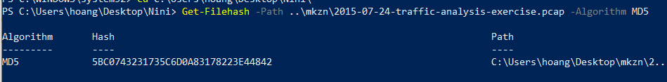
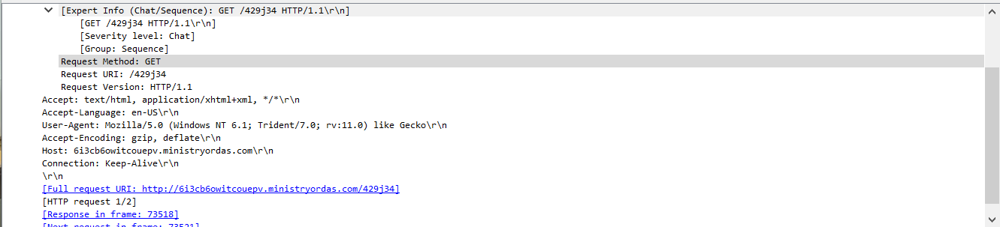

### Malware Analysis Tutorial 2 


### 0.  Preamble
_Overall I feel like there's inadequate teaching of network analysis in this course...You can't just tell us the tool is Wireshark and expect us to learn it on the spot... (Although, let's be honest that is the reality for anyone interested in this field). If you follow my previous tutorial, you know most of the time the answer came from a godlike amount of google and your intuition. Still, some guidance are nice._

_Oh Badda Badda Bing Badda Badda Boom the tutorial I recommend is [here](https://www.malware-traffic-analysis.net/tutorials/index.html). It's on steroid by the way. But it saves time._

_If you have time (which I know we all don't), there's a **Practical Packet Analysis** book that's quite popular_

어차피  let's dive in. 


# Exercise 1 

We are given a pcap file. As usual we have to check its hash: 



Oh wait this time no hash giveth.. nevermind but it's still a good practice!

We know the file is from unit42 of Palo Alto and the solution is also [there](https://www.malware-traffic-analysis.net/2015/07/24/index.html). And I'll also include a few things I take from there in this writeup :D 

### 1. What's an exploit kit 
Taken from [Palo Alto](https://www.paloaltonetworks.com/cyberpedia/what-is-an-exploit-kit) where the OG author wrote:
```
Exploit kits are automated threats that use compromised sites to divert web traffic, scan for vulnerable browser-based applications, and run malware. Exploit kits were developed as a way to automatically and silently exploit vulnerabilities on victims' machines while browsing the web.
```
Why is this question here?

 Actually there's a requirement in the original assignment to identify which exploit kit was used: Angler, Magnitude or Nuclear, but i guess it was outside the scope of this course. 
 
 BUT HEY HEY HEY THIS IS **MY** TUTORIAL. I'll prolly include it in some in-depth section.  

### 2. Hostname and Address

Now given a pcap the only reasonable thing to do is to load it into wireshark. My preference for columns are: 


_I learned how to customize wireshark efficiently [here](https://unit42.paloaltonetworks.com/unit42-customizing-wireshark-changing-column-display/)_

By reading medium and googling for this tutorial, I learned that the first step in profiling pcap is to see the DHCP packets (I won't go through the networking bits in this tutorial as it will take too much time, I'll assume google isn't faraway || we all know DHCP is what).

Use **dhcp** as filter


We got 6 packets -- 4 of them are broadcast to 255.255.255.255, and two of them have an IP. Now looking at the necessary info we need to fork out in the two packets (just expand on the second pane and expand some more -- it's in the **Client Identifier** and **Host Name** Option of DHCP of the packets): 


```
Hostname: Leonardo-PC
MAC: 80:c1:6e:6a:0b:f2, made by HP 
```

At this point in time we should also note that the infected machine has IP of **192.168.137.85**. 

### 3. Any suspicious DNS packets?

We filter by ip.addr and dns (more filter expressions [here](https://unit42.paloaltonetworks.com/using-wireshark-display-filter-expressions/).  _Just take note of any new columns I apply on the fly and the filter bar on top._

There's about 202 packets... A quick scroll through will reveal that some packets have been **flagged** due to retransmission. Flagged DNS are a crucial part of RAT malware ([why?](https://www.darkreading.com/attacks-breaches/monitor-dns-traffic-and-you-just-might-catch-a-rat/a/d-id/1269593)). 

Filtering out by DNS response's flag real quick -- there are only two major value **0x0100** (no error) and **0x8183** (no such name). We realize there are some legit DNS retransmission


This is actually **Teredo tunnelling for IPv6** ([here](https://www.reddit.com/r/networkin]g/comments/3hlagj/teredoipv6microsoftcom/) and [here](https://en.wikipedia.org/wiki/Teredo_tunneling)). I have done the googling. 

_**And then there are these bugger**_


The domain name is **SUS**. And there's recursive DNS requests made -- it looks like they are trying to resolve a CNC server name. 

```
Suspicious DNS to two domains:
6i3cb6owitcouepv.misterhoppo.com: type A, class IN 
6i3cb6owitcouepv.ministryordas.com: type A, class IN

```

You would notice that the second DNS query actually **succeed** -- its flag is 0x8180.  


### 4. Suspicious traffic

We filter any packet with that url by using the rule **tcp contains [the url]**


You can see that it get a website and the site images. I exported the text.html [here](./pcap.html) -- this will show you a rough idea of what the site looks like. 


```
There is a site to decrypt services, and then there are two img (button pay and bitcoin) to be loaded. 
A simple guess is that this is the site where you need to cough up your bitcoin in order to decrypt the jeopardized file CryptoWall3.0 has locked away. 
```

A sample from wannacry for reference:

_See the two familiar fields and images?_

### 5. Other sites

We know that the malware use DGA -- so we are out to hunt for weird looking GET 
The filter I used is:
```
http.request and ip.addr == 192.168.137.85  
```
You can add more filter to throw out legit host names after confirming they are legit. After staring at them for a while you will notice the pattern of POST \<"someurl"\>/{a,b,c,d,e}.php?=\<"some value"\>


You can notice the legit url from cbsi, although long, is just another url with tonnes of params. On the other hand biganddigital[.]com is sus with its random strings as the parameter is just a. 

The filter i settled on is \[**http.request and ip.addr == 192.168.137.85 and http.request.method == POST**\] as it is the shortest and captures the most DGA urls. 

It kinda misses out **ip-addr.es @ 188.165.164.184** GET http, but whatever that one (in the author of this pcap words -- just for CryptoWall to check its victim IP)

So the list of DGA urls are:
```
hotfrance ru                        95 85 4 87
hajuebo de                          212 90 148 43
ehsansurgical com                   50 87 150 75
biganddigital com                   198 211 120 49
bibubracelets ro                    85 204 50 99
b=beybladeoyunlari org              213 238 166 230
100pour100unity com                 91 216 107 226
6i3cb6owitcouepv.ministryordas.com  46.30.43.66
```

In wireshark:


### 6. Angler landing page

If we filter by script tag (which is not a very fail safe method due to high number of false positive -- a lot of websites , if not all, use scripts nowadays). A safer option is still to pass it through an IDS like Snort or Suricata (the sniffer pig or the sniffer meerkat) and see which IP flare up under their CryptoWall Alert (assuming your IDS has the rules for it) and look from there. 

Nonetheless, if we gracefully tracealong all the dga urls above, we will notice that there is a  **kiralyi[.]arcadiumentertainment[.]com** GET that subsequently triggers all of the dga urls request. 


It is as if this dood is reading novel, watching youtube, online shopping for some products and monitor his investment on one afternoon, then afterwards suddenly he decided to go to 7 different website in 10 seconds. We **follow TCP** (wireshark right click) that very initial trigger url. 


We know the site that host Angler is **kiralyi[.]arcadiumentertainment[.]com**. However, the referer -- the site that started off all this, is **twentyone-development[.]com**. My guess is that **twentyone-development[.]com** is a site for novel and some stuff, and then once you click on this *particular* novel, it links to **kiralyi[.]arcadiumentertainment[.]com** which still is a novel -- but with an angler surprise in \<'script'\>. I dumped the script out [here](./angler.txt), but the script is heavily obfuscated and segmented (jsnice yields little result --  i tried). As expected. 

So my answer for this question would be:

```
Compromised site: twentyone-development.com
EK Host: kiralyi arcadium entertainment 
```

### 7. Flash 

This one is straight forward enough. And as expected we saw one packet from the infecter site **kiralyi**


```
Flash version: 18.0.0.203
```

## In-depth

Now, I spent A REAL LOT OF TIME ON THIS TUTORIAL because they are outside of my normal RE/CTF stuff...So i got stuck since last week and i still figuring A LOT of things out

1. Detecting Exploit Kit -- HOW?

Well there's Snort and Suricata but both of them are hard to use and welps I haven't gotten around to use them yet. Installing them was a pain too so... let's just say it gonna be a tough cliff to climb if you want to get in depth with snort/suricata. By the way snort is a nightmare to install... 

So i used suricata and realised the ruleset that is used to detect Angler (ET Pro /Emergeing threats ruleset) is on a subscription basis (_by now, walls in learning process like this no longer surprises me, I just go around it_)

**Welps... Help needed here :D**

2. Angler EK 

[Angler](https://heimdalsecurity.com/blog/ultimate-guide-angler-exploit-kit-non-technical-people/)  good read can be found there. 

[Nuclear](https://blog.checkpoint.com/2016/05/17/inside-nuclears-core-unraveling-a-ransomware-as-a-service-infrastructure/) and [Magnitude](https://blog.malwarebytes.com/cybercrime/2017/08/enemy-at-the-gates-reviewing-the-magnitude-exploit-kit-redirection-chain/) read can be found here.

Interesting industry they have there...

3. Misc details

It's important to take note these during pcap analysis as well

-- user agents -- which browser and OS being used 



In this case it's Win 7 (check [Window versioning](https://en.wikipedia.org/wiki/List_of_Microsoft_Windows_versions)) and IE 11 (r.v 11.0)

## Dynamic Analysis Exercise


