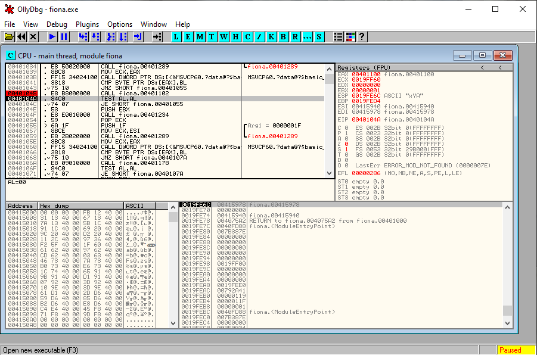

### Malware Analysis Tutorial 3

_Aiya here we go again_


[1. Ella](#ella)

[2. Fiona](#fiona)

[3. Dolly](#dolly)

# <a name="ella">1. Ella.exe</a>

Best practice 

```
This week no time to screenshot the hash for yall. Yall do it yourself ah. 
```

Running this on the win 7 fakenet 


We notice that instead of funny.exe this time round it's explorer.exe that is making the request. 

```
Domain name: CECZ4069tutorial3.net
Port: 2404
Beacon: explorer.exe 
```

Same as before, we use procmon to record the events created by Ella.exe with filter: **Process Name is ella.exe then includes**. Dump the procmon output as csv file and analyze in ipynb (both files can be found in this webpage github repo!).

To look for persistence, we look at Registry Key modified modified


```
RegSetValue 
-- HKLM\SOFTWARE\WOW6432Node\Microsoft\Windows NT\CurrentVersion\Winlogon\Shell 
-- Type: REG_SZ, Length: 134, 
-- Data: explorer.exe, "C:\Users\hoang\AppData\Roaming\naughtyme\funny.exe"

RegSetValue 
-- HKLM\SOFTWARE\WOW6432Node\Microsoft\Windows NT\CurrentVersion\Winlogon\Userinit 
-- Type: REG_SZ, Length: 174, 
-- Data: C:\WINDOWS\system32\userinit.exe, "C:\Users\hoang\AppData\Roaming\naughtyme\funny.exe"
```

That's about it! It's a short question. 

# <a name="fiona">2. Fiona.exe</a>

Now fiona.exe is a fun one. 

```
The file deletes itself after running
And it is because it detects it is in a virtual environment
```

Now, the fun part is discovering how does it do it. Let's dive in. 

Tools used: **Ollydbg and IDA**. _Tbh malwareunicorn would have been more proud if I use x32dbg but welps it is what it is, i noob bro._ 

After running a few rounds in Ollydbg to get a rough sense of what is happening (manual debugging) -- this is to get a sense of where things start to trip, where branching happens and so on. 

Summary: 
1. There is a string **hardware acpi dsdt vbox__** (it's a HKEY inside your virtual machine)
2. That string is invoked in subroutine **0x00401178** 
3. The subroutine using that subroutine is **0x0040100**
4. In the main flow of events (after checking mutex and all that), the address this thing starts to trip is **0x0040759D** 

At this point, we can casually set a breakpoint at **0x0040759D** and F7 this routines. It consists of a list of routines with very similar structure -- do something, check result, if any of those failed, then branch to a subroutine (that will eventually invoke uninstall.bat -- it is an exception handler). But it's too much to explain exception handling.

It is ok enough to guess at this stage that **0x0040100** is when it check for virtual environments. A few checks it does is:

1. The sandboxie check is at 0x00401020

2. The ? check is at 0x00401045

3. The vbox check is at 0x00401178

_Smol note: this is the actual note i built when analyzing this malware. Once I finished I just built this md on the scrap notes I made earlier._
And as we step through each check, we will see


Notice the EAX and the **TEST AL,AL** instruction right afterwards. It's checking if the function returns 0 or not. If 0 -> successful. As expected, the sbie.dll check passes (no sandboxie detected). 

Following which is some check i have no idea what it is



Within this subroutine, there is a code that asks for I/O command. I have no idea what to do, so I send it a Shift+F7 (exception). My guess is that this is an anti auto-analysis attempt? As it requires input from user. 

Again, the last byte of EAX -- AL value is 0. The check passes. 

And **here** is where it fails


At subroutine 0x00401178, eax value is **0x00000001**. What this routine does is that it will check for a signature registry key of Virtualbox. If they key is detected, it will return 1. The value will trigger the exception handler and it will promptly delete itself. 

I'm not too sure if VMWare will trip this box or not. But well VMWare user you can help me here :D 

There is a script called pafish (paranoid fish) that has the most common methods of sandbox checking techniques employed by malwares. You can find it on github if you are interested to know more about each virtual env's signatures. 

I notice that it's not too important to know the details of them all. It's just poking around and guess the overall structure of the program and have some smart guesses. Especially for these samples where our profs have very kindly don't encrypt anything (unlike charles.exe where I have to manually unpack it). It's important not to get stuck in the details. 


# <a name="dolly">3. Dolly.exe</a>

This section is just for us to explore how we can identify if a malware is a variant of one another. 

Tools: 

1. [ssdeep](https://ssdeep-project.github.io/ssdeep/index.html): computing context triggered piecewise hashes (CTPH). Also called fuzzy hashes. This can form the signature of the malware -- for e.g if they create the same backdoor they are probably the same malware. Probably. 

2. [Import hash: Imphash](https://github.com/Neo23x0/ImpHash-Generator):  generates "PE import hashes" for all executables it finds in the given
directory and marks every import hash as unusable that can also be found in the goodware-hash-database.

But keep in mind that the malware authors are always working to defeat these tools ([here](https://malcomvetter.medium.com/defeating-imphash-fb7cf0183ac))

And that's all for this week!! 

_Author's note: Sosig is kinda busy with DSP and Market Intelligence assignments (and a few other things) so this tutorial is rather brief. OH WAIT MALWARE ALSO GOT ASSIGNMENT OMG._

Nevermind stream izone's new song guys


The full video is [here](https://www.youtube.com/watch?v=hxiELGqlv5s). _Shhhhhh............[.](./sakura_qn.html)._