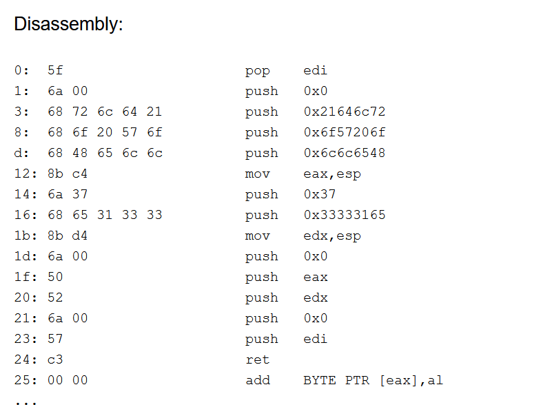

# Tutorial 5 

WEL COME BACK AFTER ASG 1


## Menu

[Qn 1](#q1)

[Qn 2](#q2)

[Qn 3](#q3)

Alright let's get started ヽ(o＾▽＾o)ノ


### <a name="q1">Qn 1</a>

At the start of this routine, we see a lot of push into the stack 
```
00010000	6A 00			    push		0
00010002	68 72 6C 64 21		push		0x21646c72
00010007	68 6F 20 57 6F		push		0x6f57206f
0001000C	68 48 65 6C 6C		push		0x6c6c6548
```
Stack be liek
```
 ^      6c6c6548       <---ESP
 |      6f57206f
 |      21646c72
 |      0
```
That looks like a null terminator right there. So let's ascii this (remember the endianess of the stack)
```
Input: 48 65 6c 6c 6f 20 57 6f 72 6c 64 21
Output: Hello World! 
```

```
00010011	8B C4			mov		eax, esp 
```
don't know what's doing here... probably need to wait a bit. Save the current stack pointer to eax

Some more pushing and then store stack frame to edx 

```
 ^      33333165       <---ESP=EDX
 |      37000000       <--- auto fill with 0 -- double as null terminator
 |      6c6c6548       <---EAX
 |      6f57206f
 |      21646c72
 |      0
```
Storing stack frame again. 

Final call to the boss function
```
0001001C	6A 00			push		0
0001001E	50				push		eax
0001001F	52				push		edx
00010020	6A 00			push		0
……          ……				mov		    eax    , <user32.MessageBox>
……		    ……				call  		eax
```
We see that there are four arguments pushed to the stack, and two of them are the pointers to the string we created just now. Remember that arguments are pushed from right to left, so let's refer to user32.MessageBox function definition, taken from MS [docs](https://docs.microsoft.com/en-us/windows/win32/api/winuser/nf-winuser-messagebox)

```
int MessageBox(
  HWND    hWnd,
  LPCTSTR lpText,
  LPCTSTR lpCaption,
  UINT    uType
);
```
Hence we can tell that uType = 0, lpCaption=eax, lpText=edx,hwnd = 0 (no handle) 

So we have 
```
user32.MessageBox(0,'e1337','Hello World!,0)
```
Why the cryptic e1337? It's an urban legend dating back 2 decades [here](https://www.urbandictionary.com/define.php?term=e1337). 

### <a name="q2">Qn 2</a>

This is actually a sample of SHELLCODE. The whole idea is that we push instructions into the stack and then run the stack. 

**The most popular shellcode** would be the execve("/bin/sh") whose sample I have kindly borrowed below from shell-storm{dot}org. 

C code:
```
#include <stdio.h>
#include <string.h>
 
char *shellcode = "\x31\xc0\x50\x68\x2f\x2f\x73\x68\x68\x2f\x62\x69"
		  "\x6e\x89\xe3\x50\x53\x89\xe1\xb0\x0b\xcd\x80";

int main(void)
{
fprintf(stdout,"Length: %d\n",strlen(shellcode));
(*(void(*)()) shellcode)();
return 0;
}
```
The shellcode (payload):
```
xor    %eax,%eax
push   %eax
push   $0x68732f2f
push   $0x6e69622f
mov    %esp,%ebx
push   %eax
push   %ebx
mov    %esp,%ecx
mov    $0xb,%al
int    $0x80
```

The shellcode is often written in assembly and hence can be executed directly on stack. In our case, call eax will put the esp into EIP, effectively making the next instruction running from the stack just being built. 

The shellcode will actually build the four parameters we saw just now in question 1. Once it finishes, it will jump back to the original routine and call user32.MessageBox. 

To see how the shellcode is being built, take a look at what is being pushed into the stack:
```
Addr.		  Bytes			      Instr.	Operands
00010000	68 C3 00 00 00	push	0xc3
00010005	68 52 6A 00 57	push	0x57006a52
0001000A	68 D4 6A 00 50	push	0x50006ad4
0001000F	68 31 33 33 8B	push	0x8b333331
00010014	68 6A 37 68 65	push	0x6568376a
00010019	68 6C 6C 8B C4	push	0xc48b6c6c
0001001E	68 6F 68 48 65	push	0x6548686f
00010023	68 68 6F 20 57	push	0x57206f68
00010028	68 72 6C 64 21	push	0x21646c72
0001002D	68 5F 6A 00 68	push	0x68006a5f
```
After each push, the stack grows by 4 bytes. At the end of the routine, after ESP is loaded into EIP, the EIP will increase (that's how instruction is loaded ). So the last thing that was pushed into the stack (stack grows to lower addresses in IA32) will be the first shellcode instruction. Visualizing the stack as follow:
```
5F 6A 00 68 <-- Low adress; EIP; ESP 
72 6C 64 21	    
68 6F 20 57	
6F 68 48 65	
6C 6C 8B C4	
6A 37 68 65	
31 33 33 8B	
D4 6A 00 50	
52 6A 00 57	
C3 00 00 00	<-- High address
```
You do see that the last thing being pushed to the stack now will be the first instruction pointed to by EIP right? 

So if we dissassemble the code [here](https://defuse.ca/online-x86-assembler.htm#disassembly2) (or any other online tools, really.) 



It is exactly the same as part a, but now instead of residing in the .text region, the instructions are now at the stack.

Those who are interested, can read "The Shellcoder's Handbook" by Anley and Felix. 

### <a name="q3">Qn 3</a>

Malware often use shellcode to run their payload. However, as we have learnt in CE4062 Computer Security, there are measures against this such as making the stack not executable (by checking if EIP went into the stack range). 

However, in 2002, phrack already know more sophisticated method to bypass this. [here](http://phrack.org/issues/56/5.html) is the issue focusing on breaking the stack even with XOR canary in that magazine. (Proceed at your own risk)

That's all for this tutorial! Shellcode is a very interesting technique and most malware payload use this. As a Malware Analysis we should know about it (actually most of them is copied off shell-storm{dot}.org)


See you next week!

[Back to Main Menu](./../)

