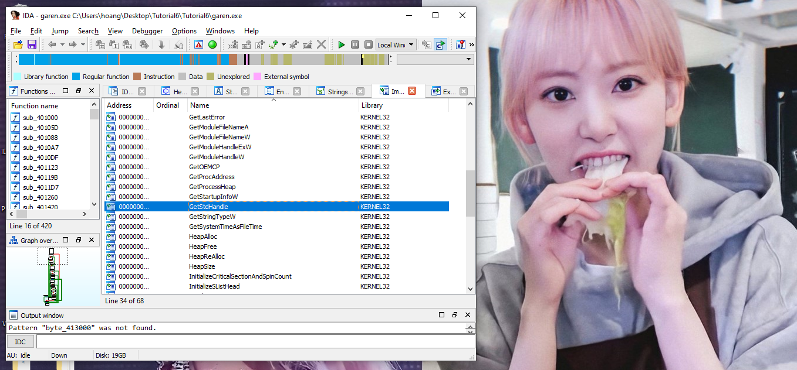
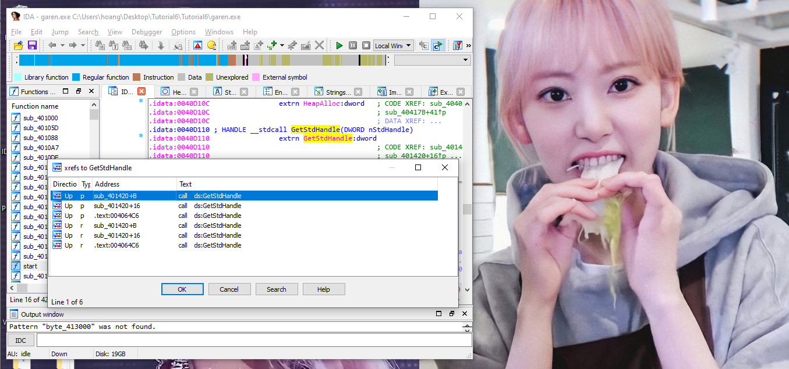
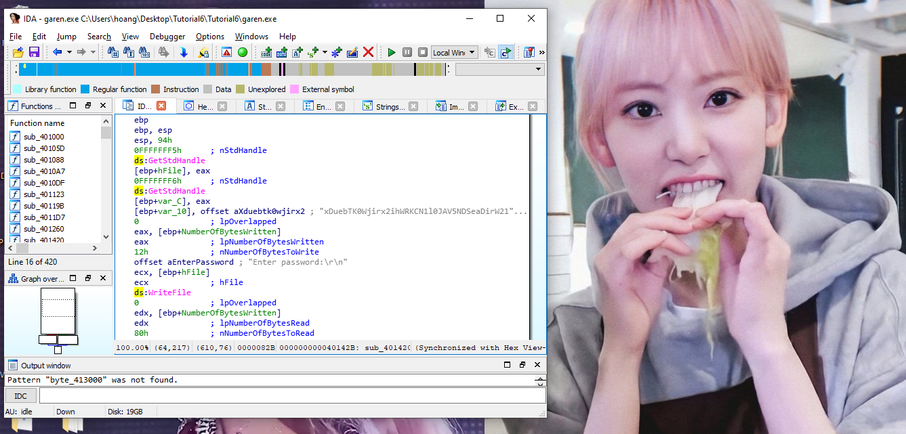
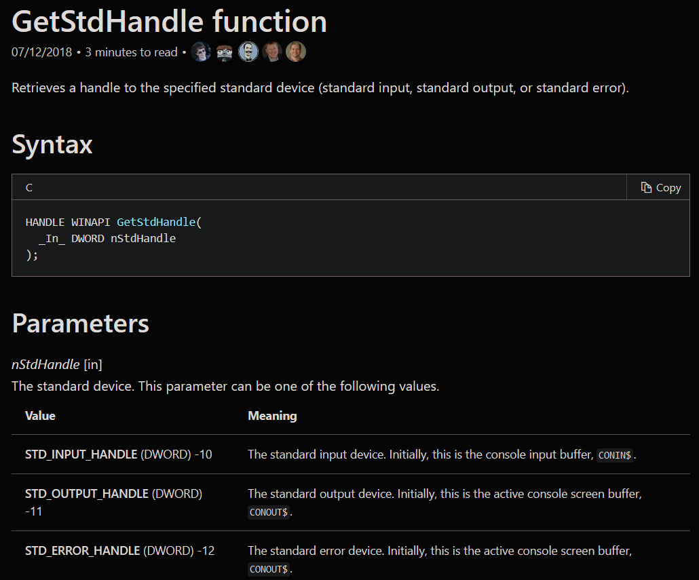
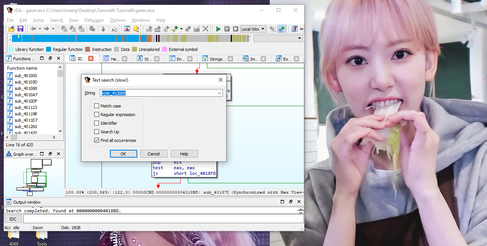
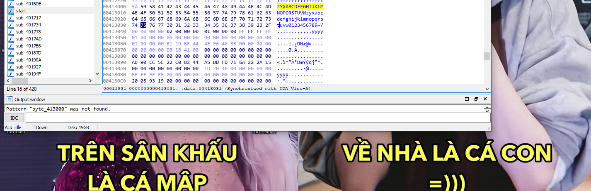
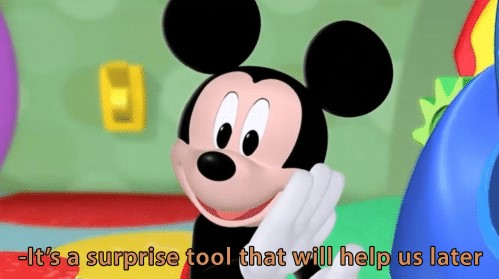
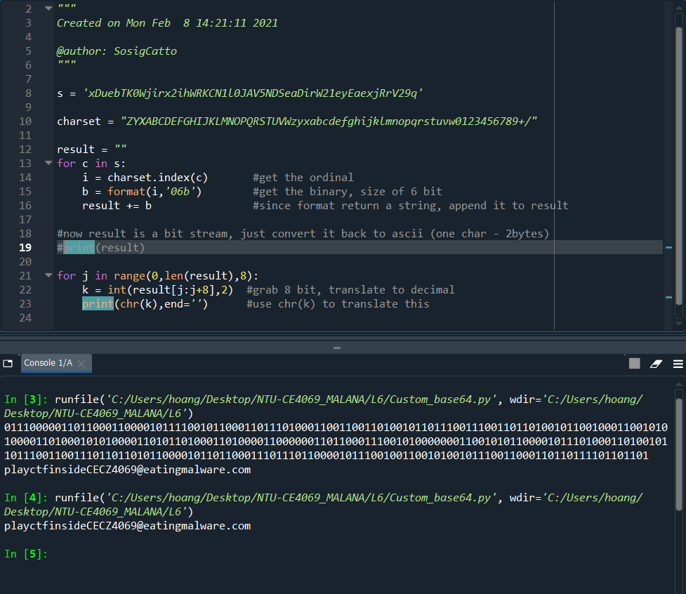

# Tutorial 6

Aye yo welcome back for another wild ride! We have a sample this time YAY. 


Let's get started! 


## Menu

[Garen.exe](#garen)

[Henry.dll](#henry)

Alright let's get started ヽ(o＾▽＾o)ノ

## <a name="garen">Garen.exe</a>

#### a.	Which handles has been retrieve for 2 calls to GetStdHandle()?

First thing is how do we even find GetStdHandle()...Oh well open the file in IDA, find the Imports View, click on __Name__ to sort it alphabetically and then find the damned function. 



Double click on the function name, it will open in IDA view, highlight the function name and then press X to show all the references. 



Click on the first one, then go to the graph functions and see the graph for more aesthetics.



Now we notice 0xffff_fff5 (-11) and 0xffff_fff6 (-10) (remeber that 5+11 = 16 and 6 + 10 = 16 ---- short hand trick for calculating signed) are being pushed as arguments. Now we search Google for the prototype of GetStHandle on [MS Docs](https://docs.microsoft.com/en-us/windows/console/getstdhandle).



So we know the handles are:

```
-10: Stdin
-11: Stdout
```

#### b.	List the array for byte_413000

We need to find the label byte_413000. Click on the binocular with a T (search Text) on the top panel and enter the value. Click on find all references. 



click on the one on .data section. Then switch to hex view.



```
ZYXABCDEFGHIJKLMNOPQRSTUVWzyxabcdefghijklmnopqrstuvw0123456789+/
```

This is a custom character set (charset) that has 64 characters...HMMMMMM



#### c.	What is the usual character set for base64 encoding? 

According to [wiki](https://en.wikipedia.org/wiki/Base64)

```
ABCDEFGHIJKLMNOPQRSTUVWXYZabcdefghijklmnopqrstuvwxyz0123456789+/
```
So we see that thie malware garen has a different charset than the standard charset of base64. This is a very normal malware behaviours. 

Well it's another hint. We'll get there soon enough. 

#### d.	What is the correct answer to the crackme? 

Base 64 is basically using 1 character to encode 6 bit of data. So imagine if you have this data chunk, every 6bit get encoded into a character. But usually ascii uses 1 bytes, so the base64-encoded string will look very very different from ascii. 


Base64-decode using that charset on the weird looking string **xDuebTK0Wjirx2ihWRKCN1l0JAV5NDSeaDirW21eyEaexjRrV29q**. We will get

```
playctfinsideCECZ4069@eatingmalware.com
```

#### e.	[Optional] Write a python script to solve the crackme

I couldn't find out how to custom decode charset that base64 online so I actually code up some python to do it. It's simple enough <<  ٩(◕‿◕｡)۶ >>. I have included the file [here](./Custom_base64.py) (100% original from Sosig CTF experience).



There should be other references online so I have searched up some [here](https://github.com/kingaling/custombase64/blob/master/custombase64.py) and [here](http://www.kahusecurity.com/tools.html). 


I have also do an encode function in that python file to create your own custom base64 encoded string. Can you find out what this is, using the same charset?

```
PS9eyS9Qy3KmW0KeaEOs
```

## <a name="henry">Henry.dll</a>


# 
And that's all for this week!! All the best for quiz everybady


See you next week!

[Back to Main Menu](./../)