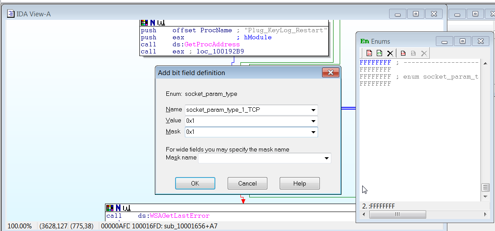

# Tutorial 6

Aye yo welcome back for another wild ride! We have a sample this time YAY. 


Let's get started! 


## Menu

[Garen.exe](#garen)

[Henry.dll](#henry)

Alright let's get started ヽ(o＾▽＾o)ノ

## <a name="garen">Garen.exe</a>

Hash that


#### a.	Which handles has been retrieve for 2 calls to GetStdHandle()?

First thing is how do we even find GetStdHandle()...Oh well open the file in IDA, find the Imports View, click on __Name__ to sort it alphabetically and then find the damned function. 


Double click on the function name, it will open in IDA view, highlight the function name and then press X to show all the references. 


Click on the first one, then go to the graph functions and see the graph for more aesthetics.


Now we notice 0xffff_fff5 (-11) and 0xffff_fff6 (-10) (remeber that 5+11 = 16 and 6 + 10 = 16 ---- short hand trick for calculating signed) are being pushed as arguments. Now we search Google for the prototype of GetStHandle on [MS Docs](https://docs.microsoft.com/en-us/windows/console/getstdhandle).


So we know the handles are:

```
-10: Stdin
-11: Stdout
```

#### b.	List the array for byte_413000

We need to find the label byte_413000. Click on the binocular with a T (search Text) on the top panel and enter the value. Click on find all references. 


click on the one on .data section. Then switch to hex view.


```
ZYXABCDEFGHIJKLMNOPQRSTUVWzyxabcdefghijklmnopqrstuvw0123456789+/
```

This is a custom character set (charset) that has 64 characters...HMMMMMM


#### c.	What is the usual character set for base64 encoding? 

According to [wiki](https://en.wikipedia.org/wiki/Base64)

```
ABCDEFGHIJKLMNOPQRSTUVWXYZabcdefghijklmnopqrstuvwxyz0123456789+/
```
So we see that thie malware garen has a different charset than the standard charset of base64. This is a very normal malware behaviours. 

Well it's another hint. We'll get there soon enough. 

#### d.	What is the correct answer to the crackme? 

Base 64 is basically using 1 character to encode 6 bit of data. So imagine if you have this data chunk, every 6bit get encoded into a character. But usually ascii uses 1 bytes, so the base64-encoded string will look very very different from ascii. 


Base64-decode using that charset on the weird looking string **xDuebTK0Wjirx2ihWRKCN1l0JAV5NDSeaDirW21eyEaexjRrV29q**. We will get

```
playctfinsideCECZ4069@eatingmalware.com
```

#### e.	[Optional] Write a python script to solve the crackme

I couldn't find out how to custom decode charset that base64 online so I actually code up some python to do it. It's simple enough <<  ٩(◕‿◕｡)۶ >>. I have included the file [here](./Custom_base64.py) (100% original from Sosig CTF experience).


There should be other references online so I have searched up some [here](https://github.com/kingaling/custombase64/blob/master/custombase64.py) and [here](http://www.kahusecurity.com/tools.html). 


I have also do an encode function in that python file to create your own custom base64 encoded string. Can you find out what this is, using the same charset?

```
PS9eyS9Qy3KmW0KeaEOs
```

## <a name="henry">Henry.dll</a>

Hash that boye


You should decompile the file in IDA **Pro**. The free version do not have the dll library necessary to properly disassmble it. 

### a. What is the address of DllMain?


```
It is .text section, addr 0x1000d02E
```
### b. Use the Imports window to browse to gethostbyname. Where is the import located? 

Go to import screen. Scroll a while. Find the fucntion and double click on it. 


```
It is at .idata section, addr 0x100163CC
```
### c.  How many functions call gethostbyname? 

Click on X, see it


```
The function is called 9 times:
    3 times by sub_10001074
    3 times by sub_10001365
    1 time  by sub_10001656
    1 time  by sub_1000208F
    1 time  by sub_10002CCE
```
### d. Focusing on the call to gethostbyname located at 0x10001757, can you figure out which DNS request will be made? 

Go to the  7th call and click ok


We see the parameter is eax, which is off_10019040 + 0Dh
We trace the off_10019040 by clicking on it, to find out it is variavle aThisIsRdo4069


```
It is trying to call 4069.tryghidraandbinaryninja.com
```

I don't understand the 0D + eax though... 

Edit: If you look at the string of aThisIsRdo4069, you will notice that the hostname only start at character 13. Hence the add was done to move the char pointer to the correct url. [Thank you](https://jmprsp.wordpress.com/2016/02/09/practical-malware-analysis-ida-pro-lab-5/)
### e. How many local variables as IDA Pro recognized for the subroutine at 0x10001656? 

Scroll scroll scroll 


Count count 
```
20 variables. Only count those with negative offset. 
```

### f. How many parameters has IDA Pro recognized for the subroutine at 0x10001656? 
```
1 variable. Only count those with positive offset. 
```
### g. Use the Strings window to locate the string \cmd.exe /c in the disassembly. Where is it located? 

Go to string view. Scroll scroll. 


```
It is at xdoors_d section, addr 0x10095B34
```

The variable is aCwd_exeC

### h.What is happening in the area of code that references \cmd.exe /c? 

Follow the graph (and abit of hints)


You see the main functions being called afterwards are:
strcat, memset and recv 

recv is to "receive a message from a connection-mode or connectionless-mode socket. It is normally used with connected sockets because it does not permit the application to retrieve the source address of received data." (from Google).

And based on the weird welcome message at the start of the function:


We can make a wild guess that after cmd.exe, it is receiving packets from a remote shell session. What else? With strcat and memset, a second wild guess is the final string send over before recv is invoked will be "cmd.exe/ {dst var}", so basically it will do a remote shell execution. 

### i.  In the same area, at 0x100101C8, it looks like dword_1008E5C4 is a global variable that helps decide which path to take. How does the malware set dword_1008E5C4? (Hint: Use dword_1008E5C4’s cross-references.) 

Press x on the variable, we will see 3 references that is relevant to this. Click on the first reference. 


We'll see dword_1008E5C4 value being loaded in from eax, which was a call from sub_10003695. Go from that subroutine. 


```
We now know that this dword_1008E5C4 is the OS information. 
```
### j. A few hundred lines into the subroutine at 0x1000FF58, a series of comparisons use memcmp to compare strings. What happens if the string comparison to robotwork is successful (when memcmp returns 0)? 

Find the function 


If memcpy succeeds, eax will be 0, so jnz will follow the red arrow (green arrow means jnz's condition is satisfied)

It will call a sub 


Click on that


We will see the subroutine. We see a few RegOpenKeyExA, ReqQueryValueExA and sprintf. So we can guess it's trying to exfiltrate some data. (Take note of which value it's querying)

What will it do with this data? 


After querying all the data and store the values in some data, it do the sub_100838EE


Yes it's sending data back :> 

```
It is sending these data back to the host:
HKLM\SOFTWARE\Microsoft\Windows\CurrentVersion\
Key: Worktime
KeyL WorkTimes 
```
### k.	What does the export PSLIST do? 

PSList first check the windows version. 


A detailed of that checkWinNT5 version is here


Then we go to he doSumThing routine. 

It has some sprintf and send and some process ID. From the book answer:
```
The PSLIST export sends a process listing across the network or finds a
particular process name in the listing and gets information about it.
```

From internet answer:
```
it will then check if a string argument is passed in as well. If there is no string being passed in, it will go through all running processes and send it out via the network else it will only send the processes that matches the string that is passed in.
```
I... will do it on another day. This is too much for me now :D

### l.	Use the graph mode to graph the cross-references from sub_10004E79. Which API functions could be called by entering this function? Based on the API functions alone, what could you rename this function? 

Search in the function for that sub, then go in graph mode. It was very near our robotwork function just now. The check, however, is not "robotwork", but "language". Sure enough when we go into the function, we'll see the usual [Core API CALL ] -- which in this case is GetSystemDefaultLangID, send and sprintf. It's for another exfiltration. 


```
It is exfiltrating the default language of the system.
```

### m.	At 0x10001358, there is a call to Sleep (an API function that takes one parameter containing the number of milliseconds to sleep). Looking backward through the code, how long will the program sleep if this code executes? 


We see that there's an add of 13 (similar to the dns string just now). Then it will take the value, multiply by 0x3E8h (1000 in decimal), then sleep. So it will sleep(off_10019020) seconds. 

Now if we look into the data:


The original lab has (courtesy of the same wordpress earlier)


So our prof has edited the program and edit out the 30 and hence the program will sleep for 0 seconds. 

### n At 0x10001701 is a call to socket. What are the three parameters? Using the MSDN page for socket and the named symbolic constants functionality in IDA Pro, can you make the parameters more meaningful? What are the parameters after you apply changes? 

Go there and find the socket call from mdsn


So mapping it to the function


So protocol = 6 , type = 1 , af = 2 

From MSDN docs
protocol=6 means TCP
type=1 means TCP
af=2 means IPv4
Personally the IDA pro already label it pretty meaningfully. But well :) 

Step-by-step guide

1. Click on View, open enums pane. Click on the first red page icon (define new enum type)


2. Declare the name (usually the variable name, not its value). tick bitfield. Add ok.


3. Once enum is defined, we go on to declare the values. Click on the second red page icon (define new member). Fill in the Name with meaningful name and then fill in value and mask (just put same as value is ok).



4. Select on the orginal value, now right click and choose the symbolic constant


This is the result. 


There's IDA plugin for all MDSN [here](https://www.fireeye.com/blog/threat-research/2014/09/flare-ida-pro-script-series-msdn-annotations-ida-pro-for-malware-analysis.html)

And that's all for this week!! All the best for quiz everybady


See you next week!

[Back to Main Menu](./../)