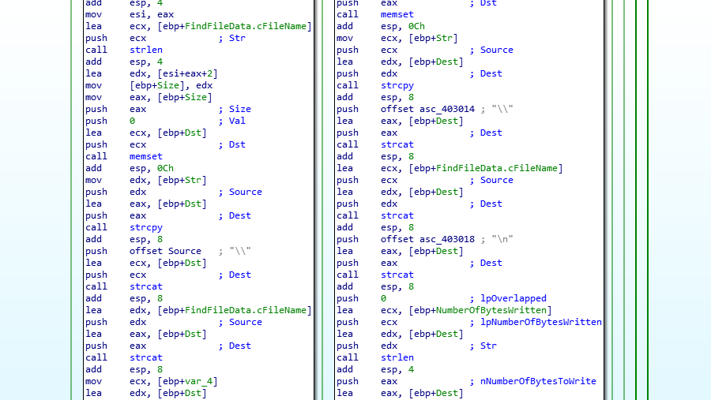

# Tutorial 7

_Prologue:_

Hi guys  (╯︵╰,)

Sosig is finally back after 25 days of not touching malware :< I have been doing a lot of technical interviews for my summer internship and so I really did not have the time (until now) to do up this blog (since I also have A*STAR work as well as other acads and CCA and AHHHHHH SO MANY OTHER TINGS). 

Anyway, now all is settled, I have made the time to return to Sosig Wonderland and tackle the most difficult topic of all time: **Windows API**. Let's GO ♡＼(￣▽￣)／♡ 


Tutorial 7 is not easy and the explanation is also not easy. The explanation is LONG because I explain very detailedly how one can come up with that kind of explanation. Choerry up!


## Menu

[idream.exe](#idream)

[jay.exe](#jay)


## <a name="idream">idream.exe</a>

First of all, get the hash


Now let's open the file in IDA and have a quick look: 


We only see one subroutine **sub_401000** and a main routine, which looks deceptively simple. It looks like a sequential if else and then execute **sub_401000** at the end.

### a.	Describe any initial file/registry operation performed by the malware. 

For this part, since it's a short sample, there's two approaches to this 
* Scroll around and see any strings lying that look like a file / a hkey
* Go to imports and find the usage of all files-related functions and hkey-related functions

I will follow the first approach, and collect: 
* Files: dream.cfg, 4069.txt 
* Hkey: SOFTWARE\Dreamer;  SOFTWARE\Microsoft\Windows\CurrentVersion\Run ;  Software\Microsoft\Windows\CurrentVersion\Explorer\Shell Folders 

The third dirty approach is to just go to data section and see all the strings there, like this


At this stage, I really don't think you can conclude any more than:
* It gonna use the **dream.cfg** (typical malware config) and write to a file called **4069.txt**
* Create a new key called SOFTWARE\Dreamer (no idea what's gonna be inside), Run persistence key (typical) and probably files enumeration in the shell folders (enum because this folder usually doesn't contain anything interesting nor is it very hidden like %TEMP%)

Which is why I kinda disagree with the prof answer but WELL...

Different styles ヽ(￣～￣　)ノ

### b.	What is the functionality of the Windows API - GetModuleFileName(). Does it return any useful information? If yes, where is it stored?

[GetModuleFileName]((https://docs.microsoft.com/en-us/windows/win32/api/libloaderapi/nf-libloaderapi-getmodulefilenamea)) this and get to the return value section:


We know that it will return the length of the fullpath string. But where is that stored? Scroll up to read the parameter and you will see that it will be stored in lpFilename. This will be useful in part f (I'll explain what is that function doing in the malware there)

```
This Windows API retrieve the fullpath of the specified module, 
the return value being the length of the string copied to the 
buffer (lpFileName)
```

### c.	What are the parameters passed to CopyFile() call at base address + 0x 15ED?

Yeet ourself to address 0x0040015ED


MSDN the CopyFile function: 


The parameters to this API call are: 
```
bFailIfExists True (function will fail if lpNewFileName already exists) 
lpNewFileName is in variable **Dest**
lpExistingFileName is in variable **Dst**
```

### d.	Which Registry path is being open for the RegOpenKey() at base address + 0x1601 and what is the purpose of this registry key. At which instruction is the value for this specific registry modified and how is the significance of that value?

In the same segment as above


Seeing in 0x00401601, the RegOpenKey is opening: 

```
SOFTWARE\Microsoft\Windows\CurrentVersion\Run
```

This is the typical run registry key persistence, which help the malware survive reboot. 

### e.	Which Registry path is being open by RegSetValueExA () at base address + 0x1687? and what is the purpose of this registry key. At which instruction is the value for this specific registry modified and how is the significance of that value?

We scroll around for abit


We see that in 0x00401668, the eax is holding the hkey **\"HKLM\\SOFTWARE\\Dreamer\"**. If the RegCreateKeyA is successful, we will go to loc_401677, where eax will be phkResult. Looking at MSDN of RegCreateKeyA, we know that phkResult is A pointer to a variable that receives a handle to the opened key.

 Hence we can be confident that RegSetValueExA will set a value in **\"HKLM\\SOFTWARE\\Dreamer\"**. Now to know detailedly about this Registry operation we need to identify: 
 * What is the full key (aka with its hive)
 * What is the value that was set

### 1. **The Key and The Hive** 

_Why is the key HKLM? Didn't the variable only contain SOFTWARE\\Dreamer?_

Look at the **RegCreateKeyA** at base+1668 and see the hkey parameter passed in as 800000002h. This is HKLM. 

For your info:
```
    HKEY_CLASSES_ROOT = (0x80000000),
    HKEY_CURRENT_USER = (0x80000001),
    HKEY_LOCAL_MACHINE = (0x80000002),
    HKEY_USERS = (0x80000003),
    HKEY_PERFORMANCE_DATA = (0x80000004),
    HKEY_CURRENT_CONFIG = (0x80000005),
    HKEY_DYN_DATA = (0x80000006),
```
It is written in Visual Basics (VB). I took my src from [here](http://www.dsource.org/projects/tango/ticket/820)

### 2. **The Value** 

We need to note in the param of RegSetValue:
* hkey is the key to be set
* lpValueName: The name of the value to be set. If a value with this name is not already present in the key, the function adds it to the key. If lpValueName is NULL or an empty string, "", the function sets the type and data for the key's unnamed or default value.
* lpData: The data to be stored.
* cbData: The size of the information pointed to by the lpData parameter, in bytes

Mapping this back to our code, we notice cbData is 4. The function will set the value default (since lpValueName is null) of key HKLM\\SOFTWARE\\Dreamer to 4 bytes pointed to by Data. 

We made good progress... but what is the variable Data still?

  Data is initialized to 0 (scroll to the top). There is no operation where it is on the dest operands (highlight Data click once on it). So that leaves the possibility that one of the API actually load the data from somewhere. Which brings us here: 


The variable Data could have been loaded by:
* RegQueryValueExA 
* ReadFile

Looking up [***RegQueryValueExA***](https://docs.microsoft.com/en-us/windows/win32/api/winreg/nf-winreg-regqueryvalueexa), data will receive the value inside the hkey "HKLM\SOFTWARE\Dreamer" ( _this shows that our original guess of it creating this key maybe wrong -- may be it is checking in the system if this key exist and extract the value from there._)

Looking up [***ReadFile***](https://docs.microsoft.com/en-us/windows/win32/api/fileapi/nf-fileapi-readfile), data will receive the its content from a file. 

So there's two possibilites, and what decides what's value? Look at the [PathFileExistsA](https://docs.microsoft.com/en-us/windows/win32/api/shlwapi/nf-shlwapi-pathfileexistsa), it will return True (Bool, 1) if it exists. 

**So, stringing these 3 APIs together:**

* Check if dream.cfg exists:
  * If Yes (1,True, EAX = 1 , EAX != 0), then open existing file ([CreateFileA](https://docs.microsoft.com/en-us/windows/win32/api/fileapi/nf-fileapi-createfilea) with DwCreationDisposition = 3) and read file content into local variable Data. 
  * Else check the key "SOFTWARE\Dreamer" and if we can open that key, then Query the value into local variable Data.
* Else, put data = 1 (.text:0x00401530)

Now this will make you think what is inside the file is probably _just an integer_. Else why its default case is 1 ??? This also tallies with the fact that we only load in 4 bytes -- size of an int. So what is so significant about this int? \

We highlight the variable and scroll **DOWN** until we see something interesting: 
* The value got written into "HKLM\SOFTWARE\Dreamer"  -- probably because if the key didn't exist yet it's time to create it now.
* It is the parameter to Sleep where it is multiplied by 60000 (mili to minutes). So by default it will sleep 60000ms = 6mins. 


  
_All that effort just to find out that it is an integer of sleep time_

### f.	What is the action taken by the sample at base address + 0x16B5 ?

For this part, the API we are looking for is [MoveFileExA](https://docs.microsoft.com/en-us/windows/win32/api/winbase/nf-winbase-movefileexa) and look at the MSDN. 

dwFlags is 4, which is **MOVEFILE_DELAY_UNTIL_REBOOT 4 (0x4)**
```
	The system does not move the file until the operating system 
    is restarted. The system moves the file immediately after 
    AUTOCHK is executed, but before creating any paging files. 
    Consequently, this parameter enables the function to delete 
    paging files from previous startups.
    
    This value can be used only if the process is in the context 
    of a user who belongs to the administrators group or the 
    LocalSystem account.
```
lpNewFileName is specified to be 0 (NULL), and interestingly enough in MSDN there is this paragraph: 

```
    If dwFlags specifies MOVEFILE_DELAY_UNTIL_REBOOT and
    lpNewFileName is NULL, MoveFileEx registers the 
    lpExistingFileName file to be deleted when the system restarts. 
    If lpExistingFileName refers to a directory, the system removes the directory at restart only if the directory is empty.
```
So it actually delete the file specified by lpExistingFileName, which is in variable Dst. 

Naturally, the next question is what's stored in Dst (tbh there's only three files dream.cfg, 4069.txt and the malware itself. Which one do you think it is?)

To verify our thoughts, let's travel up and see where \[ebp+Dst\] got set -- the GetModuleFileName in part a:


We see that after all the hoo-haas about getting the integer value Data in part e, it all goes to this portion, aka this portion is independent of all the if-elses above. Now what Module is specified by 0? According to MSDN:
```
A handle to the loaded module whose path is being requested. If this parameter is NULL, 
GetModuleFileName retrieves the path of the executable file of the current process.
```
So Dst variable is $0 (if you know bash) -- the current running script, aka the malware itself.

**So we now know that the malware will delete the original copy of itself.**

My intuition says that it probably has copied itself somewhere else before commiting to this deletion. So if it copies itself somewhere, then there will be a call to CopyFileA API where DST itself is in the lpExitingFileName: 


HMMMMMMMMMM interesting.

so Dest is the new copy of the malware and dest comes from: 


[GetSystemDirectoryA](https://docs.microsoft.com/en-us/windows/win32/api/sysinfoapi/nf-sysinfoapi-getsystemdirectorya) will get the "C:Windows\System32". Scrolliing down abit after this and you will see a lot of string functions (strlen,strcmp,strcat,strcpy). It's reasonable to guess we will be building a string that stores the new path, and this new string is stored in variable Str

**So what is Str?**

How brilliantly it is built, is actually in this function called strrchr: 


[strrchr](http://www.cplusplus.com/reference/cstring/strrchr/) returns the last occurence of a character. The character is 5C in hexa -- aka the "\\". In Dst variable, we know it has the fullpath to the malware. We know after the last slash is the malware name. So it's basically will be building a "C:Windows\\System32\\[MalwareName\]"

So to sum up our investigation so far: 
* At base+1545, we call **GetModuleFileName** with hModule = 0 to store the fullpath of the malware into Dst var
* At base+155D, we call **strrchr** to get the index of the last backlash in Dst, and we gonna use this int index for the malware name 
* At base+157F, we call **GetSystemDirectoryA** to create the "C:Windows\System32" portion of the new file
* At base+15CE, we call **strcat** to form the new file path "C:Windows\System32\\[MalwareName\]"
* At base+15ED, we call **CopyFileA** to copy the malware into its new persistent position
* At base+16B5, we call **MoveFileExA** to delete the original malware

_a truly reverse engineering experience, with a RE train of thoughts: what could have happened? We start exploring from the very last API, and deduce up the chain of events._

### g.	What is the name of the registry value being queried by the call to RegQueryValueEx at base address + 0x16F9? What is the significance of this registry value? 

Woa abit tired. Here's a chuu pic at Marie Claire photoshoot. 


OK leggo


This is the position of RegOpenKeyA. As we see it query the Personal key of HKEY HKCU\Software\Microsoft\Windows\CurrentVersion\Explorer\Shell Folders

So how about we go take a look ourself, in HKCU (rmb i said earlier, HKCU is 80000001) ? 

Win+R > regedit > multiple clicks to get down the path later: 


We see that shell:personal point to **My Documents**. By RegQueryValueA MSDN, we know the resulting path will be stored in lpData at local var_E54. 

_Just interjecting ah... if your browser don't look like this you doing something wrong_


### h.	What is the purpose of sub_401000?

Go inside it and take a look: 


It looks simple enough, and it looks like there's a loop. Most likely this will be an enum (i said something about this earlier...) cuz of the shell:personal things. Let's look abit more deeply: 


At the very front we already know this thing is trying to find files via FindFirstFileA iretatively (can see in base+12C4 and base+1035) until INVALID_HANDLE_VALUE (value of -1, 0xFFFFFFFFh) is reached. 

The next few steps are the folder stuff (see all the . there), not important. I will not look into it LOL. Jk i did look into it after half an hour and the answer is [here](https://stackoverflow.com/questions/8436841/how-to-recursively-list-directories-in-c-on-linux). They are the \. and \.\. files -- used for folder stuff. 


Now is the interesting part


Now if you still remember what i said about strrchr earlier, it looks for a character index in a string. In this case, 2E is the fullstop -- it is looking at the file extension. And following which it is comparing the extension of the file to ".doc". If that's the case (eax = 0 from strcmp), then we follow the redarrow. (since it's jnz and we fail jnz so we follow red). 

The whole chunk afterwards (the two big rectangles yall see in the earlier intro section) is worth analyzing. There are two big rectangles. The only difference between the two big rectangles are that one has WriteFile (the rightside one), while one doesn't have. So the malware will only write stuff when it has .doc extension. Oh and it also skips file that is longer than 1000 bytes because the buffer it allocated for the filename is only 1000 bytes. 

Here is the malware writing things nicely into a buffer first



Ok then eventually it writes the filename (.cFileName) to hFile local var. So what is hFile? 

I decided to go take a look at what was being given to this  function (look around base+1871 region), and we gather the following more important parameters: 
* hFile is var_C, which was created from CreateFileA which was %TEMP%/4069.txt (its path is built similar to the filepath we do just now, but with GetTempPathA instead of GetSystemDirectory API) 
* Str is var_E54, which is the list of file in shell:personal

The rest of it just gonna be formatting, but the whole idea is clearer now: write all filename containing .doc into 4069.txt, and make sure to format it nicely (wrap). :D 

After the ds:writeFile, there is still some random string lying around like "\\*" (base+12A2) -- which is a wild card character for all the files in the directory. Why would you need wild card? MSDN of FindFirstFileA says: "Searches a directory for a file or subdirectory with a name that matches a specific name (or partial name if wildcards are used)." 

So the whole purpose of this thing is to find all files in the shell:personal, and if that file has .doc extension, then write to 4069.txt

### **i.	Summarize the overall functionality of this program**

* At base+142E region, the decision making of the malware happens. It checks for "dream.cfg", if that exists then set var data = file content, else check in "HKLM\SOFTWARE\Dreamer" and set var data = value of that key. Else set data = 1 (mins) (part e)
* At base+1545 region, it creates a new filepath "C:Windows\System32\\[MalwareName\]", copy the file to this location, and delete the file if reboot happens at base+16B5 (part f)
* At base+162E, under the Run registry key, create subkey "goodnight", store the file there for it to run during restart (not covered)
* At base+1650, overwrite the "HKLM\SOFTWARE\Dreamer" to variable  data 
* At base+16F9, set var_E54 to shell:personal (which is "My Documents"). This is a directory path. (part g)
* At base+1770, create a temp file %TEMP%/4069.txt using GetTempPathA and strcat.
* Invoke sub_401000 with the tempfile and var_E54 as parameters. This will iterate through all the files in this folder (and its subfolders too) and if the file has .doc extension and its name has less than 1000 bytes, write it to the tempfile. It also writes the timestamp.
* Sleep for $data minutes. Then repeat the previous step again. 

So you can see this is more of a file monitoring system for .doc files. Interesting. 

WEW THAT's ALL FOR THE FIRST PART! 


## <a name="jay">jay.exe</a>

_tbh jay is abit better than idream_ 

Get the hash


Then, 

### a.	Is this binary the “client” or “server”


It is connecting to a foreign server, so most likely it is a client. 

### b.	Document down the network protocol, C2 domain and port.

Scrolling around the region where it makes the connection to server, we find the protocol at base+1592 at the call to [WSASocketA](https://docs.microsoft.com/en-us/windows/win32/api/winsock2/nf-winsock2-wsasocketa). 


The info are:
```
AF = 2 -> IPv4
protocol = 6 -> TCP
C2: CE4069.tutorial7.com
por:t 80
```

### c.	What is the malware functionality of jay.exe.

Aint it abit early to know what it does?? Abit the no foreplay ah. 

### d.	Try to setup a netcat server and try to establish communication with the sample. What is the greeting message?

Use fakenet as instructed by instructor. Use netcat to basically catch the connection on port 80 by 

nc -l -p 80 (listen, port 80)

We should see the malware will send the message over to C2. 

The message can be seen at base+16C7 and base+1782

"Ready for action?\n" followed by a call to ds:send -- where it sends over the greeting message to the C2. 

Now we can guess what is with part c

### c.	What is the malware functionality of jay.exe. 

the first thing it does is to ds:send greeting message, then it do a ds:recv at base+1714. Following which whatever it receives got passed into a function with a bunch of if else and based on the value do different things. This sequence of waiting for C2 and then based its decision on the C2 packet is very typical of a backdoor that allow C2 to remote control/do things on the victim machine. 

### e. What command are there? 

Erz i kinda rename all my functions:


Commands subroutine is at 401000. Let's go through each command one by one. Of course

First two: "df" and "uf"


"df" is at loc_401091 while "uf" is at loc_4010ED


_recap: sscanf read formatted input from string. In this case it reads a int and a string via %d %511s_ 

For "uf", I was confidently renaming the call to SendFile because of the Windows API it made:
* CreateFileA with dwCreationDispostion = 3 (Open Existing) (163F), GetFileSize (13A8), ReadFile (140B), followed by ds:send (1431).

For "df", we look into my typo Coomand_me_plz (i saw that string inside the function, so i just name it that.) The function has the kind of UWU vibe....ngl:

It starts with CreateFileA (1224), send a "command me plz!\n" to the C2 (1272), ds:recv (12BA) and then WriteFile (12E7). So this function downloads a file from the C2. 

Moving onto "de" and "gd"


follow Hansel and Gretel's GPS


the "de" calls a function that will call df function. While gd sends over %TEMP%/4069.txt (apparently "gd" is get document)

Looking into "de": 


After the file is sent from C2 to victim via "df" function, it gets createProcess... Somethings doesn't sound right. 

I relooked into Coomand_me_plz, and see that in "df" the file in C2 is written into a variable called lpFileName. In "de", what's written in the supposedly lpFileName is called lpCommandLine. And it is then passed to CreateProcess. I guess the malware author refashion the same call for 2 different purposes, to avoid rewriting. After all, command or files, they are bytestreams over TCP. 

We can conclude that "de" is downloads and executes. 

The last command is "qu" -- which is by the name, quit. Tracing it leads to a bunch of cleanup and return calls. 

So in summary: 
```
"df": write file from C2 to victim
"uf": send file from victim to C2
"de": recv command from C2 and execute
"gd": send %TEMP%\4069.txt to C2
"qu": quit
```

That's all for this week tutorial! What an arduous ride. 


See you next week!

[Back to Main Menu](./../)