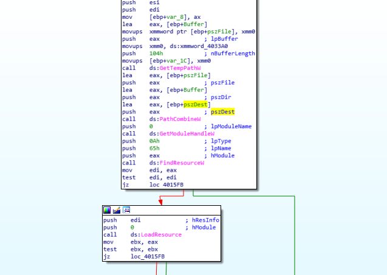

# Tutorial 8

Double shot this week because I'm having fun (ﾉ◕ヮ◕)ﾉ*:･ﾟ✧ 


Let's get started! 


## Menu

[kate.exe](#kate)

[lala.exe](#lala)

Alright let's go ヽ(o＾▽＾o)ノ

## <a name="kate">kate.exe</a>

Check the hash 


It is based off the Practical Malware Lab 7-1. Then it is similar to Alice.exe which you can find at [this repo also](./../L1/L1.md).

### a.	How does this program ensure that it continues running (achieves persistence) when the computer is restarted? Please provide specifics

Oldest tricks in the book: check the strings 


Then use the cross-ref of these variables to work backwards LMAO. I already work on Alice.exe ┐(‘～` )┌ I know the inner working of this malware. It creates malservice and also use a mutex. However now is 8 weeks down the road, so I can explain in _a lot_ more details. 

The service is called in main, quite early:


The service invokes [StartServiceCtrlDispatcherA](https://docs.microsoft.com/en-us/windows/win32/api/winsvc/nf-winsvc-startservicectrldispatchera) that will start a service (this is just part of the init routine)

 

Where the task to be run is SOSIG_MUTEX (renamed). 

Looking into that: 


We will need to take a look at MSDN for [CreateServiceA](https://docs.microsoft.com/en-us/windows/win32/api/winsvc/nf-winsvc-createservicea). 

Take note of the 

dwStartType set to 2 -- SERVICE_AUTO_START 0x00000002
```
A service started automatically by the service control manager during system startup. 
```
dwServiceType set to 10 -- SERVICE_WIN32_OWN_PROCESS 0x00000010
```
Service that runs in its own process. 
```
The binary path is set to the fullpath of the current process (i  explained this in tutorial L7 about the 0 handle thing to GetModuleFileNameA). 

So when it registers the service to SCM, SCM will auto run it during startup as a service, using the full path of the malware. (not very stealthy though, but it is persistent since SCM registered it already). 


### b.	Why does this program use a mutex? 

Tbh it doesn't have to. It likes to keep one instance running. That's about it. Or is there some functions that requires mutex inside the malware? IDK (・_・ヾ )

Anyway, the mutex is CE4069. Prof has gotten less creative with the naming. Where is "ProfLamlikesmilopengkosong.com" (つω`｡) 
	
### c.	What is a good host-based signature to use for detecting this program? 

host-based:
*	mutex CE4069 
*	service MalService with displayname Malservice

network-based: 

'http://www.eatingmalwarelabinc.com' 


It just makes a lot of connections. 

### d.	What is the purpose of this program? Elaborate your answers with justification from the assembly code. 

It is a spambot that tries to overwhelm the url in part d. I have done this in Alice.exe :> Please refer to the In-Depth section of Alice.exe for more details. 

```
Register the service
Create a timer of till 0x7E6 year -- wait till 2022
Create 17 threads (shown below) whose task is at __StartAddress__ subroutine
```

### e.	How do you would advise on how to remove this malware?

The service requires the fullpath of the malware. Just go and delete it. 

Or use sc.exe to remove it from scm

Or both. 

## <a name="lala">lala.exe</a>

When I first do this I thought it was hollowing. Turns out due to the lack of unmapping, i think it is more of a reflective dll injection. Actually, since it wrote to disk, it is definitely a dll injection, just how we classify it. 

For this tutorial, I overlooked the Unicode strings and got rekted hard. F. 

Check the hash 


### a.	What is the purpose of sub_401000?

First glance through, it works in the Kernel with all the K32 functions. That's not good. 

For this part, I need to scroll up and down and google for a good while. My guess is that it is using K32EnumProcesses, K32EnumProcessModules, K32GetModuleBaseNameW. So it will enumerate all processes, check the modules (libraries) that each process do, and get the module name. 


The module it's looking for is used in wcsstr (find substring). The substring is 30h variable, which was loaded from xmm0. So we trace xmm0 up to the data section (xmm was ds:xmmword_403310) and find:


I overlooked this unicode string the first time I saw this. Turns out Mr Ho said it's a Unicode string. So highlight the variable, click Edit > String > Unicode


So it's enumerating and find calc.exe. 

What it does when it finds is interesting:


* If it can find calc.exe in running process, grab the handle
* Else, expandEnvironmentString for calc.exe (hardcoded) and just create a process. If so, create calc.exe in suspended mode. It wont run until ResumeThread is called. 


# b.	Where is the DLL dropped to? What is the significance of that path? 

_This one was ADS and I got totally wrong on the first try_ 

Revised version:

We know that the malicious dll is in the resource section and will be written into a file


the filename is pszDest, so go to where this string was built



String was built from [PathCombineW](https://docs.microsoft.com/en-us/windows/win32/api/shlwapi/nf-shlwapi-pathcombinew) with pszFile and pszDir. 

pszFile is built from [GetTempPathW](https://docs.microsoft.com/en-us/windows/win32/api/fileapi/nf-fileapi-gettemppathw) so it will be %TEMP%

pszDir is taken from xmm0, which is xmmword_4033A0. 


This is another Unicode String


So the final file is %TEMP%/log.txt:hidden_dll

The ADS is something new to me so this is the first time I see it in Assembly form. It was extracted from the "" (unnamed stream) of the file log.txt. 


You can read more about ADS [here](https://www.deepinstinct.com/2018/06/12/the-abuse-of-alternate-data-stream-hasnt-disappeared/)

Additionally, take note that:
* pszDest is the malicious dll now
* hProcess is our calc.exe (victim process)

This will be useful for the next section

### c.	What is the purpose of instruction from 0x0040125B to 0x00401390

It is injecting the Src (the malicious dll) into  the hProcess (calc.exe) -- or at least in the process of doing it:

1. lala.exe uses ZwCreateSection to create a section in calc.exe, then take the handle of this section. 
2. It finds the baseAddress via NtMapViewOfSection, get that address into var Dst. 
3. It then write the content of Src (or its malicious dll) into this section via memcpy. 


### d.	What is the purpose of sub_401240? 

To help with your understanding, take note of the following variables:
* hProcess is host process, the calc.exe
* Src is the source file, the log.txt:hidden_dll. Also stored in esi
* var_4 is the section handle from ZwCreateSection
* Dst is a destination buffer that will contain the dll content later on. Sort of like a temp buffer. 


The whole story isof this sub routine is 

1. lala.exe uses [ZwCreateSection](https://docs.microsoft.com/en-us/windows-hardware/drivers/ddi/wdm/nf-wdm-zwcreatesection) to create a section object (handle: var_4). **This section object can be shared among processes.**
2. lala.exe then calls [NtMapViewOfSection](https://docs.microsoft.com/en-us/windows-hardware/drivers/ddi/wdm/nf-wdm-zwmapviewofsection) with arguments eax (from ds:getCurrentProcess) and var_4, so it map this section object into itself, *so that it can inject the dll inside this section*. 
3. lala.exe determines the base address of this section that just got created, and then memcpy the content of the malicious dll (esi--Src) in to this section object.
4. lala.exe then maps this section object to the host process via NtMapViewOfSection (since ZwCreateSection's section can be shared among processes) with arguments var_4 and hProcess
5. It unmaps section object from itself via ZwUnmapViewOfSection with arguments eax (from ds:getCurrentProcess) and var_4, so now the section object is only owned by hProcess.
6. CreateRemote Thread via LoadLibraryW via kernel32.dll to start the dll run. It is so standard it can be written as below: 

```
VOID InjectDll(HANDLE hProcess, LPCSTR lpszDllPath) {
	LPVOID lpBaseAddress = VirtualAllocEx(hProcess, NULL, dwDllPathLen, MEM_COMMIT | MEM_RESERVE, PAGE_EXECUTE_READWRITE);

	WriteProcessMemory(hProcess, lpBaseAddress, lpszDllPath, dwDllPathLen, &dwWritten);

	HMODULE hModule = GetModuleHandle("kernel32.dll");

	LPVOID lpStartAddress = GetProcAddress(hModule, "LoadLibraryA");

	CreateRemoteThread(hProcess, NULL, 0, (LPTHREAD_START_ROUTINE)lpStartAddress, lpBaseAddress, 0, NULL);
}
```

Src: [dll inject](https://0x00sec.org/t/reflective-dll-injection/3080)

I can summarize the whole process of injection as followed: 

* Stage 1: Host Finding: find calc.exe: enum running processes to find it or create a new calc.exe process in suspended state then resume thread. 
* Stage 2: Dropping: Extract the dll from the resource section of the malware, write it to a lpbuffer (VirtualAlloc) then write the buffer to the a file (the ADS of log.txt)
* Stage 3: Injection: Create a section object, maps the object to itself in order to memcpy the dll (which is hiding in the log.txt's ADS) into the section object, then map this section object to host process, and run the dll via standard dll injection techniques (where it force calc.exe to load the dll payload as a library. As a result of this loading, it will immediately execute the DLL’s DllMain entry point with the DLL_PROCESS_ATTACH reason)

I have stumbled on some nice resource while doing this tutorial

[Summary of Windows API in malware](https://resources.infosecinstitute.com/topic/windows-functions-in-malware-analysis-cheat-sheet-part-2/)

#
That's all for this week! Goodbye, au revoir, adiós


See you next week!

[Back to Main Menu](./../)
