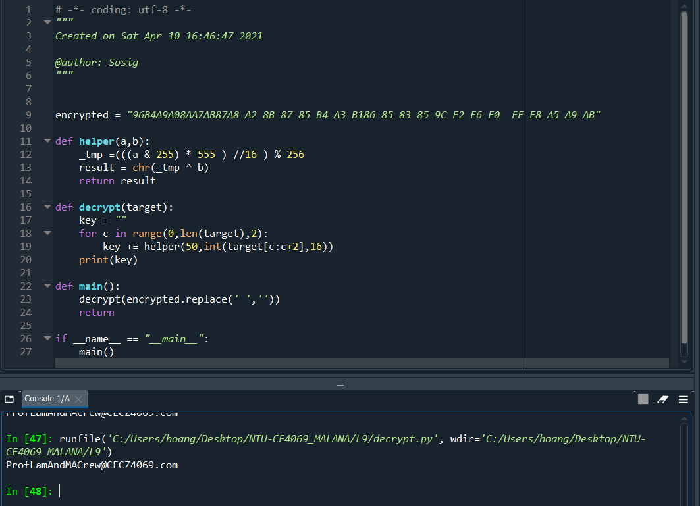
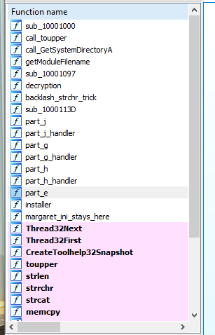
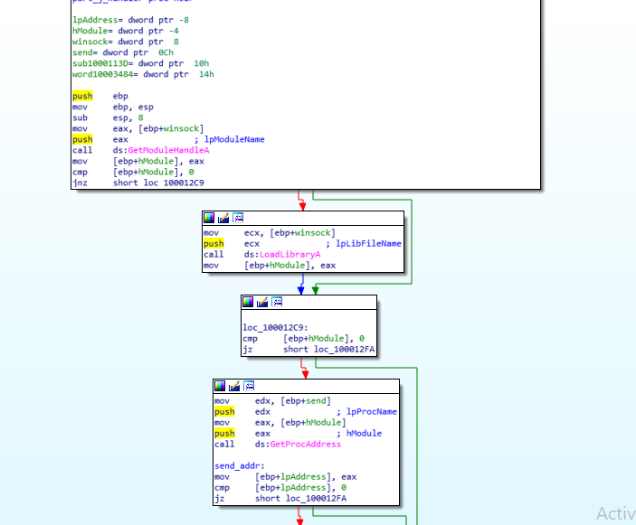

# Tutorial 9

Second last tutorial. Let's go(won) ~^0^~ 


# Prelude

This is a hard tutorial, especially the last part when the hooking is carried out. There is a lot of variable renaming in this tutorial due to the fact that variable and arguments are being thrown around very often and as such it's easier for me to rename and track what they are doing at the moment. However it will make YOU following the tutorial harder. And I'm sorry for that. 

With that being said, let's 0xE9 in :) 

*seriously though, you need to understand that reference to understand the last part of this tutorial*

# Margaret.exe

## a.	How many other exports (aside from DllEntryPoint ), does Margaret.dll has?

It has 2 exports 


## b.	What happens after you attempt to run the malware on the export(s). 

This part refers to the installer export of the malware


sub_10001058 is just a handler to GetSystemDirectoryA. 

Copy answer from [BufferOverflowed](https://bufferoverflowed.wordpress.com/practical-malware-analysis/malware-behavior/practical-malware-analysis-lab-11-2/) because I was lazy to run the olly and procmon (but you shouldn't):

* After installing the Malware with rundll32.exe and the export name, the Malware copies itself to C:\Windows\system32\spoolvxx32.dll.

* Then, it achieves persistency by using the AppInit_DLLs Registry Key. The configuration Value of the Key is C:\windows\system32\spoolvxx32.dll.

* It also attempts to read Lab11-02.ini from C:\Windows\system32\, however, the Malware doesn’t copy the file to that location prior to the function that attempts to read the file.

I think the order is to create the HKEY first, then create the file, but the order doesn't matter so much :). 

## c.	Where must Margaret.ini reside in order for the malware to install properly

Using strings, we find a \\margaret.ini. Aiya it is gonna call strcat with either:
* %TEMP%
* %SYSTEM%
* or surprise me


Aiya so it's system, or in this case C:\\Windows\\System32. I have gotten to rename the sub_10001058 into GetSystemDirectoryA. 

## d.	Sub_100010B3 appears to be a decryption algorithm. What contents does this function attempt to decrypt? Reverse Engineer the algorithm and write out the decrypted content. 

It's the normal RE stuff. Going to the function, after the checking for some terminating value we spot the core decrypt happening here. 


So the function gonna call sub_10001097 on (0x32, cur_byte_of_file). Interesting. 


So the value of 0x32 is and with 0x0FF (extract last byte), multiply by 555 (decimal) (since it's in EAX, i think it can tahan such big mul) then shift right by 4 (aka signed divide by 16). Then xor with the last byte of the file. 

So in python:



*I copy the byte from ida, pardon. It should have been read into python as a real RE move*

The file is in this repo folder. Just find it :>

**Alternatively**, you can cheat by placing the ini in %SYSTEM% and then run olly:


```
The content is the email that gonna be used later on for address of exfiltration:
ProfLamAndMACrew@CECZ4069.com
```

## e.	Describe the code functionality from 0x100014B6 to 0x1000155F

Ok before we jump into the e f g h j part, I would like to say that (in hindsight) all of these parts are components of a bigger exfiltration scheme, and it would only make sense at the end of it all. 

And be prepared for the massive renaming:



For part e, this is the front section:


GetModuleFileName with argument 0 will return fullpath of the executable, and the strrchr trick I explained in L8 -- to extract the name of just the executable. The question is... which executable? It has to be the process that is loading the dll. 

After that it calls a toupper and memcpy for the three strings:
* THEBAT.EXE (The bat email client)
* OUTLOOK.EXE (Outlook email client)
* MSIMN.EXE (Outlook Express email client)

You can check these on file{dot}net. 

By now it's reasonable that it's an email stealer (I mean... what else...? a dropper or ransom wouldn't have to decrypt a secretive weird email address then inject itself into one of the email client)

Do note that the malware will jump to 10001561 the moment it finds that it is attached to one of the mailer:


## f.	What is the significance of the GetModuleFileNameA call?

It finds the executable that is running this dll. 

## g.	What does sub_100012FE do?

Thread suspension. It covers the first two steps in our lecture: 


It does so by first get the process id in the g_handler function, then use that id (later) to enum through all the threads that this process owns via API CreateToolhelp32Snapshot + Thread32First + GetCurrentThreadId. You can see the whole sequence here. 


If one of the email client fits the condition in that loop -- it will call suspendThread and then proceed to part_j.

## h.	What does sub_10001499 do?

Resume the thread. It repeats what part g did, but resume the thread. 

## i.	What is significance of sub_100012FE and sub_10001499

It's steps 1 2 5 of our lecture on Thread Execution Hijacking. 

That can only mean -- 3 and 4 has to be done by part j

## j.	What does sub_10001203 do? 

The hardest part of all. 

First, this is where part_j_handler that was in part_e's near end section(10001203 was called)


Notice the argument to part_j_handler, we'll get to that later. Now looking into part_j_handler: 



So effectively lpAddress is wsock32.dll:send function from the GetModuleHandle, LoadLibrary and GetProcAddress. Combine our knowledge from earlier, we know 3 arguments to the part_j (10001203) function:
* dword10003484 (this is a global pointer which we will know later)
* sub_1000113D (this is the malicious hook)
* send (the victim function)

We can rename the 10001203 args as:


Now we are ready to dive into the functions:

First is virtual protect and some offset arithmetic that will only make sense later on: 


The thing we need to care is the flNewProtect flag, which is a constant defined in [Memory Protection Constants List](https://docs.microsoft.com/en-us/windows/win32/memory/memory-protection-constants).

```
0x40h means RW
0x10h means X
```
(later it gonna call 0x10h again at the end of the routine so write here first)

At this point, we know that a region of memory will be edited and marked as executable. Now the hard part is the hooking. 

Now we have to first 

**(1) make sense of the malloc**


var_8 is return of malloc call. So now **malloc handle = var_8 = word10003484 = start_addr of send API**.

It then do something that *no one online explains and I also do not understand why it is there*:
```
It copy the address of send_addr to the first 4 bytes, 
and copy the value of 5 to the 5th byte. 
```
So var_8 is currently \[4 bytes: addr of send\]\[1 byte: int 5\]

**(2) make sense of memcpy**

It copies the first 5 bytes of send to the malloc region's next 5 bytes of var_8 (notice the add ecx 5 before memcpy). 

It's worth noting at this point that the JMP \[offset\] has a total size of 5 bytes - 1 byte for opcode 0xE9 and 4 bytes for the address. We will see a lot of **0xE9** (opcode for relative jump) being crafted into existing code -- the malware will try to jmp from a victim subroutine to a malicious subroutine, execute finish and then jump back to *where it left off*. 

Because we are going to destroy the first 5 bytes of send to hook it up to some place, we would want to move these 5 bytes to the end of our malicious subroutine. In this case, since address won't be known beforehand, we have to copy the first 5 bytes of send to somewhere and ask our hook to jump there later. 

*It is as if we cut off the head of send routine and place it somewhere first, and put some other head on send for now* 

From this part onwards, I will use term such as body of send to refer to the send_addr+5, and the first 5 bytes of send is crafted into some JMP instruction. 

**(3) Understand the prelude**

Now the malloc region has 10 bytes as follow: 

\[4 bytes: addr of send\]\[1 byte: int 5\]\[5 bytes: original 5 bytes of send\]


After the memcpy:


We gonna put 0xE9 into the 10th byte (cough cough this gonna be a JMP instruction). Then after that the 4 bytes following are calculated by value of eax, which is

**send_addr - var_8 - 10**

if the CPU is running this instruction, the EIP is (var_8 + 10) + 5 (pre-increment of EIP) so to jump back to send_addr + 5 (the body of the send) we do offset = - var_8 -10 + send_addr

So in total the var_8 -- malloc region layout is as followed:

\[1 byte: int 5\]\[5 bytes: original 5 bytes of send\]\[5 bytes: JMP back to the body of send\]

*Walao eh malloc 255 bytes use only 15 bytes. Tsk*

**(4) Understand the patch of send first 5 bytes**


Send is then finally patched with JMP \[Malicious hook\]. The four bytes patch is done via (eax +1) -- 1 because the first byte is already 0xe9, we only modyfying the next 4 bytes. And turns out it is offset to 113D (since the address is currently at send_addr +5 (EIP always pre-increment), so the offset should be: - send_addr - 5 + var_113D) 

Also worth noting that eventually dword10003484 is stored as the 5th byte of var_8, which is:

\[1 byte: int 5\]\[5 bytes: original 5 bytes of send\]\[5 bytes: JMP back to the body of send\]


So now we have done the following:
* malloc, copy first 5 bytes of send into the region, and set up the jmp back into the body of send
* set up send to jmp to a malicious hook at 113D
* save a pointer at dword10003484 to the original 5 byte of send and the jmp just now 

That means the 113D will be a hook that do something malicious and after it's done it will just jump back to dword10003484. 

Looking at 113D:


So the routine will build a RCPT TO: ProfLamAndMACrew@CECZ4069.com\r\n

Also do note the call dword_10003484 -- as expected. 

Now in summary of part_j (and borrow the pic from bufferoverflowed{dot}com):


<ol>
<li>Call malloc (let's call the addr to this region var_8) of 0xFF bytes</li>
<li>Put some weird shit in first 5 bytes of var_8</li>
<li>Put the original 5 bytes of send to the next 5 bytes</li>
<li>Create a JMP [send_addr+5] in the next 5 bytes. Now our prelude (orange block) is done.</li>
<li>Now we change the first 5 byte of send into JMP [113D]</li>
<li>Save the important block of the prelude (var_8+5) into a global pointer dword_10003484 so hook 113D knows where to jump back</li>
</ol> 

So before any email client do a send, it will also forward the same content to ProfLamAndMACrew@CECZ4069.com. Thus we can conclude that this malware is an email stealer/listener. I call it an eavedropper because as long as it persists, it will exfiltrate all the email from the clients to the email sepcified in .ini file. 

# Conclusion

This tutorial was hard. Like legit, hard -- it was the advanced section of the Malware Analysis book. I couldn't understand the hooking on the last part but welps a lot of online blog has done it. So it was a great relief to just use them, but then ah they also never explain the address offseting properly, and they also cheat by using Ollydbg. So well I hope this clarifies up the pure RE part that the devoted wants to know. 

Adios and see you in L10 ! 


[Back to Main Menu](./../)